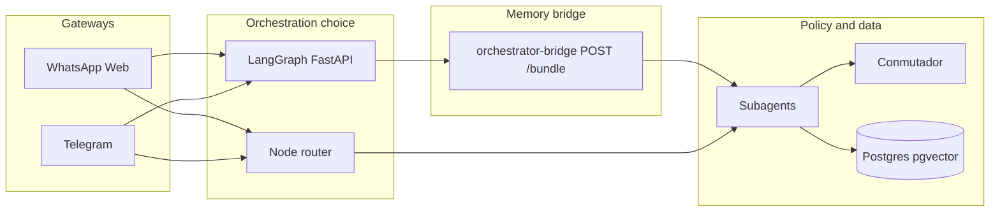
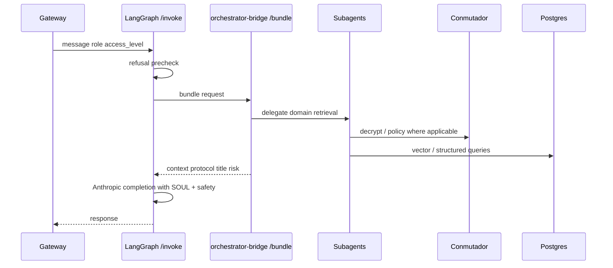

# IAldea

IAldea is collective intelligence infrastructure for protecting, organizing, and querying the memory of autonomous communities. The architecture isolates cryptographic secrets from the language model and enforces access by role and governance tier so sensitive material is only exposed when policy allows.

IAldea does not replace assemblies, legitimate authorities, or professional advice; it is tooling for civic memory under community-defined rules.

---

## Vision and boundaries

| Principle | Meaning |
|-----------|---------|
| Sovereignty | Data and policy belong to the community; deployment can stay self-hosted. |
| Separation of duties | The model orchestrates language; the **Conmutador** arbitrates decryption and access; gateways do not hold master keys. |
| Verifiability | Answers should align with a **source hierarchy**; contradictions trigger canonical warnings and human review. |
| Modularity | Gateways, orchestration (Node router vs LangGraph), retrieval, and crypto are separate services and packages. |

Governance of tone, refusals, and identity is defined in `docs/governance/IaAldea_SOUL.md`. Safety refusals used by orchestrators live under `tests/safety/refusals.md`.

---

## The Conmutador (cryptographic arbiter)

The **Conmutador** is an isolated service (intended as a hard boundary, “black box”) between AI components and encrypted community data.

| Responsibility | Description |
|----------------|-------------|
| Key custody | It is the component entrusted with encryption keys appropriate to the deployment. The LLM and generic app code do not receive those secrets. |
| Access arbitration | It validates requests (including access tier) before releasing decrypted material to authorized subagent flows. |
| Blast-radius reduction | Compromise of a gateway or prompt path is not equivalent to bulk exfiltration of ciphertext keys. |

**Access tiers (keychain model)** are used to classify how strictly material is guarded:

| Tier | Typical content |
|------|-----------------|
| L1 | Community-facing, public or low-sensitivity material. |
| L2 | Strategic or operational material (e.g. secretariat, treasury, committee). |
| L3 | High-sensitivity administrative or safety-related material. |

Exact key naming and environment variables for your deployment are listed in `.env.example`.

---

## The Node router (classic orchestrator)

`packages/agents/router.js` implements the **legacy Node orchestrator**: role-specific configuration, retrieval via **subagents**, assembly of context, and a single Anthropic call with SOUL and safety text loaded from disk.

| When it runs | Gateways and tools point to Node-only flows, or `LANGGRAPH_ORCHESTRATOR_URL` is unset / empty so they do not call the Python service. |
| Role configs | Modular files under `packages/agents/orchestrators/configs/` (e.g. ciudadano, secretaria, tesoreria). |
| Subagents | Domain experts (`packages/agents/subagents`) query memory through the Conmutador / kernel stack as implemented in code. |

This path keeps ingestion and subagent logic in one ecosystem (Node) and is the default when LangGraph is not wired in.

---

## LangGraph orchestrator (optional)

When `LANGGRAPH_ORCHESTRATOR_URL` is set (e.g. `http://127.0.0.1:8000` locally), gateways can call **FastAPI + LangGraph** (`apps/langgraph-orchestrator`):

1. **Precheck** against YAML refusal patterns.
2. **Gather** context via the **orchestrator bridge** (`POST /bundle` on `apps/orchestrator-bridge`), reusing the same Node subagents and Postgres-backed memory instead of duplicating ingestion.
3. **LLM** step with Anthropic using SOUL, refusals, role protocol, and bundled context.

If the bridge fails, the graph can still respond under degraded context (no documentary memory) while respecting SOUL and safety instructions; diagnostics can be enabled with `IALDEA_EXPOSE_GATHER_ERRORS=1` (see `.env.example`).

---

## Multi-agent model

IAldea is not a single generic chatbot. Two layers matter:

**Experience layer (by stakeholder role)**  
Orchestrator behavior is tuned for roles such as secretariat, treasury, coordination, citizen, validator, committee, aligning prompts and policy emphasis.

**Domain layer (subagents)**  
Specialized experts cover areas including water, economy, health, education, assemblies, legal, safety, transport, production, and infrastructure. The router or bridge invokes them as needed.

---

## Access channels (gateways)

| Channel | Path | Notes |
|---------|------|-------|
| WhatsApp Web | `apps/whatsapp-web-gateway` | Rapid local pilots; session data under app directory. |
| Telegram | `apps/telegram-gateway` | Bot token-driven. |
| WhatsApp Business API | `apps/whatsapp-gateway` | Meta-approved scalability. |

All channels are intended to share the same security core (Conmutador, same orchestration contract) rather than bespoke stacks per channel.

---

## Source hierarchy (trust levels)

| Trust band | Interpretation |
|------------|----------------|
| 1–2 | Strongly grounded: official documents, approved minutes. |
| 3 | Referential: working drafts or preparatory material. |
| 4–5 | Signals: citizen feedback or model inference, explicitly labeled (e.g. `[INFERENCIA]`). |

Conflicts across sources should surface canonical inconsistency messaging and invite human resolution.

---

## Technology stack

| Layer | Technology |
|-------|------------|
| Reasoning model | Anthropic Claude (see `ANTHROPIC_MODEL` / app defaults). |
| Embeddings / retrieval helpers | OpenAI embeddings where configured (`OPENAI_API_KEY`). |
| Memory kernel | PostgreSQL with pgvector. |
| Encryption transit | AES-256-GCM framing around Conmutador-mediated access (see `apps/conmutador-service`, `packages/security`). |
| Classic orchestration | Node.js, `packages/agents/router.js`. |
| Graph orchestration | Python, LangGraph, FastAPI, `langchain-anthropic`. |
| Container orchestration | Docker Compose, optional `Makefile` wrappers. |

---

## Modularity and repository layout

Applications are thin deployable entrypoints; shared logic lives under `packages/`.

```text
IAldea-org-26/
├── apps/
│   ├── conmutador-service/      # Conmutador HTTP service
│   ├── orchestrator-bridge/     # Node bridge: POST /bundle (subagents + DB)
│   ├── langgraph-orchestrator/ # FastAPI + LangGraph graph
│   ├── whatsapp-web-gateway/
│   ├── telegram-gateway/
│   ├── whatsapp-gateway/
│   ├── whatsapp-gateway-free/
│   └── web/
├── packages/
│   ├── agents/                  # Router, subagents, orchestrator configs
│   ├── kernel/                  # DB and data-access patterns
│   ├── ingesta/                 # Embedding / ingestion utilities
│   ├── security/                # Crypto helpers
│   └── trust/                   # Trust / provenance helpers
├── tests/                       # Including safety corpora (e.g. refusals)
├── CONTEXTO-POPUP-VILLAGE.md    # Pop-up sprint bible (raíz)
├── docs/                        # Documentation root index: docs/README.md
│   ├── project/                 # repo-structure.md, guia-diaria.md
│   ├── foundation/              # vision, principles, civic-safety, privacy, positioning
│   ├── governance/
│   │   └── IaAldea_SOUL.md     # Identity protocol (loaded at runtime)
│   ├── memory/                  # Episodic, sources, source hierarchy drafts
│   ├── architecture/            # system-architecture.md (canonical), README index
│   └── …                        # roles, planning, pop-up-2026, etc.
├── config/
├── infra/
├── docker-compose.yml
├── Makefile                     # compose shortcuts (up, down, logs)
└── .env.example
```

---

## Architecture (high level)



**With LangGraph enabled**, a simplified request sequence:



---

## Configuration

Copy `.env.example` to `.env` and set database credentials, `CONMUTADOR_KEY` (or deployment-specific key variables), `ANTHROPIC_API_KEY`, and `OPENAI_API_KEY` as required by your bridge and ingestion paths.

| Variable | Role |
|----------|------|
| `LANGGRAPH_ORCHESTRATOR_URL` | If set, gateways target the Python orchestrator; if empty, Node router path. |
| `ORCHESTRATOR_BRIDGE_URL` | Base URL for `POST /bundle` (LangGraph gather step). |
| `CONMUTADOR_URL` | URL subagents and bridge use to reach the Conmutador. |
| `DB_*` | PostgreSQL connectivity. |
| `COMMUNITY_DISPLAY_NAME` | Community name substituted into `IaAldea_SOUL.md` greetings (bridge and LangGraph). |
| `IALDEA_EXPOSE_GATHER_ERRORS` | When `1`, `/invoke` may include `gather_error` for debugging. |

---

## Local development

### One-time setup (per machine)

1. **Environment:** copy `.env.example` to `.env` and set keys, database passwords, and `COMMUNITY_DISPLAY_NAME`.
2. **Node** (from repository root; first clone or after dependency changes):

```bash
(cd packages/kernel && npm install)
(cd packages/agents && npm install)
(cd apps/conmutador-service && npm install)
(cd apps/orchestrator-bridge && npm install)
(cd apps/whatsapp-web-gateway && npm install)
```

3. **Python (LangGraph):** in `apps/langgraph-orchestrator`:

```bash
python3 -m venv .venv
.venv/bin/pip install -r requirements.txt
```

4. **Database volume:** the first time you need Postgres with the IAldea schema, start the DB container and optionally apply `init.sql` if the data directory already existed without it:

```bash
docker compose up -d db
make db-init   # only if memberships / vector tables are missing inside an old volume
```

Day-to-day you only start processes unless dependencies or schema change.

### Service ports (host-based runs)

| Port | Service | Notes |
|------|---------|--------|
| 5432 | PostgreSQL (`ialdea-db`) | Published by Compose; use `DB_HOST=localhost` from processes on the host. |
| 3005 | Conmutador | `CONMUTADOR_URL=http://127.0.0.1:3005` in `.env`. |
| 3011 | Orchestrator bridge | `ORCHESTRATOR_BRIDGE_URL=http://127.0.0.1:3011` for LangGraph gather. |
| 8000 | LangGraph FastAPI | `LANGGRAPH_ORCHESTRATOR_URL=http://127.0.0.1:8000` for gateways using the graph. |
| — | WhatsApp Web gateway | No HTTP port; connects outbound and shows a QR in the terminal. |

### Five-terminal full stack (recommended for local debugging)

In **each** terminal, change to the **repository root** (`cd` into `IAldea-org-26`) before running the commands below. Using five terminals keeps logs separate so you can restart one service without stopping the others.

**Terminal 1 — PostgreSQL**

Keep Postgres in the foreground so you see startup errors, or use `-d` and free this terminal for something else.

```bash
docker compose up db
# Alternative (background): docker compose up -d db
```

**Terminal 2 — Conmutador**

```bash
cd apps/conmutador-service && node index.js
```

**Terminal 3 — Orchestrator bridge (subagents + Postgres)**

```bash
cd apps/orchestrator-bridge && node index.js
```

**Terminal 4 — LangGraph orchestrator**

```bash
cd apps/langgraph-orchestrator
export REPO_ROOT="$(cd ../.. && pwd)"
export ORCHESTRATOR_BRIDGE_URL="${ORCHESTRATOR_BRIDGE_URL:-http://127.0.0.1:3011}"
.venv/bin/uvicorn main:app --host 0.0.0.0 --port 8000
```

**Terminal 5 — WhatsApp Web gateway**

```bash
cd apps/whatsapp-web-gateway && node index.js
```

Scan the QR printed in this terminal to link WhatsApp Web. Ensure `.env` points gateways at the graph and bridge on the host, for example:

- `DB_HOST=localhost`
- `CONMUTADOR_URL=http://127.0.0.1:3005`
- `ORCHESTRATOR_BRIDGE_URL=http://127.0.0.1:3011`
- `LANGGRAPH_ORCHESTRATOR_URL=http://127.0.0.1:8000`

**Optional:** if `LANGGRAPH_ORCHESTRATOR_URL` is empty or LangGraph is down, the WhatsApp gateway **falls back** to the Node `Orchestrator` in `packages/agents/router.js`. You can omit terminal 4 in that mode, but you lose LangGraph precheck and the bundled gather contract. Keep terminal 3 if you still use `POST /bundle` from scripts or from LangGraph elsewhere.

### Smoke checks (host ports)

```bash
curl -s http://127.0.0.1:3011/health
curl -s http://127.0.0.1:8000/health
curl -s -X POST http://127.0.0.1:3011/bundle \
  -H "Content-Type: application/json" \
  -d '{"message":"prueba de memoria","role":"ciudadano","accessLevel":1}'
curl -s -X POST http://127.0.0.1:8000/invoke \
  -H "Content-Type: application/json" \
  -d '{"message":"hola","role":"ciudadano","access_level":1}'
```

The Conmutador only exposes `POST /encrypt` and `POST /decrypt` (no HTTP health route); if terminal 2 shows the bunker banner, it is up.

### Docker Compose (single command, all services in containers)

From repository root:

```bash
docker compose up -d --build
# or
make up
```

Useful Makefile targets:

| Target | Purpose |
|--------|---------|
| `make up` | Build and start the full stack in the background. |
| `make down` | Stop and remove containers. |
| `make ps` | Show container status. |
| `make logs-whatsapp` | Follow WhatsApp Web container logs. |
| `make logs-langgraph` | Follow LangGraph container logs. |
| `make db-init` | Pipe `infra/db/init.sql` into the running `db` container (repair empty or legacy schema). |

Inside Compose, services use hostnames `db`, `conmutador`, `orchestrator-bridge`, and `langgraph-orchestrator`; `.env` values that say `127.0.0.1` apply to **host** runs only.

---

## Response governance

Public-facing replies follow `docs/governance/IaAldea_SOUL.md`: concise (on the order of 150 words), formal civic tone, source labeling (e.g. `[HECHO]` / `[INFERENCIA]`, `[FTE: ...]`) as configured, and alignment with the refusal corpus.

---

## License and positioning

This project is released under the **MIT License** (see `LICENSE`). For public positioning and pop-up messaging aligned with the original vision, see `docs/foundation/positioning-v1.md` and `CONTEXTO-POPUP-VILLAGE.md` (repository root).

---

IAldea: community sovereignty through structured civic memory.
