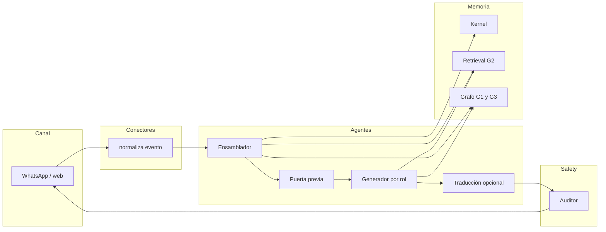
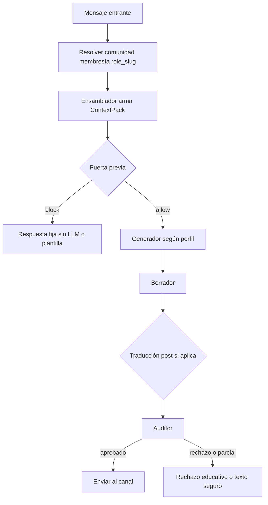
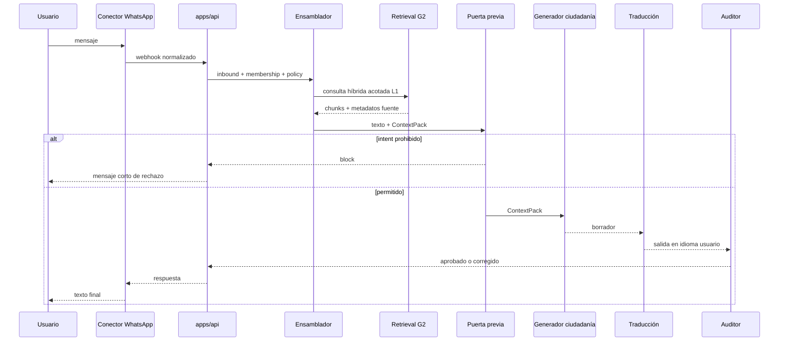
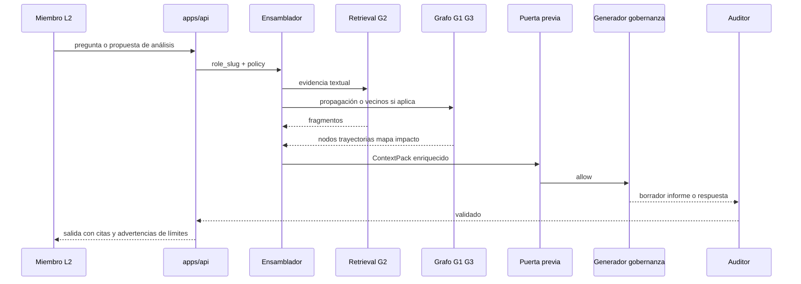

# Arquitectura IAldea — guía operativa

> Cuatro capas: **Kernel → Graph → Agents → Safety**. Esta página detalla la capa **Graph** (tres piezas), la capa **Agents** (actividades, tubería y flujos) y **quién filtra** qué.  
> Marco del Pop-Up: [`CONTEXTO-POPUP-VILLAGE.md`](../CONTEXTO-POPUP-VILLAGE.md) §11–§13 · visión de producto: [`planning/plan_producto_unificado.md`](planning/plan_producto_unificado.md) · roles y canales: [`planning/dia_02_gobernanza_roles_y_accesos.md`](planning/dia_02_gobernanza_roles_y_accesos.md) · contratos de agentes: [`packages/agents/`](../packages/agents/) · voz y límites humanos: [`../soul/SOUL.example.md`](../soul/SOUL.example.md).

---

## 1. Qué guarda cada capa (mental model)

| Capa | Pregunta que responde | Analogía breve |
|------|----------------------|----------------|
| **01 Kernel** | “¿Qué texto crudo tenemos y de dónde viene?” | Archivero versionado: PDFs/actas transcritos → fragmentos (`chunks`) en SQLite. |
| **02 Graph** | “¿Cómo se **relacionan** las cosas y qué fragmentos **parecen** relevantes por significado?” | Mapa de nodos y aristas + buscador semántico (y opcionalmente propagación de impacto). |
| **03 Agents** | “¿Qué **dice** el sistema al usuario, con qué rol, qué fuentes y qué herramientas?” | **Una tubería**: ensamblador → (puerta previa) → **generador por perfil** → traducción si aplica → **auditor**. |
| **04 Safety** | “¿Esa salida **puede publicarse** sin violar SOUL y `policy_config`?” | Auditor obligatorio; clasificadores; configurador y simulador fuera del camino caliente. |

El Kernel **no** “entiende” relaciones; solo persiste y versiona. El Graph **no** inventa texto; cruza entidades y recupera pasajes. Los agentes **no** son la capa de seguridad final: redactan bajo política; el **auditor** cierra el circuito.

---

## 2. Capa Graph — las tres cajas del diagrama

### 2.1 Grafo de conocimiento (estructura explícita)

- **Qué es:** nodos tipados (Persona, Rol, Comité, Acuerdo, Documento, Proyecto, Recurso, Riesgo, …) y **aristas** con significado (`AFECTA`, `REGISTRADO_EN`, `CONSUME`, `APROBÓ`, …).
- **Para qué:** preguntas del tipo “si toco **X**, qué **Y** del grafo está a N saltos?” — trazabilidad de acuerdos y dependencias.
- **No es:** una base de texto libre; lo que no esté modelado como nodo/arista no se recorre bien.

### 2.2 Búsqueda vectorial (significado / RAG)

- **Qué es:** embeddings de fragmentos del Kernel; consulta por **similitud** (“por significado”, no solo palabra clave).
- **Para qué:** encontrar párrafos de actas o oficios relevantes aunque el usuario use otras palabras; alimentar citas del generador.
- **No es:** el grafo relacional; convive en **híbrido** (G1 + G2).

### 2.3 Motor de propagación de impacto (algoritmo sobre el grafo)

- **Qué es:** a partir de una **decisión o consulta** (a menudo extraída por NLP desde lenguaje natural), recorre el grafo (BFS/DFS con límites de profundidad y pesos) y opcionalmente cruza con resultados vectoriales.
- **Para qué:** armar el “mapa de impacto”: qué proyectos, fondos o acuerdos **aparecen conectados** en la memoria documentada.
- **No hace:** recomendar la decisión correcta (véase [plan_08_analisis_impacto.md](planning/plan_08_analisis_impacto.md): solo ilumina conexiones).

**Flujo típico de datos:** Kernel alimenta texto → (extracción) crea o enlaza nodos → Graph sirve al **perfil gobernanza** para G3 y al **perfil ciudadanía** sobre todo para G2 (RAG); ambos pasan por el **auditor** antes de salir al canal.

---

## 3. Herramientas recomendadas (alineadas al plan unificado)

| Pieza | Herramienta sugerida | Por qué encaja |
|-------|---------------------|----------------|
| Almacén + trazas | **SQLite** (ya en Kernel) | Offline, portable, un archivo por comunidad. |
| Grafo en memoria / algoritmos | **NetworkX** (Python) | Ligero, sin Neo4j; serialización a tablas SQLite si hace falta. |
| Vectores embebidos | **Chroma** en modo embedded / SQLite-backed | Sin servidor; encaja con “laptop 8 GB, sin GPU obligatoria”. |
| API orquestación | **FastAPI** (cuando exista `apps/api`) | Ecosistema NLP, async, fácil de desplegar detrás de nginx o local. |
| OCR / audio | **Tesseract**, **Whisper.cpp** | Offline según [plan_01_ingesta_multimodal.md](planning/plan_01_ingesta_multimodal.md). |
| LLM | **Ollama / API** configurable | Política por comunidad en `policy_config.yaml`. |

**Alternativas** (si el equipo crece): Neo4j o Kuzu para grafo persistente más rico; Qdrant embedded; siguiendo siempre la restricción **offline-first** del README y del CONTEXTO.

---

## 4. Capa Agents — actividades, perfiles y flujos

Los **siete roles** del modelo (`docs/roles/role-model.md`) se implementan como **perfiles** sobre la **misma tubería**: cambian instrucciones de sistema, herramientas y límites de contexto, no la lógica de seguridad final. Detalle de pasos: [`packages/agents/README.md`](../packages/agents/README.md); contratos: [`citizen.md`](../packages/agents/citizen.md), [`authority.md`](../packages/agents/authority.md).

### 4.1 Actividades por componente (quién hace qué)

| Componente | Actividad principal | Entrada típica | Salida típica |
|------------|--------------------|----------------|---------------|
| **Conector de canal** (`packages/connectors/`) | Recibir webhook (p. ej. WhatsApp), validar firma, normalizar texto y metadatos de sesión. | Payload proveedor | `InboundMessage` interno (texto, ids, timestamp). |
| **Resolución de identidad** | Mapear cuenta de canal a `community_id`, `membership`, `role_slug`, `contributor_handle` o hash según política. | Id de canal + registro local | Registro para el ensamblador (sin exponer teléfono en agregados). |
| **Ensamblador de contexto** | Leer `policy_config.yaml`, trozos relevantes de `SOUL.md`, recuperar chunks (G2) y, si el rol y la pregunta lo permiten, subgrafos o resultados G3; respetar modo de privacidad y nivel L0–L3. | Mensaje + ids + políticas | **`ContextPack`**: textos citables, lista de fuentes, límites de tono, flags “puede usar G3”. **No llama al LLM generativo.** |
| **Puerta previa** (opcional, Capa 04) | Clasificación barata: electoral, médico, legal, acusación, etc. | Texto usuario + `ContextPack` | `allow` / `block` / `escalate_human` + código de motivo. |
| **Generador por rol** | Un solo módulo con `dispatch(role_slug)`: elige system prompt y tools; llama al modelo; produce **borrador** con citas cuando hay fuentes. | `ContextPack` + decisión puerta | Borrador markdown o texto. |
| **Motor de traducción híbrido** | Pre: detectar idioma y traducir entrada; post: traducir salida; memoria de frases validadas por humanos cuando la confianza es baja ([plan_13_traduccion_lenguas.md](planning/plan_13_traduccion_lenguas.md)). | Texto | Texto; **no** redefine política de seguridad. |
| **Auditor** | Verificar borrador contra SOUL, política, citas obligatorias, fugas, identificación indebida; puede devolver “bloquear”, “reescribir” o “aprobar”. | Borrador + `ContextPack` + SOUL | Respuesta final o rechazo educativo al canal. |

**Regla de oro:** el generador **redacta**; la puerta previa y el auditor **filtran**; el ensamblador **acota** el mundo visible al modelo.

### 4.2 Perfiles de generador vs `role_slug`

| `role_slug` | Perfil | Actividad del modelo (resumen) |
|-------------|--------|----------------------------------|
| `ciudadano` | Ciudadanía | RAG sobre documentos permitidos a L1; citas; feedback según privacidad. |
| `financiador` | Ciudadanía restringida | Igual tubería; instrucciones extra: solo agregados y comentarios acotados, sin presionar decisiones. |
| `secretaria`, `coordinacion`, `comite_miembro`, `tesoreria`, `validador` | Gobernanza | Más contexto L2; escenarios 2–3; evidencia; G3 cuando aplique; **tesorería**: nunca “liberar fondos” por IA. |
| `admin_plataforma` | Operador (L3) | Ingesta, configuración, logs; canal distinto al ciudadano idealmente. |

### 4.3 Vista global: mensaje atraviesa el sistema

### 4.4 Flujo de un turno (decisiones)

### 4.5 Secuencia — consulta ciudadanía (ej. WhatsApp)

### 4.6 Secuencia — gobernanza (impacto o escenarios)

### 4.7 Orden estricto con traducción (ciudadanía)

1. Entrada de usuario (idioma A).  
2. **Traducción pre** (si A no es el idioma de trabajo del RAG): obtener texto para búsqueda sin perder aviso de incertidumbre.  
3. Ensamblador + RAG + política.  
4. Puerta previa.  
5. Generador (perfil ciudadanía).  
6. **Traducción post** (si la respuesta debe volver en idioma A).  
7. **Auditor** sobre el texto que verá el usuario (CONTEXTO: formato claro, citas, sin fugas).

### 4.8 Capa Safety — quién filtra (resumen)

| Componente | Función |
|--------------|---------|
| **Auditor (SOUL + policy)** | **Filtro final obligatorio** sobre toda respuesta al usuario: legal, médico, electoral, acusaciones, privacidad, alucinaciones, citas. |
| **Clasificador ligero** (opcional) | Antes del LLM: ahorro de tokens y rechazo educativo temprano ([ideas_desarrollo.md](planning/ideas_desarrollo.md), plan 16). |
| **Configurador no-code** | No intercepta tráfico; **define** reglas que el auditor aplica. |
| **Simulador** | **Prueba** regresiones; no está en el camino en vivo. |

**En una frase:** el **generador** redacta bajo un `ContextPack` acotado; la **traducción** adapta idioma; el **auditor** permite o bloquea la salida.

---

## 5. GIS y capas territoriales (fuera del alcance Días 1–2)

Cuando el proyecto entre en **fase de datos geoespaciales** (Día 3+ o PR dedicado), los raster (MDT, pendientes, riesgo, etc.) pueden modelarse como nodos `PublicSource` o `Layer` enlazados a `Location` en el grafo y citarse como cualquier fuente. No sustituyen acuerdos internos. Hoy el repo **no** versiona rasters ni metadatos INEGI masivos; ver [`reestructura.md`](../reestructura.md).

---

## 6. Paquetes en este monorepo (objetivo)

| Carpeta | Responsabilidad |
|---------|-----------------|
| `packages/memory-kernel/` | SQLite, documentos, chunks, versiones. |
| `packages/graph/` | Modelo de nodos/aristas, propagación G3, export/import. |
| `packages/retrieval/` | BM25 + vector store + fusión híbrida (G2). |
| `packages/agents/` | Ensamblador, dispatch por rol, contratos `citizen.md` / `authority.md`. |
| `packages/civic-safety/` | Auditor, clasificadores, simulador. |
| `packages/connectors/` | WhatsApp u otros canales; normalización hacia `apps/api`. |
| `packages/audit-log/` | Eventos append-only (ingesta, cambios de config, consultas si aplica). |

---

*Última revisión: capa Agents ampliada con actividades y flujos; alineado a CONTEXTO, Día 2, `docs/roles/` y `packages/agents/`.*
