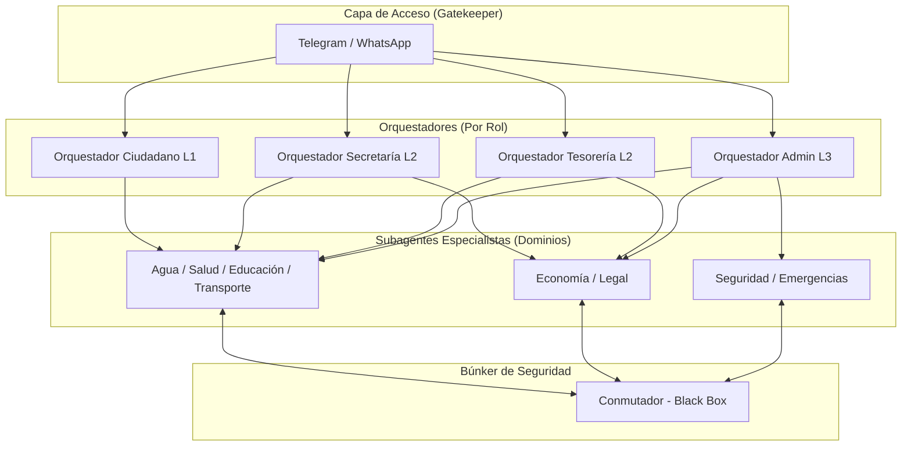

# Arquitectura Real IAldea - Estado Día 4 (Fase: Orquestación y Seguridad)

## 1. Estado Actual de Componentes

| Componente | Estado | Implementación Real |
| :--- | :--- | :--- |
| **Kernel (Postgres + pgvector)** | ✅ Operativo | Tablas creadas, búsqueda semántica funcional, niveles L1-L3 numéricos. |
| **Conmutador (AES-256-GCM)** | ⚠️ Parcial | La lógica de cifrado existe en `packages/agents/conmutador.js`, pero se usa de forma síncrona en el mismo proceso del orquestador. No hay "túnel" aislado aún. |
| **Orquestador (Claude 4.6)** | ✅ Operativo | Implementado en `packages/agents/router.js`. Lee `SOUL.md` y tiene personalidad cívica. |
| **Subagentes** | ❌ Pendiente | Actualmente el Orquestador hace todo (RAG + Razonamiento). No hay división de tareas (Tesorería, Secretaría, etc.). |
| **Gatekeeper (Telegram)** | ✅ Operativo | Hashing de privacidad (`sha256`) y auto-onboarding L1 funcional. |

---

## 2. El Flujo de Datos Actual (Blindado)
Hoy el flujo es:
`Kernel -> Subagente (Ciphertext) -> Conmutador (Black Box) -> Subagente (Plaintext) -> Orquestador -> Respuesta`

**Seguridad:** El Orquestador nunca toca la base de datos ni las llaves de cifrado.

---

## 3. Diagrama de Gobernanza: Orquestadores y Subagentes

---

## 4. Matriz de Gobernanza de Inteligencia

| Subagente (Experto) | Dominio de Info | Acceso Mínimo | Roles Autorizados |
| :--- | :--- | :--- | :--- |
| **Agua** | Reglamento, cortes, pozos | L1 | Todos los vecinos |
| **Salud** | Brigadas, clínica, turnos | L1 | Todos los vecinos |
| **Economía** | Cuotas, deudas, presupuesto | L2 | Tesorería, Secretaría, Comité |
| **Legal** | Reglamentos, mediación formal | L2 | Secretaría, Comité, Coordinación |
| **Seguridad** | Reportes críticos, vigilancia | L3 | Admin Técnico, Seguridad |

---

---

## 4. ¿Qué falta para el blindaje total?

1. **Aislamiento del Conmutador:** Mover la lógica de cifrado a un módulo que el Orquestador llame pero cuyas llaves no pueda "ver" (ej: usando variables de entorno protegidas o un servicio aparte).
2. **Implementación de Subagentes:** 
   - Crear la clase `BaseSubagent`.
   - Modificar el `Orchestrator` para que delegue la búsqueda a subagentes específicos según el tema.
3. **Cifrado en Ingesta:** Asegurar que cuando subimos un documento, el Kernel guarde el contenido ya cifrado con la llave del Conmutador.

---

## 5. Próximos Pasos Técnicos Inmediatos
1. Refactorizar `router.js` para separar al Orquestador de la lógica de base de datos.
2. Crear el primer Subagente: `SecretariaSubagent`.
