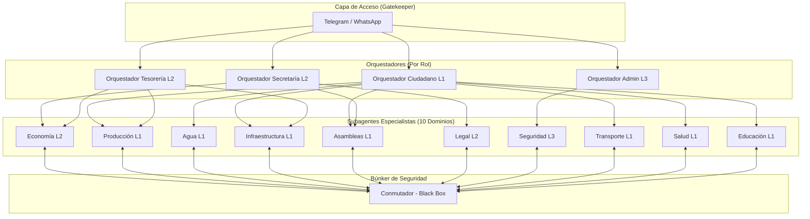

# Arquitectura Real IAldea - Estado Día 4 (Fase: Orquestación y Seguridad)

## 1. Estado Actual de Componentes

| Componente | Estado | Implementación Real |
| :--- | :--- | :--- |
| **Kernel (Postgres + pgvector)** | ✅ Operativo | Tablas creadas, búsqueda semántica funcional, niveles L1-L3 numéricos. |
| **Conmutador (AES-256-GCM)** | ⚠️ Parcial | La lógica de cifrado existe en `packages/agents/conmutador.js`, pero se usa de forma síncrona en el mismo proceso del orquestador. No hay "túnel" aislado aún. |
| **Orquestador (Claude 4.6)** | ✅ Operativo | Implementado en `packages/agents/router.js`. Lee `SOUL.md` y tiene personalidad cívica. |
| **Subagentes** | ❌ Pendiente | Actualmente el Orquestador hace todo (RAG + Razonamiento). No hay división de tareas (Tesorería, Secretaría, etc.). |
| **Gatekeeper (Telegram)** | ✅ Operativo | Hashing de privacidad (`sha256`) y auto-onboarding L1 funcional. |

---

## 2. El Flujo de Datos Actual (Blindado)
Hoy el flujo es:
`Kernel -> Subagente (Ciphertext) -> Conmutador (Black Box) -> Subagente (Plaintext) -> Orquestador -> Respuesta`

**Seguridad:** El Orquestador nunca toca la base de datos ni las llaves de cifrado.

---

## 3. Diagrama de Gobernanza: Orquestadores y Subagentes

---

## 4. Directorio de los 10 Subagentes (Expertos de IAldea)

Estos subagentes son los únicos autorizados para interactuar con el **Conmutador Service** para descifrar memoria según su dominio.

| Subagente | Dominio de Info | Nivel | Responsabilidad |
| :--- | :--- | :--- | :--- |
| **Agente_Economia** | Finanzas / Presupuesto | L2 | Control de cuotas, gastos y viabilidad. |
| **Agente_Produccion** | Huertos / Manufactura | L1 | Seguimiento a la producción local. |
| **Agente_Agua** | Pozos / Distribución | L1 | Gestión del recurso vital y reglamentos. |
| **Agente_Infra** | Energía / Caminos | L1 | Mantenimiento de infraestructura común. |
| **Agente_Asambleas** | Actas / Acuerdos | L1 | Memoria histórica de decisiones. |
| **Agente_Legal** | Reglamentos / Mediación | L2 | Marco normativo y resolución de conflictos. |
| **Agente_Seguridad** | Vigilancia / Emergencia | L3 | Protección y alertas comunitarias. |
| **Agente_Transporte** | Logística / Rutas | L1 | Coordinación de movilidad comunitaria. |
| **Agente_Salud** | Bienestar / Brigadas | L1 | Atención primaria y salud colectiva. |
| **Agente_Educacion** | Talleres / Escuela | L1 | Formación y transferencia de saberes. |

---

## 5. Orquestadores por Rol (The Experience Layer)

Cada orquestador es una instancia única de IA que utiliza el **SOUL.md** para dar voz a la comunidad, filtrando información según el rol del usuario.

| Orquestador | Enfoque Principal | Riesgo que Vigila |
| :--- | :--- | :--- |
| **Secretaría** | Registrar memoria oficial | Información no validada |
| **Coordinación** | Cuidar el proceso | Centralización de poder |
| **Tesorería** | Viabilidad de recursos | Comprometer presupuesto |
| **Comité** | Deliberación y decisión | Fuga de datos sensibles |
| **Validador** | Revisar evidencia | Juicios personales |
| **Ciudadano** | Consulta y participación | Rumores y acusaciones |

---

---

## 4. ¿Qué falta para el blindaje total?

1. **Aislamiento del Conmutador:** Mover la lógica de cifrado a un módulo que el Orquestador llame pero cuyas llaves no pueda "ver" (ej: usando variables de entorno protegidas o un servicio aparte).
2. **Implementación de Subagentes:** 
   - Crear la clase `BaseSubagent`.
   - Modificar el `Orchestrator` para que delegue la búsqueda a subagentes específicos según el tema.
3. **Cifrado en Ingesta:** Asegurar que cuando subimos un documento, el Kernel guarde el contenido ya cifrado con la llave del Conmutador.

---

## 5. Próximos Pasos Técnicos Inmediatos
1. Refactorizar `router.js` para separar al Orquestador de la lógica de base de datos.
2. Crear el primer Subagente: `SecretariaSubagent`.
