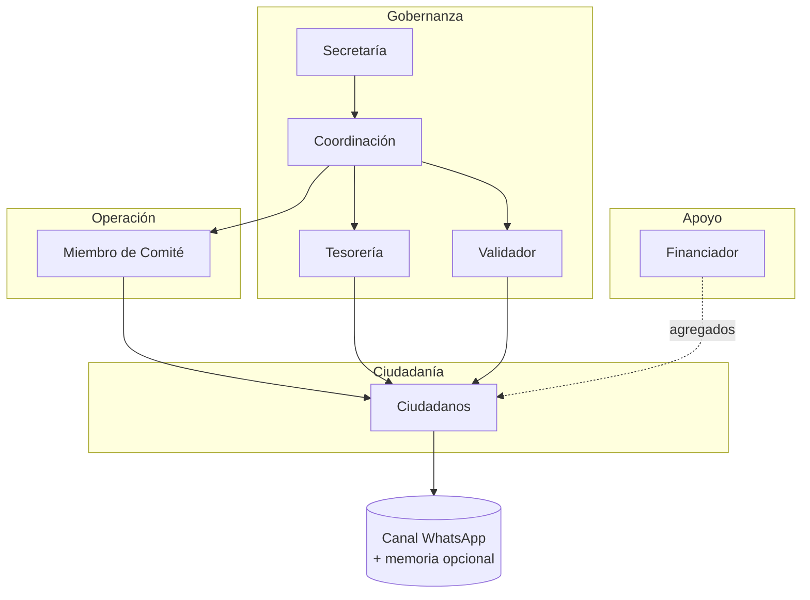
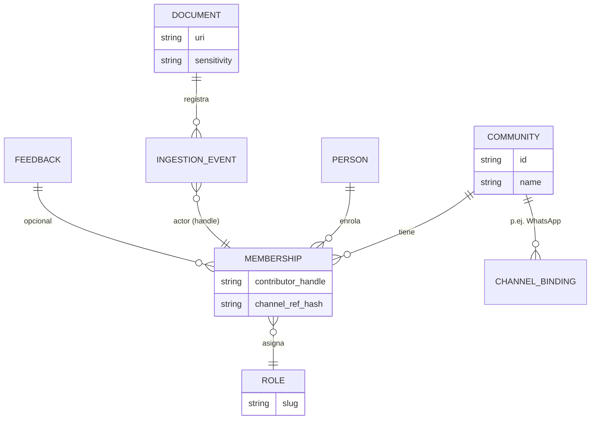

# Día 2 — Gobernanza, roles y accesos (IAldea)

**Objetivo:** alinear **roles**, **niveles de acceso** y **política de privacidad** con el modelo que el equipo ya consensuó en la matriz colaboradores, y fijar **WhatsApp** como medio principal de consulta ciudadana.

**Fuentes canónicas:**

- Matriz **Etapa × Rol** (CSV): [`docs/roles/permission-matrix.csv`](../roles/permission-matrix.csv) (copia estándar del archivo original en `docs/`).
- Resumen de roles: [`docs/roles/role-model.md`](../roles/role-model.md).
- Árbol de repo esperado: `CONTEXTO-POPUP-VILLAGE.md` §18 (adecuación al final de este documento, §13).

---

## Metas del taller (Día 2)

- [ ] Validar **roles oficiales** (7) y **etapas del ciclo** (8) frente al CSV.
- [ ] Acordar **WhatsApp** como canal ciudadano (alcance, opt-in, límites).
- [ ] Definir **niveles L0–L3** y mapeo rol → nivel.
- [ ] Definir **modos de privacidad** por defecto y excepciones.
- [ ] Alinear **modelo de datos** mínimo (membresía, documentos, `contributor_handle`).
- [ ] Dejar **matriz de permisos** lista para implementación (síntesis §9).
- [ ] **Checklist** de salidas del Día 2 (§12).

---

## 2. Canal ciudadano principal: WhatsApp

**Decisión:** el **medio de entrada** para consultas ciudadanas, aclaraciones y (cuando aplique) reservas de cita o flujos guiados será **WhatsApp**, por cobertura y costo de adopción en el piloto.

**Qué cubre en MVP conceptual**

- Preguntas con respuesta basada en **fuentes comunitarias** (actas, reglamentos, FAQs) con **citas** cuando exista documento.
- Derivación a **humanos** (Secretaría / Coordinación) cuando falte fuente o haya riesgo (salud, denuncias, datos personales de terceros).
- **Opt-in explícito** al tratamiento de mensajes; enlace corto a política de privacidad y al modo de memoria (ver §7).

**Qué no sustituye**

- No reemplaza **asamblea**, **votación formal** ni firma de actas: solo reduce fricción informativa y canaliza demanda.
- No es el único posible **frontend** futuro: la app web / otros conectores pueden convivir.

**Implementación en repo (roadmap)**

- Conector en `packages/connectors/` (p. ej. WhatsApp Cloud API / proveedor acordado). Hasta que exista código, el flujo se documenta aquí y en `docs/architecture.md`.
- Identidad técnica: enlazar mensajes a **`contributor_handle`** (§8.1), no exponer teléfono en agregados ni en tableros públicos.

**Relación con modos de privacidad**

- En modo **sin memoria persistente**, el conector no debe escribir contenido identificable en el Kernel más allá de lo estrictamente necesario para la sesión (definir umbral en taller).
- En modo **comunitario confidencial**, solo roles con agregación autorizada ven métricas derivadas del canal.

---

## 3. Estructura comunitaria (diagrama)



---

## 4. Roles oficiales (modelo colaboradores)

Los **siete roles** de la matriz CSV son la referencia. Slugs propuestos para código y YAML:

| Rol (UI) | `slug` | Rol en el sistema |
|----------|--------|-------------------|
| Secretaría | `secretaria` | Memoria formal, actas, registro de etapas. |
| Coordinación | `coordinacion` | Orquesta flujos entre actores y etapas. |
| Miembro de Comité | `comite_miembro` | Propone, ejecuta y aporta evidencia operativa. |
| Tesorería | `tesoreria` | Viabilidad y registro de recursos; **humano** para liberación de fondos. |
| Validador | `validador` | Verificación, cumplimiento y calidad de evidencia / informes. |
| Ciudadano | `ciudadano` | Consulta, aportes y memoria según política. |
| Financiador | `financiador` | Visión agregada y comentarios de financiamiento **sin** condicionar la decisión comunitaria. |

**Nota (modelo anterior / talleres locales):** roles como *presidente*, *regidor*, *secretario municipal* pueden **mapearse** a `coordinacion`, `comite_miembro` o `secretaria` según la comunidad; no son columnas del CSV actual — documentar el mapeo por piloto si aplica.

---

## 5. Etapas del ciclo (objeto de coordinación)

Resumen alineado al CSV (detalle narrativo en cada celda del archivo).

| Etapa | Objeto de coordinación | Papel típico de la IA |
|-------|------------------------|------------------------|
| **Entender** | Narrativa y contexto compartido | Sintetiza fuentes con trazabilidad y límites. |
| **Proponer** | Opciones e impactos | Estructura propuestas y trade-offs para deliberación humana. |
| **Decidir** | Respuesta institucional | Asiste **solo** con *human-in-the-loop*; Tesorería sobre recursos. |
| **Ejecutar** | Acciones y programas | Da seguimiento y observabilidad; no sustituye actos humanos. |
| **Verificar** | Evidencia y cumplimiento | Apoya listas de chequeo; Validador con responsabilidad explícita. |
| **Informar** | Transparencia y divulgación | Adapta mensajes por audiencia sin identificar personas. |
| **Recordar** | Memoria institucional | Consulta para ciudadanía y financiadores bajo reglas de agregación. |
| **Aprender** | Retroalimentación colectiva | Detecta patrones; no prescribe decisiones finales. |

---

## 6. Niveles de acceso (L0–L3)

| Nivel | Quién (orientativo) | Puede ver / hacer |
|-------|---------------------|-------------------|
| **L0** | Invitado externo, patrocinador sin membresía | Solo material explícitamente público o reportes agregados acordados. |
| **L1** | `ciudadano`, `financiador` | Documentos permitidos al rol; agregados según política; **no** listas identificables de aportes ajenos. |
| **L2** | `secretaria`, `coordinacion`, `comite_miembro`, `tesoreria`, `validador` | Operación completa de gobernanza y comités según matriz; agregados y evidencia interna. |
| **L3** | Operador técnico / piloto (`admin_plataforma` o equivalente) | Configuración, ingesta, roles técnicos, auditoría de sistema (no “veto” político). |

---

## 7. Modos de privacidad (resumen)

| Modo | Descripción breve | Uso típico |
|------|-------------------|------------|
| **Público** | Respuestas sin datos personales. | FAQs, convocatorias. |
| **Confidencial comunitario** | Agregados solo para roles L2 acordados. | Pulso para asamblea, informes internos. |
| **Privado ciudadano** | Sin exposición a terceros; memoria mínima o nula. | Temas sensibles vía WhatsApp o web. |

**Reglas transversales**

- **K-anonimato** (p. ej. *k* ≥ 3) antes de mostrar conteos finos.
- **Financiador:** solo **agregados** y canales acordados; sin microdatos de ciudadanos.
- **WhatsApp:** política de retención y borrado alineada al modo activo del usuario.

---

## 8. Modelo de datos mínimo y `contributor_handle`



### 8.1 Identidad pseudónima (`contributor_handle`)

- Handle **opaco** por enrolamiento; rotación al cambiar rol si la comunidad lo exige.
- **Canal WhatsApp:** guardar *referencia técnica hasheada* (`channel_ref_hash`) para enlazar conversación con membresía, **no** teléfono en claro en tablas de analítica.
- Quién ve el handle: el propio ciudadano (opcional en UI), operadores L3 en logs de ingesta, **no** en agregados públicos.

---

## 9. Matriz etapas × rol (síntesis del CSV)

Leyenda: **✅** permiso / responsabilidad principal · **⚠️** acotado o con condiciones · **—** fuera de alcance habitual.

**Etapas 1–4**

| Etapa | Secretaría | Coordinación | Comité | Tesorería | Validador | Ciudadano | Financiador |
|-------|:------------:|:--------------:|:--------:|:-----------:|:-----------:|:-----------:|:-------------:|
| Entender | ✅ | ✅ | ✅ | ✅ | — | ✅ | ⚠️ |
| Proponer | ✅ | ✅ | ✅ | ✅ | — | ⚠️ | ⚠️ |
| Decidir | ✅ | ✅ | ✅ | ✅ | — | ⚠️ | ⚠️ |
| Ejecutar | ✅ | ✅ | ✅ | ✅ | — | ⚠️ | ⚠️ |

**Etapas 5–8**

| Etapa | Secretaría | Coordinación | Comité | Tesorería | Validador | Ciudadano | Financiador |
|-------|:------------:|:--------------:|:--------:|:-----------:|:-----------:|:-----------:|:-------------:|
| Verificar | ✅ | ✅ | ✅ | ✅ | ✅ | ⚠️ | ⚠️ |
| Informar | ✅ | ✅ | ✅ | ✅ | ⚠️ | ⚠️ | ⚠️ |
| Recordar | ✅ | ✅ | ✅ | ✅ | ✅ | ✅ | ✅ |
| Aprender | ✅ | ✅ | ✅ | ✅ | ✅ | ✅ | ✅ |

> **Criterio:** las celdas reflejan el texto narrativo del CSV; donde el CSV dice explícitamente que un rol *no* participa (p. ej. Validador en *Entender* / *Proponer* / *Decidir* / *Ejecutar*), se marca **—**. *Financiador* en etapas tempranas queda en **⚠️** (solo lectura / comentario agregado, sin intervención operativa). Ajustar en taller si una comunidad redefine límites.

---

## 10. Esquema de comunidad de ejemplo (YAML)

Copia base para `policy_config.yaml` o generador. Ajustar listas en el taller.

```yaml
community:
  id: "san_juan_ejemplo"
  name: "San Juan Ejemplo"
  governance: "usos_y_costumbres"

channels:
  citizen_primary: "whatsapp"
  whatsapp:
    opt_in_required: true
    privacy_policy_url: "https://ejemplo.org/privacidad"

access_levels:
  observe_external: L0
  ciudadano: L1
  financiador: L1
  secretaria: L2
  coordinacion: L2
  comite_miembro: L2
  tesoreria: L2
  validador: L2
  admin_plataforma: L3

roles:
  authorities:
    - "secretaria"
    - "coordinacion"
  committees: []
  treasury:
    - "tesoreria"
  validation:
    - "validador"
  admin:
    - "admin_plataforma"

privacy:
  default_mode: "confidential_community"
  aggregation_threshold: 3
  aggregate_visibility: "authorities_only"
  contributor_identity:
    scheme: "opaque_uuid_per_enrollment"
    store_role_slug_with_membership: true
    show_handle_in_ui:
      citizen_self: true
      authority_aggregates: false
      operator_audit_logs: true
    rotate_handle_on_role_change: true
    channel_binding:
      whatsapp: "hash_phone_or_wa_id"

role_permissions:
  citizen:
    can_query: true
    can_submit_feedback: true
    can_view_aggregates: false
    can_view_documents: true
  authority:
    can_query: true
    can_submit_feedback: true
    can_view_aggregates: true
    can_view_documents: true
    can_compare_scenarios: true
    can_export_reports: true
  admin:
    can_modify_config: true
    can_ingest_documents: true
    can_manage_roles: true
```

**Mapeo MVP código:** `secretaria`, `coordinacion`, `comite_miembro`, `tesoreria` y `validador` pueden compartir inicialmente el bloque `authority` salvo que el código distinga permisos finos; `financiador` hereda de `citizen` más flags de solo agregados; `admin_plataforma` → `admin`.

---

## 11. User stories (validación Día 2)

1. **Como** secretaría **quiero** que solo el núcleo de gobernanza vea agregados de pulso **para** preparar la asamblea sin exponer nombres.
2. **Como** ciudadana **quiero** preguntar por **WhatsApp** en mixteco y recibir respuesta con cita a acta **para** confiar sin ir al palacio.
3. **Como** comité de agua **quiero** comparar dos escenarios documentados **para** deliberar en asamblea sin “orden” del sistema.
4. **Como** financiador **quiero** ver solo indicadores agregados **para** acompañar sin condicionar la decisión.
5. **Como** coordinación **quiero** ver el estado de cada etapa del ciclo **para** saber qué falta antes de informar.
6. **Como** tesorería **quiero** que ninguna liberación de fondos sea solo por IA **para** mantener control humano.
7. **Como** validador **quiero** checklist de evidencia en **Verificar** **para** firmar calidad sin sustituir al comité.
8. **Como** ciudadano **quiero** modo privado sin memoria persistente **para** temas sensibles por WhatsApp.
9. **Como** operadora L3 **quiero** cada PDF ligado a `contributor_handle` **para** auditar ingesta.
10. **Como** ciudadano **quiero** ver solo mi handle en ajustes **para** saber que mis aportes cuentan sin exponerme.

---

## 12. Salidas del taller (marcar al cerrar)

- [ ] Roles y etapas validados con el CSV en `docs/roles/permission-matrix.csv`.
- [ ] WhatsApp acordado (§2) con texto de opt-in y enlace a privacidad.
- [ ] Matriz §9 revisada celda a celda con dueños de rol.
- [ ] YAML de ejemplo validado con comunidad ficticia.
- [ ] Cambios reflejados en `plan_16_config_nocode.md` y en el **configurador web** cuando aplique.

---

## 13. Adecuación del repo a `CONTEXTO-POPUP-VILLAGE.md` §18

| Elemento §18 | Estado sugerido |
|--------------|-----------------|
| `CONTRIBUTING.md`, `CODE_OF_CONDUCT.md` | Pendientes Día 2 (crear en raíz cuando el equipo redacte). |
| `docs/roles/role-model.md`, `permission-matrix.csv`, `user-stories.md` | Listos (`user-stories.md` enlazado a §11). |
| `docs/pop-up-2026/day-N.md` | Carpeta y días: alinear con bitácora del Pop-Up. |
| `config/roles.example.yaml` | Opcional; hoy basta `policy_config.example.yaml` si el YAML unificado cubre roles. |
| `packages/connectors/` | Stub o README “WhatsApp” cuando arranque integración. |
| `packages/audit-log/` | Añadido `README.md` (placeholder §18). |
| `apps/web/`, `apps/api/` | Roadmap Día 4; documentar en `docs/architecture.md`. |

**Commits:** mensajes en inglés, imperativo; ramas por día según convención del CONTEXTO.

---

*Documento de trabajo — Día 2. Sin nombres de personas; ajustar tras decisión comunitaria en despliegue real.*
