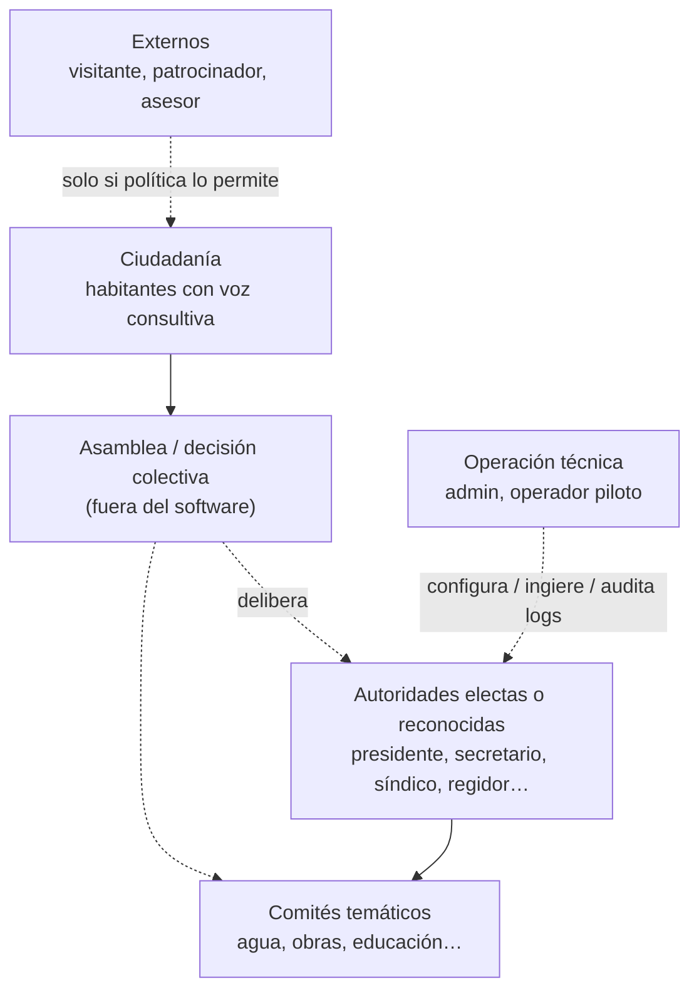
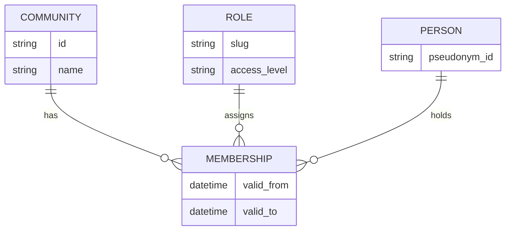

# Día 2 — Gobernanza, roles y accesos (IAldea)

> **Objetivo del día:** dejar definidos la **estructura comunitaria**, los **roles de usuario**, los **permisos**, los **niveles de acceso**, la **separación autoridad / ciudadanía**, y los modos **público / privado / confidencial** — listos para volcar a `policy_config.yaml` y al asistente no-code.  
> Referencias: [README.md](../../README.md) (privacidad, agentes), [plan_16_config_nocode.md](plan_16_config_nocode.md), [config/policy_config.example.yaml](../../config/policy_config.example.yaml).

---

## 1. Metas del Día 2 (checklist)

| Meta | Entregable concreto |
|------|---------------------|
| Estructura comunitaria | Modelo de **órganos** (asamblea, autoridades, comités, ciudadanía, externos) y cómo se mapean a **roles técnicos** en el sistema. |
| Roles de usuario | Catálogo de **roles considerados** + slugs estables + agrupación (autoridad / comité / ciudadanía / externo / operación). |
| Permisos | **Matriz permiso × rol** (booleana o niveles) alineada a capacidades del producto. |
| Niveles de acceso | **Niveles L0–L3** (o similar) sobre datos y acciones; qué rol entra en qué nivel. |
| Separación autoridad / ciudadanía | Reglas explícitas: **qué ve** cada bando, **qué no ve**, y **qué requiere umbral de agregación**. |
| Modos público / privado / confidencial | Definición operativa y **valor por defecto**; relación con roles y con el Agente Ciudadano vs Autoridad. |

---

## 2. Estructura comunitaria (modelo lógico)

La comunidad **no es plana**: IAldea refleja **gobierno y participación**, sin sustituir asambleas ni ley local.



**Principio:** el software **registra, consulta y resume** según permisos; la **soberanía** sigue en la asamblea y en las normas comunitarias.

---

## 3. Roles a considerar (catálogo → slugs)

Cada persona tiene **un rol principal** en el sistema (y opcionalmente roles secundarios en una fase posterior). Los slugs van en minúsculas y sin espacios; la etiqueta visible puede ir en español en la UI.

| Rol (nombre de trabajo) | `slug` sugerido | Grupo |
|-------------------------|-----------------|--------|
| Presidente municipal / comunitario | `presidente` | autoridad |
| Secretario | `secretario` | autoridad |
| Miembro de comité | `comite_miembro` | comité |
| Regidor / concejal (donde aplique) | `regidor` | autoridad |
| Asesor (técnico o comunitario) | `asesor` | externo_proximo |
| Ciudadano | `ciudadano` | ciudadania |
| Joven | `joven` | ciudadania |
| Persona mayor | `adulto_mayor` | ciudadania |
| Visitante | `visitante` | externo |
| Administrador del sistema | `admin` | operacion |
| Operador piloto (cívico / ETH / partner) | `operador_piloto` | operacion |
| Patrocinador u observador externo | `observador_externo` | externo |

**Notas:**

- **Joven** y **adulto mayor** comparten la mayoría de permisos con **ciudadano** salvo que la comunidad active **políticas diferenciadas** (p. ej. menores: sin retención de memoria en modo público).
- **Visitante** y **observador_externo** suelen tener **L0/L1** muy acotados (solo lectura de material explícitamente público, sin feedback confidencial).
- **Asesor** puede leer más que un ciudadano **solo si** el comité lo delega por escrito en política (evitar “asesor omnisciente” por defecto).

---

## 4. Niveles de acceso (L0–L3)

Niveles son **abstracción** para implementar checks; no son “rangos morales”, son **control de superficie de ataque**.

| Nivel | Quién típico | Datos / acciones |
|-------|----------------|------------------|
| **L0** | Visitante, observador externo | Solo contenido marcado **público** y sin datos personales. Sin ingesta. |
| **L1** | Ciudadano, joven, adulto mayor | Chat y consulta según **modo de privacidad**; feedback según política; **no** ve agregados crudos de otros si la política lo restringe. |
| **L2** | Presidente, secretario, regidor, comité | Ver agregados (si `aggregate_visibility` lo permite), comparar escenarios, exportar informes, **no** modificar `policy` salvo que también sean admin. |
| **L3** | `admin`, `operador_piloto` (delegado) | Ingesta, cambio de configuración, gestión de roles, lectura de **logs de auditoría** según lo que la comunidad delegue al piloto. |

**Separación autoridad / ciudadanía (reglas cortas):**

- **Autoridad y comité (L2):** pueden ver **agregados** que cumplan umbral (`aggregation_threshold`) y políticas de visibilidad; **nunca** listas de “quién preguntó qué” en modo confidencial.
- **Ciudadanía (L1):** ve **sus propias** interacciones y respuestas citadas; agregados solo si la política dice `all` o equivalente explícito.
- **Externos (L0–L1 acotado):** sin acceso a minutas internas salvo **fuente pública** explícita.

---

## 5. Modos de privacidad (público / confidencial / privado sin memoria)

Alineado al README: `public` · `confidential_community` · `private_no_memory`.

| Modo | Qué se guarda | Quién puede usarlo típicamente | Riesgo si se malconfigura |
|------|----------------|----------------------------------|---------------------------|
| **Público** | Preguntas y respuestas en memoria citable | Acuerdos explícitos de transparencia | Reidentificación si se mezcla con otros datos. |
| **Confidencial comunitario** | Solo patrones agregados; **≥ N** contribuyentes para mostrar agregado | Por defecto recomendado para pulso ciudadano | Umbral mal puesto → filtrado de identidad. |
| **Privado, sin memoria** | Nada retenido tras la sesión | Temas sensibles, salud, conflictos | Menos trazabilidad; útil para consulta puntual. |

**Default recomendado en MVP:** `confidential_community` + `aggregate_visibility: authorities_only` hasta que la asamblea decida lo contrario por escrito.

---

## 6. Modelo de roles (entidad–relación simplificado)



- **`PERSON`:** en logs y agregados, preferir **pseudónimos** o IDs internos; nombres reales solo donde la ley y la asamblea lo exijan y esté modelado en política.

---

## 7. Matriz de permisos (MVP — borrador para validar en taller)

Leyenda: **✓** permitido · **—** denegado · **~** solo con condición (texto entre paréntesis).

| Capacidad | ciudadano | joven | adulto_mayor | comite_miembro | presidente | secretario | regidor | asesor | visitante | observador_externo | admin | operador_piloto |
|-----------|:---------:|:-----:|:------------:|:--------------:|:----------:|:-------:|:------:|:---------:|:------------------:|:-----:|:----------------:|
| Consultar Agente Ciudadano (citas) | ✓ | ✓ | ✓ | ✓ | ✓ | ✓ | ✓ | ~ (alcance delegado) | ~ (solo público) | ~ (solo público) | ✓ | ✓ |
| Enviar feedback / pulso | ✓ | ~ (edad / consentimiento) | ✓ | ✓ | ✓ | ✓ | ✓ | — | — | — | ✓ | ✓ |
| Ver agregados de feedback | — | — | — | ✓ | ✓ | ✓ | ✓ | ~ | — | — | ✓ | ✓ |
| Agente Autoridad (escenarios / impacto) | — | — | — | ✓ | ✓ | ✓ | ✓ | ~ | — | — | ✓ | ✓ |
| Exportar informes (PDF, etc.) | — | — | — | ~ | ✓ | ✓ | ✓ | — | — | — | ✓ | ✓ |
| Ingestar documentos al Kernel | — | — | — | ~ | ✓ | ✓ | — | — | — | — | ✓ | ~ (según mandato) |
| Cambiar `policy_config` / SOUL | — | — | — | — | ~ (dual control) | ✓ | — | — | — | — | ✓ | — |
| Ver logs de auditoría completos | — | — | — | — | ~ | ✓ | — | — | — | — | ✓ | ~ |

**Condiciones típicas (`~`):**

- **Asesor:** solo documentos y comités explícitamente listados en `policy_config`.
- **Dual control:** dos firmas o dos roles `admin` para cambios sensibles (definir en taller si aplica).

---

## 8. Esquema de comunidad de ejemplo (YAML)

Copia base para `policy_config.yaml` o para el generador no-code. Ajustar nombres y listas en el taller.

```yaml
community:
  id: "san_juan_ejemplo"
  name: "San Juan Ejemplo"
  governance: "usos_y_costumbres"

# Niveles de acceso por slug (opcional; puede derivarse del rol)
access_levels:
  visitante: L0
  observador_externo: L0
  ciudadano: L1
  joven: L1
  adulto_mayor: L1
  comite_miembro: L2
  regidor: L2
  presidente: L2
  secretario: L2
  asesor: L1   # o L2 si la comunidad delega explícitamente
  admin: L3
  operador_piloto: L3

roles:
  authorities: [presidente, secretario, regidor]
  committees: [comite_agua, comite_obras]
  admin: [secretario]
  pilot_operators: [operador_piloto]

privacy:
  default_mode: "confidential_community"
  aggregation_threshold: 3
  aggregate_visibility: "authorities_only"

role_permissions:
  citizen:
    can_query: true
    can_submit_feedback: true
    can_view_aggregates: false
    can_view_documents: true
  authority:
    can_query: true
    can_submit_feedback: true
    can_view_aggregates: true
    can_view_documents: true
    can_compare_scenarios: true
    can_export_reports: true
  admin:
    can_modify_config: true
    can_ingest_documents: true
    can_manage_roles: true
```

**Mapeo de roles del taller → `role_permissions`:** en el MVP, **joven** y **adulto_mayor** heredan el bloque `citizen` salvo excepciones; **comite_miembro** puede mapearse a `authority` o a un tercer bloque `committee` si el código lo soporta (Día 2 puede decidir si unifican en `authority` temporalmente).

---

## 9. User stories (para validar en Día 2)

1. **Como** secretaria **quiero** que solo presidenta, regidores y yo veamos agregados de pulso ciudadano **para** preparar la asamblea sin exponer nombres individuales.  
2. **Como** ciudadana **quiero** preguntar en mixteco y recibir respuesta con cita a acta **para** confiar en la fuente sin ir al palacio municipal.  
3. **Como** comité de agua **quiero** usar el Agente Autoridad para comparar dos escenarios de obra **para** llevar a la asamblea pros/contras documentados, no una “orden” del sistema.  
4. **Como** visitante **quiero** ver solo la página de bienvenida y documentos marcados públicos **para** no acceder a minutas internas por error.  
5. **Como** admin **quiero** registrar quién subió cada PDF **para** auditar ingesta sin usar eso como denuncia automática en el chat.  
6. **Como** joven **quiero** usar el chat en modo privado sin memoria cuando pregunto un tema sensible **para** que no quede rastro en el Kernel.  
7. **Como** operador piloto **quiero** ingestar el anuario INEGI con rol explícito **para** que la comunidad sepa que la fuente es externa y revisable.  
8. **Como** observador externo **quiero** acceso de solo lectura a indicadores acordados **para** evaluar el piloto sin ver feedback identificable.

---

## 10. Salidas del taller (Día 2) — marcar al cerrar sesión

- [ ] **Modelo de roles** aprobado por el equipo (esta sección + diagrama ER).
- [ ] **Matriz de permisos** consensuada (tabla §7 actualizada).
- [ ] **Esquema YAML** de ejemplo validado con una comunidad ficticia.
- [ ] **User stories** priorizadas (MVP vs post-MVP).
- [ ] Lista de cambios a introducir en `plan_16_config_nocode.md` y en el **configurador web** (preguntas del asistente).

---

*Documento de trabajo — Día 2. Sin nombres de personas; ajustar tras decisión comunitaria en despliegue real.*
