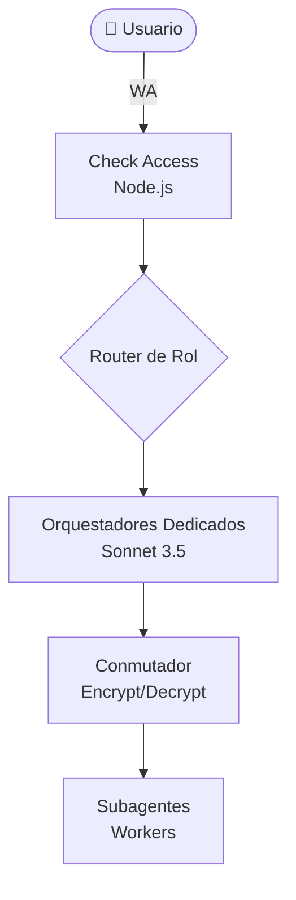
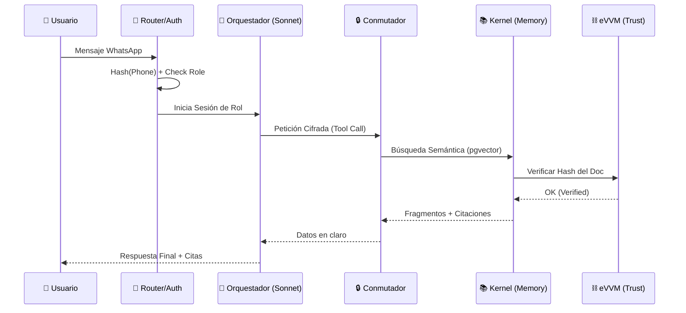
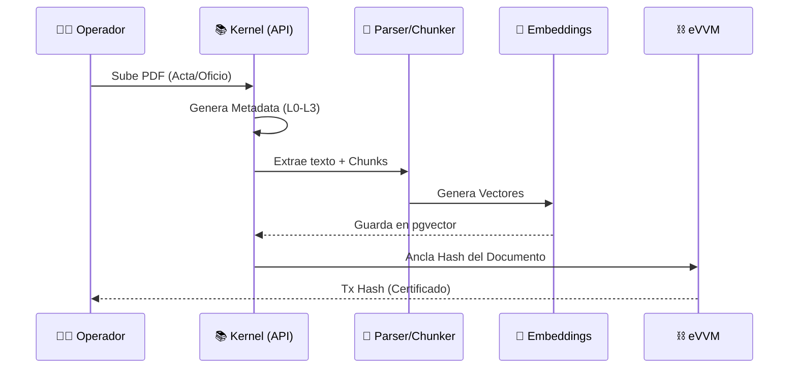

# Día 3 — Plan Maestro de Arquitectura (IAldea)

Este documento consolida la visión completa de la arquitectura de IAldea: desde la orquestación de agentes hasta la infraestructura de memoria y confianza en blockchain.

---

## 1. Resumen y Principios de Diseño

IAldea es un sistema de memoria cívica basado en **5 Capas** que garantiza soberanía, privacidad y veracidad.

| Capa | Nombre | Función |
|---|---|---|
| **04** | Safety | Auditoría y filtros de salida basados en `SOUL.md`. |
| **03** | Agents | Orquestadores dedicados por rol + Conmutador cifrado. |
| **02** | Graph/Vectors | Índice semántico y relaciones de conocimiento (Postgres + pgvector). |
| **01** | Kernel | Almacén de documentos comunitarios (Postgres). |
| **00** | Trust | Verificación on-chain de integridad y firmas (eVVM). |

### Principios
- **Privacidad Total:** Los números de teléfono se hashean (`channel_ref_hash`).
- **Soberanía:** La comunidad es dueña de su base de datos.
- **Veracidad:** Cada respuesta debe citar una fuente verificada.

### Stack Tecnológico Detallado

| Componente | Tecnología | Razón / Versión |
|---|---|---|
| **LLM (Cerebro)** | Claude 3.5 Sonnet | Siguiendo instrucciones de SOUL.md y razonamiento cívico. |
| **Database** | Postgres 16 + `pgvector` | Una sola DB para relacional, grafo y vectores. |
| **Blockchain** | **eVVM** | Virtual Blockchain para anclaje de hashes y Phone-as-ID. |
| **Backend** | Node.js (TypeScript) | Rapidez de I/O para WhatsApp y Webhooks. |
| **Cifrado** | AES-256-GCM | Estándar de seguridad para el Conmutador. |
| **Embeddings** | `text-embedding-3-small` | Eficiencia y balance costo/calidad. |

---

## 2. Capa 03: Orquestación y Canal WhatsApp

### El Conmutador y el Router de Rol
- **Auth primero:** El nivel de acceso se resuelve en Node.js antes de tocar cualquier LLM.
- **Router:** Deriva el mensaje al orquestador específico según el rol del usuario (`orc_ciudadano`, `orc_secretaria`, etc.).
- **Conmutador:** Túnel cifrado AES-256-GCM que protege el tráfico entre el orquestador y los workers de los subagentes.

### Flujo de Consulta (Secuencia)

---

## 3. Capas 02/01: Arquitectura de Memoria (Kernel, Grafo, Vectores)

### Kernel y Persistencia
- **Stack:** Postgres 16 con extensión `pgvector`.
- **Pipeline de Ingesta:** 
    1. Parse (PDF/Docx)
    2. Hash (SHA-256)
    3. Classify (Public/Confidencial/Private)
    4. Chunk (512 tokens)
    5. Index (Vector + Graph)

### Grafo de Conocimiento (Postgres Relational)
Modelamos la comunidad mediante una tabla de `edges` que conecta entidades como:
- `Person` -> `belongs_to` -> `Community`
- `Document` -> `validates` -> `Agreement`
- `Committee` -> `reviews` -> `Proposal`

### Flujo de Ingesta (Secuencia)

---

## 4. Capa 00: Trust Layer (eVVM Integration)

Utilizamos **eVVM** (Virtual Blockchain) para asegurar la integridad de la memoria.
- **Identidad:** Soporte nativo para usar teléfonos como IDs.
- **Inmutabilidad:** Los hashes de cada documento se anclan en la cadena.
- **Verificación:** Antes de responder, el sistema valida que el hash local coincide con el registro en eVVM.

---

## 5. Hoja de Ruta: Pasos Detallados de Implementación

### Fase 1: Infraestructura (El Kernel)
1. **Docker Setup:** Configurar `docker-compose.yml` con `ankane/pgvector` y persistencia de volúmenes.
2. **DDL de Base de Datos:**
   - Tabla `memberships` (Auth Gatekeeper).
   - Tabla `documents` y `document_versions` (Kernel).
   - Tabla `blockchain_anchors` (Trust Layer).
   - Tabla `graph_edges` (Relaciones).
3. **Node.js Auth Gatekeeper:** Implementar el middleware que hashea el número de teléfono y valida contra la tabla `memberships`.

### Fase 2: Pipeline de Ingesta
1. **Parser Service:** Implementar extractor de texto para PDF y Docx (usando `pdf-parse` o similar).
2. **Chunking Strategy:** Lógica para dividir texto en fragmentos de 512 tokens con metadatos de origen.
3. **Vector Storage:** Conexión con OpenAI API para generar embeddings e insertarlos en `pgvector`.

### Fase 3: Integración eVVM
1. **eVVM Anchoring:** Script para enviar el `content_hash` a la Virtual Blockchain y recuperar el `tx_hash`.
2. **Integrity Check:** Función de utilidad que compara el hash local contra el registro on-chain durante la recuperación.

### Fase 4: Orquestadores y RAG
1. **Conmutador Service:** Implementar cifrado/descifrado AES-256-GCM para la comunicación entre agentes.
2. **Router de Rol:** Lógica que instancia el orquestador correcto (Sonnet 3.5) según el `role_slug` detectado.
3. **RAG Tool:** Implementar la herramienta de búsqueda que el orquestador usa para consultar Postgres filtrando por nivel de acceso.

---

*Documento consolidado — Día 3. Reemplaza a todos los planes previos de este día.*
