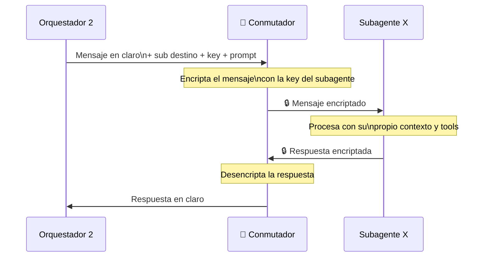

# Día 3 — Arquitectura de subagentes con niveles de acceso (WhatsApp Bot)

**Estado:** borrador de ingeniería para cuando el repo abra entregables **Día 3+** según [`CONTEXTO-POPUP-VILLAGE.md`](../../CONTEXTO-POPUP-VILLAGE.md) §10–11.

**Alineación Día 2:** niveles L0–L3, roles, `contributor_handle`, WhatsApp y política machine-enforceable en [`dia_02_gobernanza_roles_y_accesos.md`](dia_02_gobernanza_roles_y_accesos.md) y `config/policy_config.example.yaml`.

---

## Resumen

Chatbot de WhatsApp orquestado por **ROLES**. El sistema identifica al usuario, valida su nivel de acceso y lo deriva a un **Orquestador dedicado** (ej: `orc_ciudadano`, `orc_secretaria`). El acceso se valida **antes** de tocar cualquier LLM. Los mensajes entre orquestadores y subagentes viajan encriptados a través del **Conmutador**, que actúa como túnel bidireccional seguro. Cada orquestador posee las llaves de sus propios subagentes.

---

## Principios de diseño

| Principio | Descripción |
|-----------|-------------|
| **Auth primero** | El nivel de acceso se resuelve en Node.js, nunca por el LLM |
| **Orquestadores por Rol** | Cada rol oficial tiene su propio orquestador con prompt y contexto aislado |
| **Llaves por Orquestador** | Cada orquestador posee las llaves de sus propios subagentes |
| **Conmutador como túnel** | Encripta y desencripta mensajes en ambas direcciones — el mensaje no circula en claro *en el segmento* orquestador ↔ subagente (ver nota de amenazas abajo) |
| **Subagentes compartibles** | Algunos subagentes pueden ser accedidos por más de un orquestador si comparten llave |
| **Zero-token en rechazo** | Usuarios sin acceso no consumen tokens de LLM |

**Nota de modelo de amenazas:** el tráfico **WhatsApp ↔ tu backend** ya va sobre TLS. El Conmutador añade aislamiento **entre** orquestador y workers de subagente (p. ej. procesos distintos, redes distintas). Si ORC2 envía al Conmutador “mensaje en claro + key” en la misma máquina, el riesgo es el **proceso** y la **memoria** compartida; para máxima separación, valorar **wrapping** de clave (KMS/HSM) y canales IPC cifrados o mTLS entre servicios.

---

## Flujo completo

```mermaid
flowchart TD
    A([👤 Usuario\n+ Teléfono]) -->|WhatsApp Mensaje| B[WhatsApp API]
    B --> C[Check User Access\nNode.js]

    C -->|L0| REJ[Rechazo zero-token]
    C -->|L1-L3| ROUTER{Router de Rol\nNode.js}

    subgraph ORCS["🛡️ Orquestadores Dedicados\n(Anthropic Claude 3.5 Sonnet)"]
        ROUTER -->|ciudadano| ORC_C[orc_ciudadano]
        ROUTER -->|secretaria| ORC_S[orc_secretaria]
        ROUTER -->|coordinacion| ORC_CO[orc_coordinacion]
        ROUTER -->|...otros| ORC_N[Orquestador N]
    end

    ORC_C -->|Msg + Key| SW
    ORC_S -->|Msg + Key| SW
    ORC_CO -->|Msg + Key| SW
    ORC_N -->|Msg + Key| SW

    subgraph WORKERS["⚙️ Workers (Subagentes)"]
        SW[🔀 Conmutador\nAES-256-GCM]
        SW -->|🔒| Sub1[Subagente 1\n(OpenAI Embeddings)]
        SW -->|🔒| Sub2[Subagente 2\n(OpenAI Embeddings)]
        Sub1 -->|🔒| SW
        Sub2 -->|🔒| SW
    end

    subgraph KERNEL["📚 Memoria (Kernel)"]
        Sub1 --- DB[(Postgres\n+ pgvector)]
        Sub2 --- DB
    end

    SW -->|Respuesta en claro| ORCS
    ORCS --> RESP([✅ Respuesta al usuario])
```

---

## Detalle: el Conmutador (túnel bidireccional)

El Conmutador es el componente de seguridad de la Capa IA. No decide a qué subagente ir — eso ya lo sabe el Orquestador 2. Su responsabilidad es el **canal cifrado** entre orquestador y subagente según el diseño elegido.



---

## Reglas de oro

1. **Node.js decide el nivel** — el LLM nunca toma decisiones de acceso.
2. **Rechazo sin tokens** — usuarios no autorizados nunca llegan al LLM.
3. **Las llaves viven en los orquestadores** — el conmutador solo las usa en tránsito, no las almacena (idealmente ni en logs).
4. **El mensaje no viaja en claro** en el segmento que el Conmutador protege entre orquestador y subagente.
5. **Orquestador 1 no puede invocar subagentes de IA** — no tiene sus llaves.
6. **Orquestador 2 no puede invocar subagentes básicos exclusivos** — no tiene sus llaves.
7. **Subagentes compartidos** son posibles si ambos orquestadores tienen la llave del subagente.
8. **Cada subagente es ciego** — no sabe quién lo invocó ni que existen otros subagentes.
9. **Silencio ante error de clave:** Si el Conmutador no provee una clave válida o el descifrado falla, el subagente tiene prohibido emitir cualquier respuesta al orquestador (Fail-safe).

---

## Próximos pasos sugeridos

- [ ] Definir qué subagentes son exclusivos de cada orquestador y cuáles se comparten
- [ ] Elegir algoritmo de encriptación para el Conmutador (recomendado: **AES-256-GCM**)
- [ ] Configurar DB de usuarios con campo `nivel_acceso` (y vínculo a rol / L0–L3)
- [ ] Implementar el Conmutador como servicio independiente con cifrado bidireccional

---

*Documento restaurado y actualizado con la Regla de Silencio (Día 3).*
