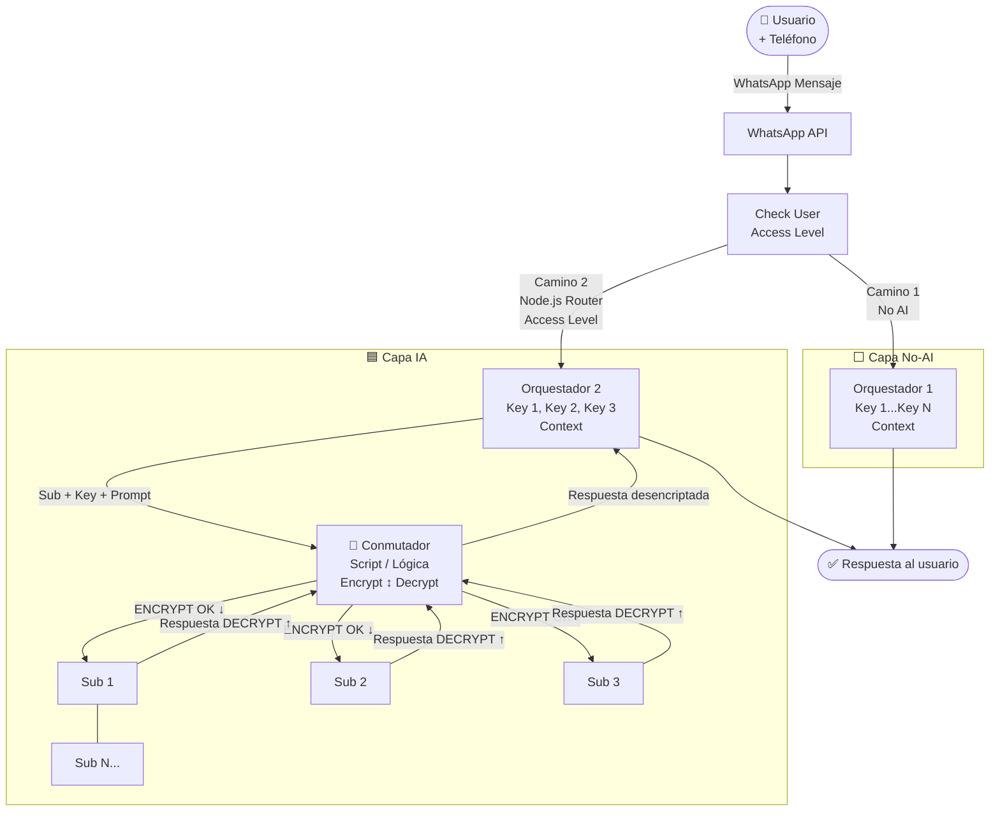
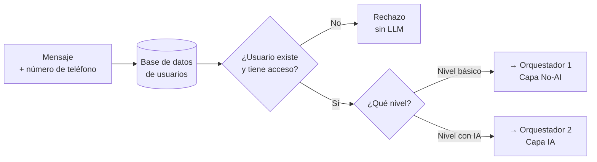
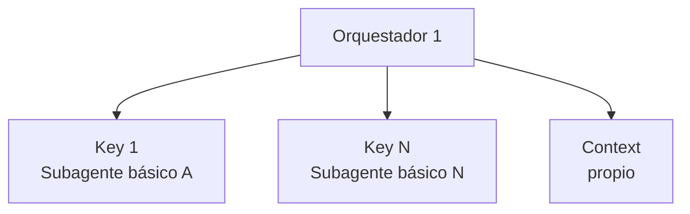
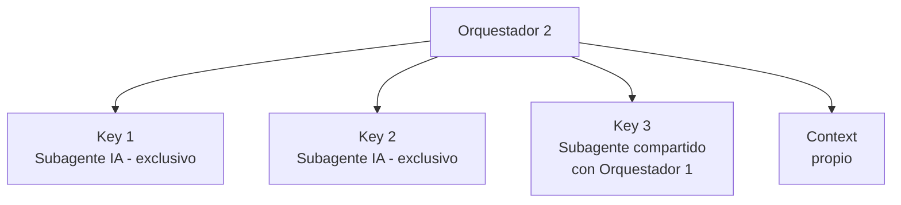
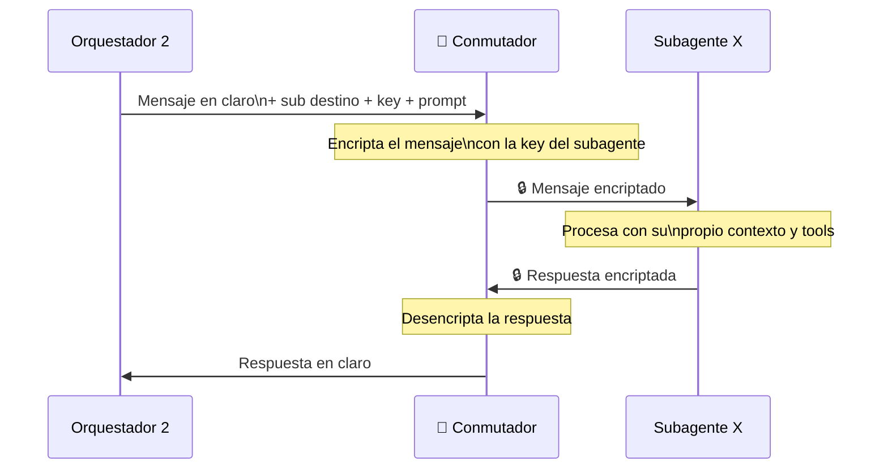
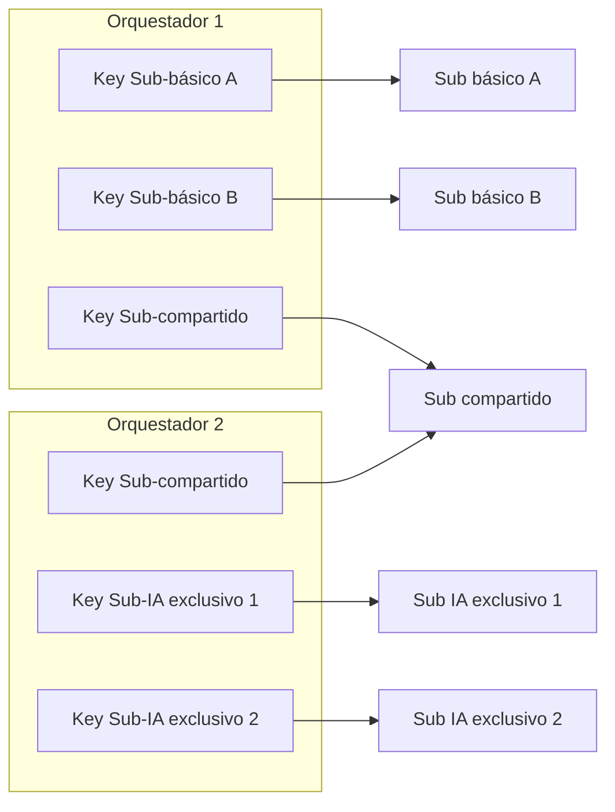
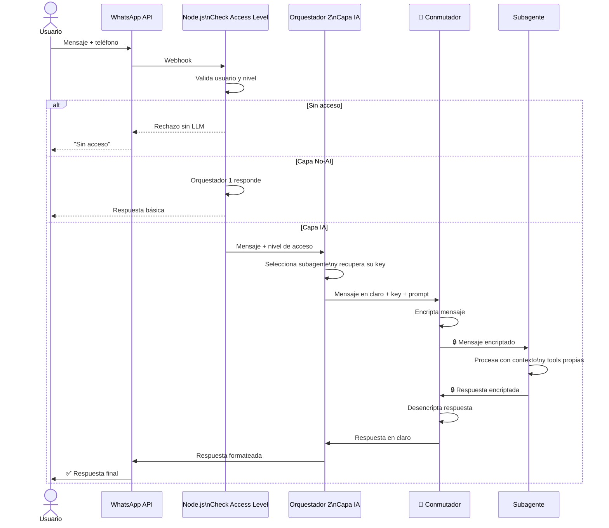

# Día 3 — Arquitectura de subagentes con niveles de acceso (WhatsApp Bot)

**Estado:** borrador de ingeniería para cuando el repo abra entregables **Día 3+** según [`CONTEXTO-POPUP-VILLAGE.md`](../../CONTEXTO-POPUP-VILLAGE.md) §10–11.

**Alineación Día 2:** niveles L0–L3, roles, `contributor_handle`, WhatsApp y política machine-enforceable en [`dia_02_gobernanza_roles_y_accesos.md`](dia_02_gobernanza_roles_y_accesos.md) y `config/policy_config.example.yaml`.

---

## Resumen

Chatbot de WhatsApp con dos capas bien diferenciadas: una **capa No-AI** para flujos básicos y una **capa IA** para flujos complejos con subagentes. El acceso se valida **antes** de tocar cualquier LLM. Los mensajes entre orquestadores y subagentes viajan encriptados a través del **Conmutador**, que actúa como túnel bidireccional seguro. Cada orquestador posee las llaves de sus subagentes, y ciertos subagentes pueden ser compartidos entre orquestadores.

---

## Principios de diseño

| Principio | Descripción |
|-----------|-------------|
| **Auth primero** | El nivel de acceso se resuelve en Node.js, nunca por el LLM |
| **Dos capas separadas** | Capa No-AI para rechazos/flujos simples, Capa IA para subagentes |
| **Llaves en el orquestador** | Cada orquestador posee las llaves de sus propios subagentes |
| **Conmutador como túnel** | Encripta y desencripta mensajes en ambas direcciones — el mensaje no circula en claro *en el segmento* orquestador ↔ subagente (ver nota de amenazas abajo) |
| **Subagentes compartibles** | Algunos subagentes pueden ser accedidos por más de un orquestador si comparten llave |
| **Zero-token en rechazo** | Usuarios sin acceso no consumen tokens de LLM |

**Nota de modelo de amenazas:** el tráfico **WhatsApp ↔ tu backend** ya va sobre TLS. El Conmutador añade aislamiento **entre** orquestador y workers de subagente (p. ej. procesos distintos, redes distintas). Si ORC2 envía al Conmutador “mensaje en claro + key” en la misma máquina, el riesgo es el **proceso** y la **memoria** compartida; para máxima separación, valorar **wrapping** de clave (KMS/HSM) y canales IPC cifrados o mTLS entre servicios.

---

## Flujo completo

---

## Detalle: Check User Access Level (Node.js)

Primer filtro — decide a qué capa va el mensaje sin tocar ningún LLM.

Mapeo sugerido con Día 2: **L0/L1** → más tráfico a capa No-AI + respuestas acotadas; **L2/L3** o intenciones que requieren modelo → Orquestador 2 (siempre tras policy).

---

## Detalle: los dos orquestadores

### Orquestador 1 — Capa No-AI

Maneja flujos que no requieren LLM: respuestas predefinidas, menús, consultas simples. Tiene sus propias llaves para los subagentes básicos que le corresponden.

### Orquestador 2 — Capa IA

Maneja flujos complejos con LLM. Tiene llaves para sus subagentes de IA. Algunos de esos subagentes pueden ser compartidos con el Orquestador 1 si ambos tienen la llave correspondiente.

**Subagentes compartidos:** si un subagente tiene sentido en ambas capas (ej. un consultor de FAQ), ambos orquestadores pueden tener su llave. El subagente no cambia — solo quién puede invocarlo.

---

## Detalle: el Conmutador (túnel bidireccional)

El Conmutador es el componente de seguridad de la Capa IA. No decide a qué subagente ir — eso ya lo sabe el Orquestador 2. Su responsabilidad es el **canal cifrado** entre orquestador y subagente según el diseño elegido.

### Lo que el Conmutador hace en cada dirección

| Dirección | Acción |
|-----------|--------|
| Orquestador → Subagente | Encripta el mensaje con la key del subagente destino |
| Subagente → Orquestador | Desencripta la respuesta y la devuelve en claro al orquestador |

### Lo que el Conmutador NO hace

- No decide a qué subagente ir
- No almacena mensajes ni llaves (por diseño; si persiste algo, debe ser acotado y auditado)
- No tiene lógica de negocio
- No puede ser interrogado sobre otros subagentes

---

## Detalle: llaves — quién tiene qué

El sub compartido puede ser invocado por ambos orquestadores porque ambos tienen su llave. Ningún orquestador puede invocar los subagentes exclusivos del otro — no tiene la llave.

---

## Flujo completo de una sesión (Capa IA)

---

## Reglas de oro

1. **Node.js decide el nivel** — el LLM nunca toma decisiones de acceso.
2. **Rechazo sin tokens** — usuarios no autorizados nunca llegan al LLM.
3. **Las llaves viven en los orquestadores** — el conmutador solo las usa en tránsito, no las almacena (idealmente ni en logs).
4. **El mensaje no viaja en claro** en el segmento que el Conmutador protege entre orquestador y subagente.
5. **Orquestador 1 no puede invocar subagentes de IA** — no tiene sus llaves.
6. **Orquestador 2 no puede invocar subagentes básicos exclusivos** — no tiene sus llaves.
7. **Subagentes compartidos** son posibles si ambos orquestadores tienen la llave del subagente.
8. **Cada subagente es ciego** — no sabe quién lo invocó ni que existen otros subagentes (ajustar si necesitas auditoría: entonces un **claim** mínimo firmado puede viajar cifrado).

---

## Próximos pasos sugeridos

- [ ] Definir qué subagentes son exclusivos de cada orquestador y cuáles se comparten
- [ ] Elegir algoritmo de encriptación para el Conmutador (recomendado: **AES-256-GCM** con nonces únicos por mensaje)
- [ ] Definir el system prompt base de cada subagente
- [ ] Decidir qué tools tiene disponible cada subagente por nivel (alineado a `policy_config`)
- [ ] Configurar DB de usuarios con campo `nivel_acceso` (y vínculo a rol / L0–L3)
- [ ] Implementar el Conmutador como servicio independiente con cifrado bidireccional
- [ ] Implementar los dos orquestadores con sus respectivos keystores
- [ ] Testear flujos por nivel antes de producción

---

*Documento aportado por el equipo; integrado al planning del repo para revisión en Día 3.*
