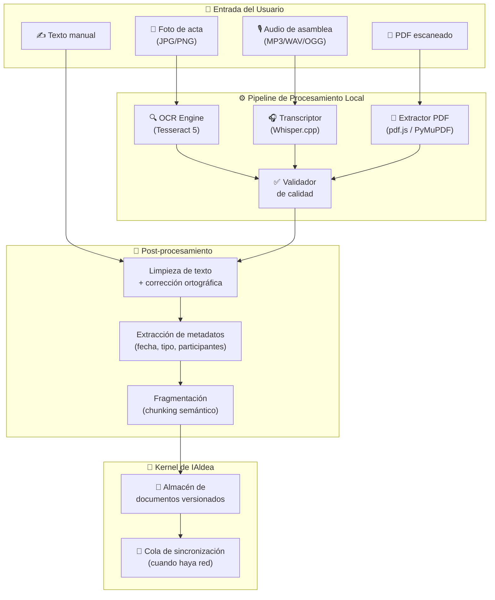
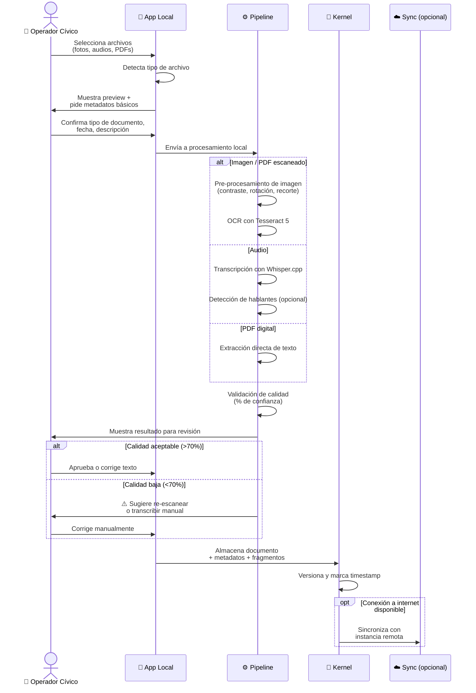
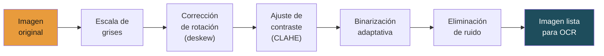
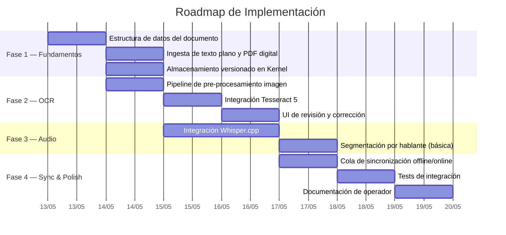

# 📦 Plan: Módulo de Ingesta Multimodal Offline

> **Capa:** 01 / Kernel — Community Memory Kernel  
> **Prioridad:** Alta  
> **Complejidad estimada:** Media-Alta  
> **Sprint sugerido:** Day 3–5 del Pop-Up City  

---

## 1. Visión General

Permitir que comunidades con conectividad limitada o nula digitalicen su memoria histórica (actas en papel, grabaciones de asambleas, fotografías de documentos) y la indexen en el Kernel de IAldea de forma completamente local.

> [!IMPORTANT]
> Este módulo es la puerta de entrada para comunidades rurales. Sin él, IAldea solo funciona para quienes ya tienen documentos digitales.

---

## 2. Diagrama de Arquitectura



---

## 3. Tipos de Entrada Soportados

| Tipo de archivo | Formatos | Motor de procesamiento | Peso típico | Tiempo estimado* |
|---|---|---|---|---|
| 📄 Imagen de documento | JPG, PNG, TIFF, HEIC | Tesseract 5 + preprocesador | 2–8 MB | 3–10 seg |
| 🎙️ Audio de asamblea | MP3, WAV, OGG, M4A | Whisper.cpp (modelo `small`) | 10–200 MB | 1–15 min |
| 📑 PDF escaneado | PDF (imagen) | Tesseract 5 vía PyMuPDF | 1–50 MB | 5–30 seg |
| 📑 PDF digital | PDF (texto) | PyMuPDF / pdf.js | 0.1–10 MB | <1 seg |
| ✍️ Texto libre | TXT, MD | Directo | <1 MB | Instantáneo |

> \* En hardware de referencia: laptop con CPU i5 de 4 núcleos, 8 GB RAM, sin GPU.

---

## 4. Flujo de Usuario



---

## 5. Estructura de Datos del Documento Ingestado

```yaml
# Ejemplo de documento procesado en el Kernel
document:
  id: "doc_2026_0614_acta_asamblea"
  type: "acta_asamblea"                  # Tipos: acta_asamblea, reglamento, minuta, oficio, audio_asamblea, foto_historica
  source_format: "image/jpeg"
  original_file: "IMG_20260614_asamblea.jpg"
  
  metadata:
    title: "Acta de asamblea ordinaria - Junio 2026"
    date_document: "2026-06-14"
    date_ingested: "2026-06-15T10:23:00-06:00"
    ingested_by: "operador_maria"
    community_id: "san_juan_mixtepec"
    tags: ["asamblea", "agua_potable", "comité_obras"]
    language: "es"
    custom_labels:                       # Plantillas de metadatos contextuales
      tipo_reunion: "ordinaria"
      barrio: "centro"
  
  processing:
    engine: "tesseract_5"
    confidence_score: 0.87               # 0.0 a 1.0
    human_reviewed: true
    reviewed_by: "operador_maria"
    review_date: "2026-06-15T10:45:00-06:00"
  
  content:
    raw_text: "..."                      # Texto completo extraído
    chunks:                              # Fragmentos para búsqueda vectorial
      - id: "chunk_001"
        text: "Se aprobó por unanimidad destinar $45,000 del fondo comunitario..."
        embedding_status: "pending"      # pending | indexed | error
      - id: "chunk_002"
        text: "El comité de agua reportó avance del 60% en la red..."
        embedding_status: "pending"
  
  versioning:
    version: 1
    changelog: []
    
  sync:
    status: "pending"                    # pending | synced | local_only
    last_sync: null
```

---

## 6. Componentes Técnicos

### 6.1 Pre-procesamiento de Imágenes



**Librería sugerida:** OpenCV (Python) o Sharp (Node.js)

### 6.2 Configuración de Whisper.cpp

| Modelo | Tamaño en disco | RAM requerida | Velocidad (1 min audio) | Precisión español |
|---|---|---|---|---|
| `tiny` | 75 MB | ~400 MB | ~5 seg | ⭐⭐ |
| `base` | 142 MB | ~500 MB | ~10 seg | ⭐⭐⭐ |
| `small` | 466 MB | ~1 GB | ~30 seg | ⭐⭐⭐⭐ |
| `medium` | 1.5 GB | ~2.5 GB | ~2 min | ⭐⭐⭐⭐⭐ |

> [!TIP]
> **Recomendación:** Usar el modelo `small` como default. Ofrece el mejor balance entre precisión en español y rendimiento en hardware modesto. Permitir al operador elegir `tiny` si el hardware es muy limitado.

### 6.3 Umbrales de Calidad

| Nivel | Score OCR/STT | Acción |
|---|---|---|
| 🟢 Alto | ≥ 85% | Indexar automáticamente, mostrar para revisión opcional |
| 🟡 Medio | 70–84% | Indexar pero marcar como "revisión sugerida" |
| 🟠 Bajo | 50–69% | Requiere corrección humana antes de indexar |
| 🔴 Ilegible | < 50% | Rechazar, sugerir re-escaneo o transcripción manual |

---

## 7. Fases de Implementación



---

## 8. Requisitos de Hardware Mínimo

| Componente | Mínimo | Recomendado |
|---|---|---|
| CPU | 2 núcleos, 1.5 GHz | 4 núcleos, 2.5 GHz |
| RAM | 4 GB | 8 GB |
| Almacenamiento | 2 GB libres | 10 GB libres |
| GPU | No requerida | Opcional (acelera Whisper) |
| OS | Linux, macOS, Windows | Linux (Raspberry Pi 4+ viable) |
| Red | **No requerida** para ingesta | Necesaria solo para sync remoto |

---

## 9. Dependencias

| Paquete | Función | Licencia | Peso |
|---|---|---|---|
| Tesseract 5 | OCR | Apache 2.0 | ~30 MB + datos de idioma |
| `tesseract-lang-spa` | Datos de español para OCR | Apache 2.0 | ~15 MB |
| Whisper.cpp | Transcripción de audio | MIT | 75 MB–1.5 GB (según modelo) |
| OpenCV / Sharp | Pre-procesamiento de imagen | Apache 2.0 / Apache 2.0 | ~50 MB |
| PyMuPDF / pdf.js | Extracción de PDF | AGPL / Apache 2.0 | ~10 MB |
| SQLite | Almacenamiento local | Public domain | Incluido |

---

## 10. Riesgos y Mitigaciones

| Riesgo | Probabilidad | Impacto | Mitigación |
|---|---|---|---|
| OCR de baja calidad en documentos viejos/maltratados | Alta | Medio | UI de corrección manual + flag de calidad |
| Whisper impreciso en acentos regionales | Media | Alto | Permitir corrección humana + fine-tuning futuro |
| Hardware insuficiente en comunidades | Media | Alto | Modelo `tiny` como fallback, procesamiento por lotes |
| Archivos muy grandes saturan la memoria | Baja | Medio | Procesamiento en streaming, límites configurables |
| Privacidad: audios con datos sensibles | Media | Alto | Procesamiento 100% local, nunca enviar audio a APIs externas |

> [!CAUTION]
> Los audios de asambleas pueden contener información sensible (nombres, conflictos, votos). El procesamiento **debe** ser completamente local. Nunca enviar audio a servicios en la nube sin consentimiento explícito documentado.

---

## 11. Métricas de Éxito

| Métrica | Objetivo MVP | Objetivo Piloto |
|---|---|---|
| Tiempo de ingesta por documento (imagen) | < 15 seg | < 10 seg |
| Precisión OCR en documentos limpios | > 80% | > 90% |
| Precisión transcripción de audio (español) | > 70% | > 85% |
| % de documentos que requieren corrección humana | < 40% | < 20% |
| Documentos ingestados sin conexión | 100% | 100% |

---

## 12. Interfaz de Usuario (Wireframe Conceptual)

```
┌─────────────────────────────────────────────────────────┐
│  📦 Ingesta de Documentos                    [Ayuda ?]  │
├─────────────────────────────────────────────────────────┤
│                                                         │
│  ┌─────────────────────────────────────────────────┐    │
│  │                                                 │    │
│  │        📁  Arrastra archivos aquí               │    │
│  │            o haz clic para seleccionar           │    │
│  │                                                 │    │
│  │   Formatos: JPG, PNG, PDF, MP3, WAV, TXT        │    │
│  └─────────────────────────────────────────────────┘    │
│                                                         │
│  ── Archivos seleccionados ──────────────────────────   │
│                                                         │
│  📄 IMG_asamblea_junio.jpg          2.3 MB    [🗑️]     │
│     Tipo: [Acta de asamblea ▾]                          │
│     Fecha del documento: [14/06/2026]                   │
│     Descripción: [Asamblea ordinaria - agua potable]    │
│                                                         │
│  🎙️ grabacion_asamblea.mp3         45.2 MB    [🗑️]     │
│     Tipo: [Audio de asamblea ▾]                         │
│     Fecha del documento: [14/06/2026]                   │
│     Descripción: [Grabación completa de la reunión]     │
│                                                         │
│  ┌─────────────────────────────────────────────────┐    │
│  │  ⚙️ Opciones de procesamiento                   │    │
│  │  Modelo de audio: [small (recomendado) ▾]       │    │
│  │  Idioma: [Español ▾]                            │    │
│  │  □ Intentar separar hablantes                   │    │
│  └─────────────────────────────────────────────────┘    │
│                                                         │
│            [ ⬆️ Procesar e Ingresar al Kernel ]         │
│                                                         │
│  Estado: 🟢 Sin conexión — los documentos se            │
│          almacenarán localmente                         │
└─────────────────────────────────────────────────────────┘
```

---

*Documento generado como parte del plan de desarrollo de IAldea.*
