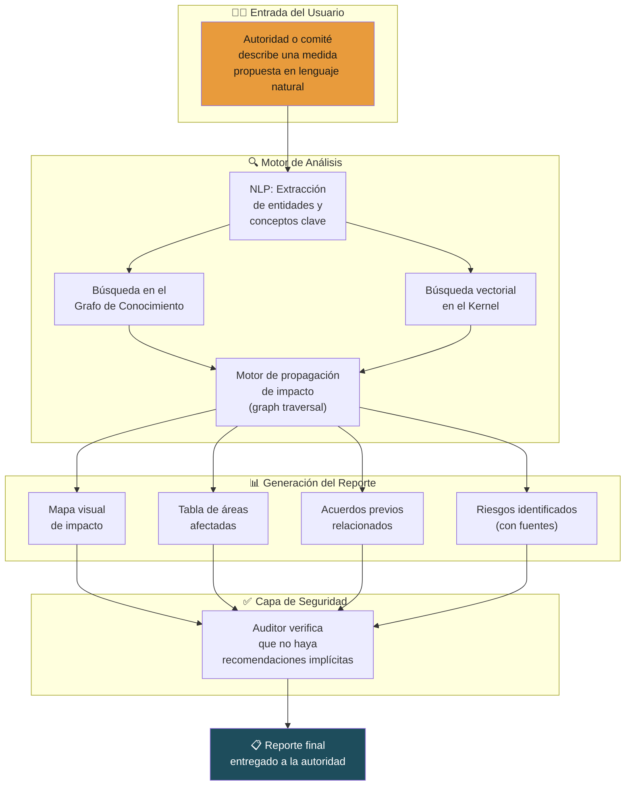
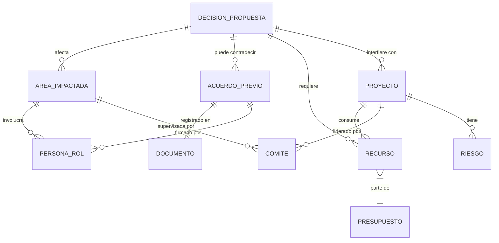
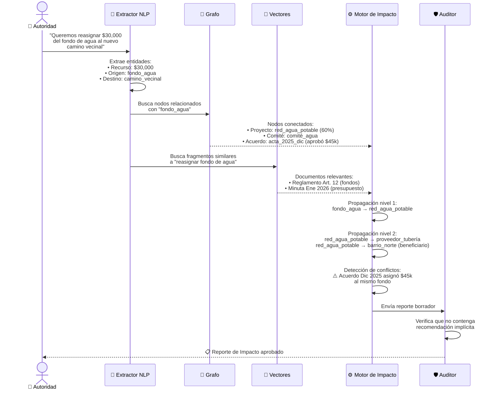
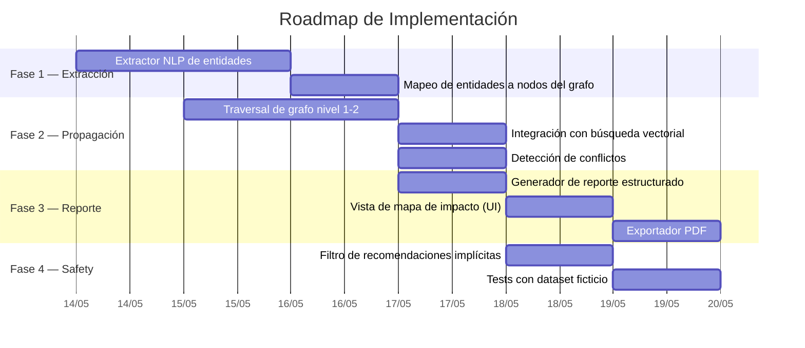
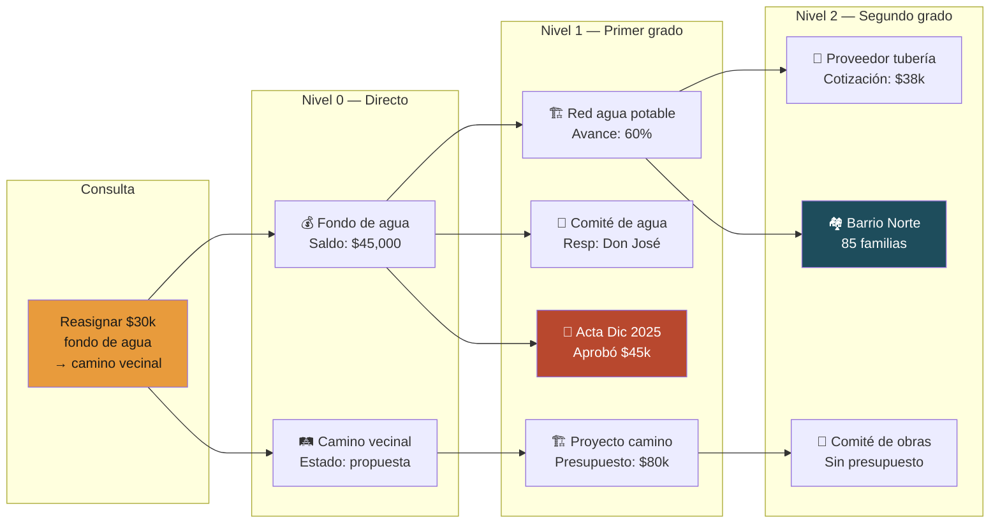

# 🔮 Plan: Análisis Predictivo de Impacto

> **Capa:** 02 / Graph — Knowledge Graph + Vectors  
> **Prioridad:** Media-Alta  
> **Complejidad estimada:** Alta  
> **Sprint sugerido:** Day 4–6 del Pop-Up City  

---

## 1. Visión General

Antes de que una comunidad tome una decisión, este módulo navega el grafo de conocimiento para revelar **qué otras áreas, proyectos, recursos y acuerdos previos** podrían verse afectados. No predice el futuro ni recomienda — **ilumina conexiones que un humano podría no ver**.

> [!IMPORTANT]
> Este módulo **nunca** recomienda una decisión. Solo muestra las relaciones existentes en la memoria comunitaria para que los humanos decidan con más contexto.

---

## 2. Diagrama de Flujo General



---

## 3. Modelo de Entidades del Grafo

El análisis predictivo opera sobre las entidades ya definidas en la arquitectura de IAldea. Aquí se muestra cómo se relacionan para este módulo:



---

## 4. Algoritmo de Propagación de Impacto

### 4.1 Proceso paso a paso



### 4.2 Niveles de Propagación

| Nivel | Alcance | Descripción | Ejemplo |
|---|---|---|---|
| **0** | Directo | La entidad mencionada explícitamente | "Fondo de agua" |
| **1** | Primer grado | Entidades directamente conectadas en el grafo | Proyecto de red de agua, Comité de agua |
| **2** | Segundo grado | Conexiones de las conexiones | Proveedor de tubería, Barrio beneficiario |
| **3** | Contextual | Entidades encontradas por similitud vectorial | Reglamentos relacionados, acuerdos históricos |

> [!TIP]
> El MVP debe implementar hasta nivel 2 de propagación. El nivel 3 (contextual) se puede agregar en la fase de pilotos cuando haya más datos reales.

---

## 5. Tipos de Impacto Detectados

| Tipo de Impacto | Icono | Descripción | Fuente de detección |
|---|---|---|---|
| **Contradicción con acuerdo previo** | ⚠️ | La medida contradice algo ya aprobado | Grafo: relación `contradice` |
| **Recurso compartido** | 💰 | El recurso afectado está comprometido en otro proyecto | Grafo: nodo `Recurso` con múltiples aristas |
| **Proyecto en curso afectado** | 🏗️ | Un proyecto activo depende de lo que se modifica | Grafo: relación `depende_de` |
| **Población impactada** | 👥 | Grupos o barrios que se benefician o perjudican | Grafo: relación `beneficiario` |
| **Precedente histórico** | 📜 | Situaciones similares ya ocurrieron antes | Vectores: similitud semántica |
| **Vacío normativo** | ❓ | No existe regulación ni precedente claro | Ausencia de nodos/documentos relacionados |

---

## 6. Formato del Reporte de Impacto

### 6.1 Estructura

```
┌─────────────────────────────────────────────────────────┐
│  🔮 Reporte de Análisis de Impacto                      │
│  Medida: "Reasignar $30,000 del fondo de agua al       │
│           nuevo camino vecinal"                          │
│  Fecha: 14 de junio de 2026                             │
│  Solicitado por: Presidente municipal                   │
├─────────────────────────────────────────────────────────┤
│                                                         │
│  📊 RESUMEN DE IMPACTO                                  │
│  ┌─────────┬──────────┬────────────┬─────────────────┐  │
│  │ Tipo    │ Cantidad │ Severidad  │ Requiere atención│  │
│  ├─────────┼──────────┼────────────┼─────────────────┤  │
│  │ ⚠️ Conflicto│ 1   │ 🔴 Alta    │ Sí              │  │
│  │ 💰 Recurso │ 2    │ 🟡 Media   │ Sí              │  │
│  │ 🏗️ Proyecto│ 1    │ 🟡 Media   │ Sí              │  │
│  │ 👥 Población│ 1   │ 🟡 Media   │ Revisar         │  │
│  │ 📜 Precedente│ 0  │ —          │ —               │  │
│  └─────────┴──────────┴────────────┴─────────────────┘  │
│                                                         │
│  ⚠️ CONFLICTO CON ACUERDO PREVIO                        │
│  ┌─────────────────────────────────────────────────┐    │
│  │ El acta de asamblea del 15 de diciembre de 2025 │    │
│  │ aprobó destinar $45,000 al fondo de agua para   │    │
│  │ el proyecto de red de agua potable.              │    │
│  │                                                 │    │
│  │ 📎 Fuente: acta_2025_dic_15.pdf, página 3       │    │
│  │ ✅ Aprobado por: asamblea general                │    │
│  └─────────────────────────────────────────────────┘    │
│                                                         │
│  💰 RECURSOS AFECTADOS                                  │
│  • Fondo de agua: saldo actual $45,000                  │
│    → Reasignación propuesta: $30,000 (67%)              │
│    → Saldo restante: $15,000                            │
│  • Compromiso existente: compra de tubería ($38,000)    │
│    📎 Fuente: cotización_tubería_feb2026.pdf            │
│                                                         │
│  🏗️ PROYECTOS EN CURSO IMPACTADOS                       │
│  • Red de agua potable (avance: 60%)                    │
│    Responsable: Comité de agua                          │
│    → Sin los $30,000 el proyecto se detiene             │
│    📎 Fuente: informe_avance_mayo2026.pdf               │
│                                                         │
│  👥 POBLACIÓN IMPACTADA                                  │
│  • Barrio Norte: 85 familias esperando la conexión      │
│    📎 Fuente: censo_beneficiarios_2025.xlsx             │
│                                                         │
│  ⚠️ Este reporte NO es una recomendación.               │
│  La decisión corresponde a la asamblea comunitaria.     │
│                                                         │
│  [📄 Exportar PDF]  [🔗 Ver en grafo]  [📤 Compartir]  │
└─────────────────────────────────────────────────────────┘
```

---

## 7. Fases de Implementación



---

## 8. Reglas de Seguridad Cívica Específicas

Este módulo es especialmente sensible porque opera cerca de la toma de decisiones. Las siguientes reglas son **inquebrantables**:

| Regla | Implementación técnica |
|---|---|
| Nunca recomendar una opción sobre otra | El Auditor escanea el reporte buscando lenguaje directivo ("debería", "es mejor", "se recomienda") |
| Siempre citar fuentes | Cada afirmación del reporte incluye referencia al documento origen |
| No inventar conexiones | Solo se reportan relaciones que **existen** en el grafo o documentos |
| Marcar incertidumbre | Si la conexión es por similitud vectorial (no explícita), se marca como "posible relación" |
| No mencionar individuos en contextos negativos | Las personas se referencian por rol, no por nombre, en impactos negativos |
| Disclaimer visible | Cada reporte incluye al final: "Este reporte NO es una recomendación" |

> [!WARNING]
> Un reporte de impacto mal diseñado puede convertirse en una herramienta de manipulación política. El Auditor debe verificar que el reporte no favorezca implícitamente ninguna postura.

---

## 9. Ejemplo de Consulta al Grafo



---

## 10. Dependencias

| Componente | Función | Dependencia interna |
|---|---|---|
| Extractor NLP | Identificar entidades en la consulta | LLM configurado (OpenAI/Anthropic/local) |
| Grafo de conocimiento | Almacenar y navegar relaciones | Capa 02 de IAldea (`packages/graph/`) |
| Búsqueda vectorial | Encontrar documentos similares | Capa 02 de IAldea (`packages/retrieval/`) |
| Auditor | Verificar neutralidad del reporte | Capa 04 de IAldea (`packages/civic-safety/`) |
| Agente de Autoridad | Interfaz de entrada y salida | Capa 03 de IAldea (`packages/agents/`) |

---

## 11. Métricas de Éxito

| Métrica | Objetivo MVP | Objetivo Piloto |
|---|---|---|
| Entidades correctamente extraídas de la consulta | > 75% | > 90% |
| Relaciones relevantes encontradas en grafo | > 60% de las existentes | > 80% |
| Falsos positivos (relaciones irrelevantes) | < 30% | < 15% |
| Tiempo de generación del reporte | < 30 seg | < 15 seg |
| Reportes que pasan el filtro del Auditor sin edición | > 90% | > 95% |
| Conflictos con acuerdos previos detectados correctamente | > 70% | > 90% |

---

*Documento generado como parte del plan de desarrollo de IAldea.*
