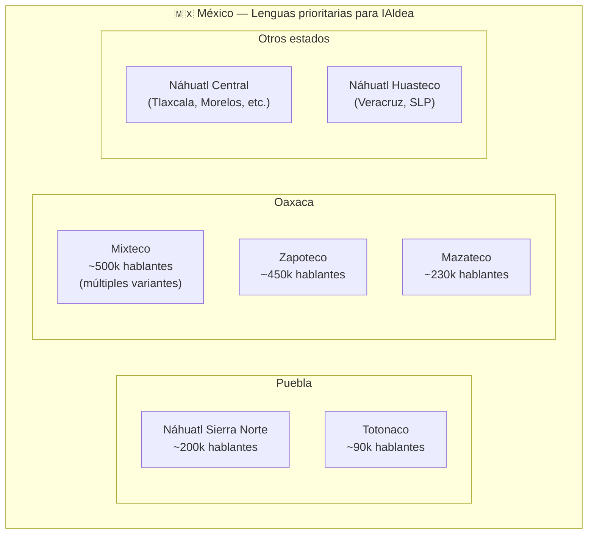
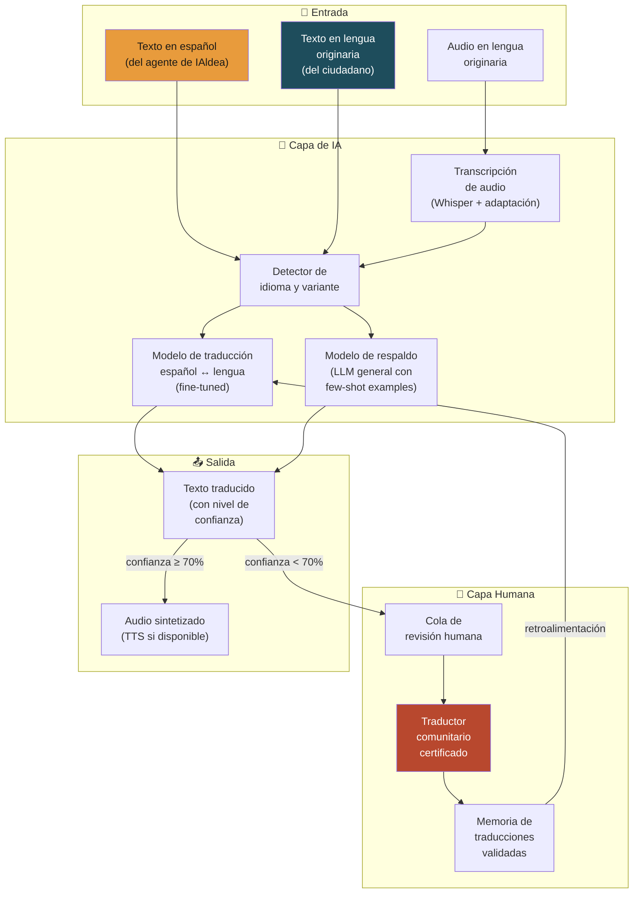
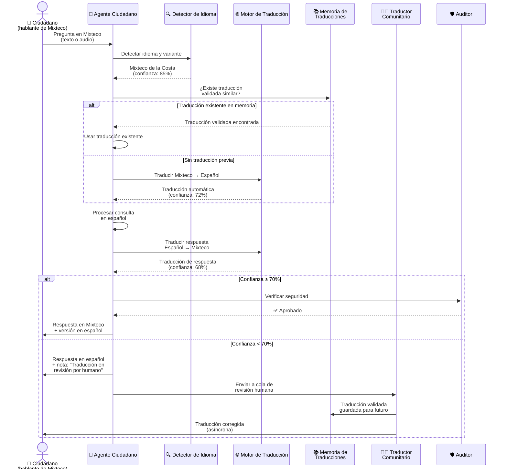
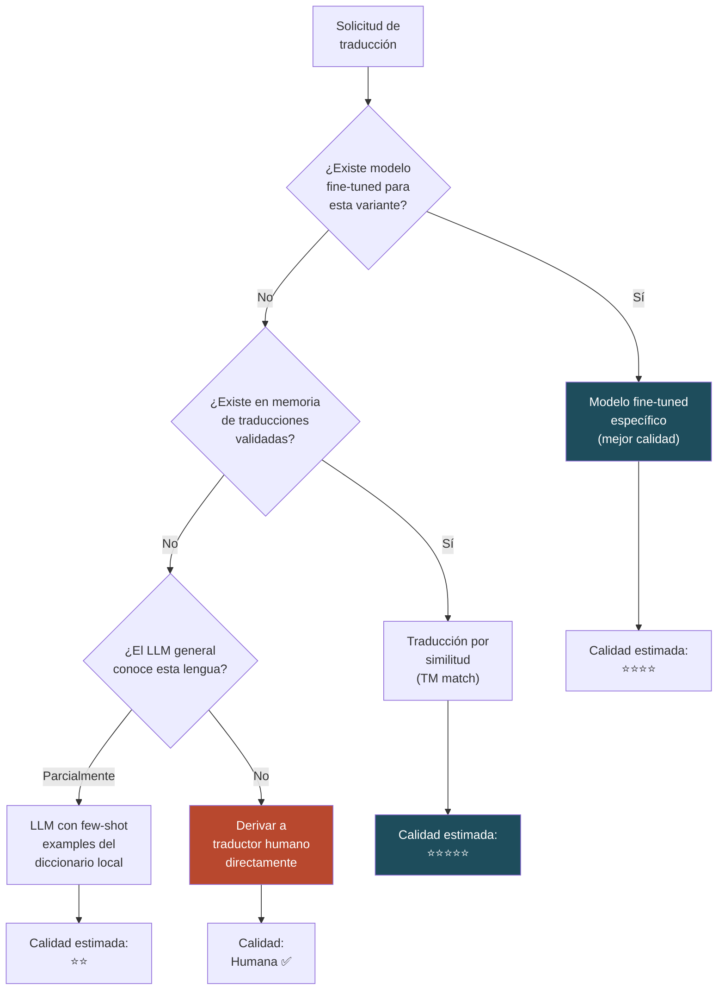
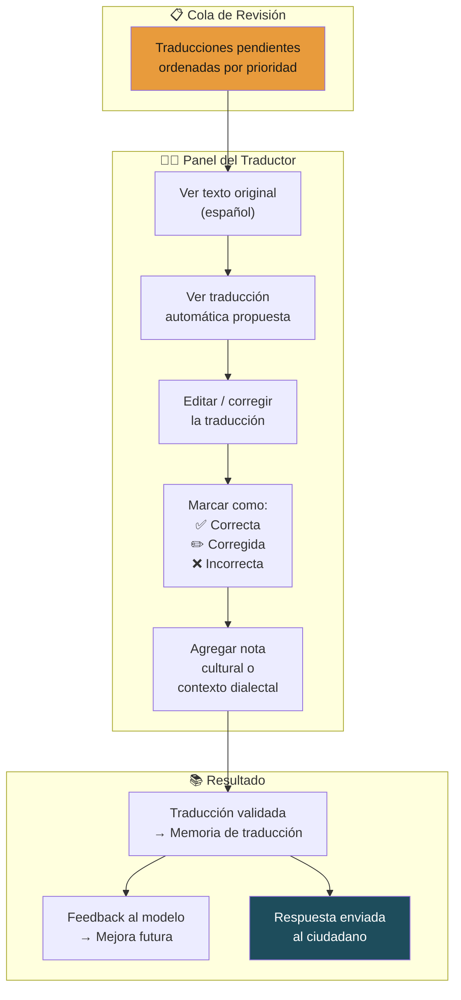
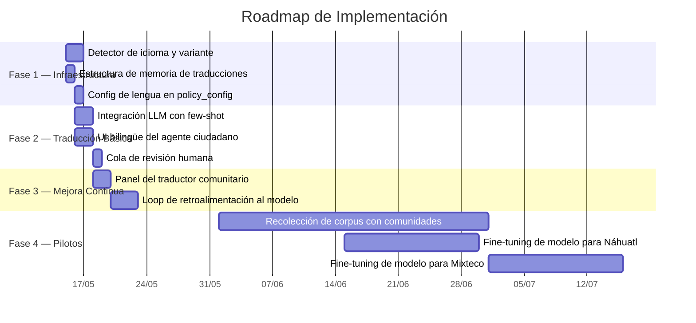

# 🌐 Plan: Módulo de Traducción a Lenguas Originarias

> **Capa:** 03 / Agents — Citizen + Authority + Committee  
> **Prioridad:** Alta (diferenciador social clave)  
> **Complejidad estimada:** Alta  
> **Sprint sugerido:** Day 5–7 del Pop-Up City + iteración en pilotos  

---

## 1. Visión General

Integrar capacidades de traducción y comunicación en **lenguas originarias de México** (Náhuatl, Mixteco, Zapoteco, entre otras) para que los agentes de IAldea puedan explicar documentos, responder consultas y recoger feedback en el idioma materno de los ciudadanos.

Este no es solo un módulo de traducción automática. Es un **sistema híbrido** que combina modelos de IA con validación de traductores humanos locales, reconociendo que:

- Muchas lenguas originarias tienen variantes dialectales por región.
- Los corpus digitales disponibles son muy limitados.
- La confianza de la comunidad depende de la precisión cultural, no solo lingüística.

> [!IMPORTANT]
> Las lenguas originarias no son un "extra". En muchas comunidades objetivo de IAldea, el español es la segunda lengua. Sin este módulo, IAldea excluye precisamente a quienes más necesitan acceso a información pública.

---

## 2. Mapa de Lenguas Objetivo

### 2.1 Fase de Pilotos (Oaxaca + Puebla)

| Lengua | Hablantes en México | Variantes principales | Recursos digitales disponibles | Prioridad |
|---|---|---|---|---|
| **Náhuatl** | ~1,700,000 | Central, Huasteco, Sierra Norte | Medio (diccionarios, corpus INALI) | 🔴 Alta |
| **Mixteco** | ~500,000 | Costa, Mixteca Alta, Baja | Bajo (fragmentado por variante) | 🔴 Alta |
| **Zapoteco** | ~450,000 | Sierra Norte, Istmo, Valles | Bajo-Medio | 🟡 Media |
| **Mazateco** | ~230,000 | Sierra, Tierra Baja | Muy bajo | 🟢 Futura |
| **Chinanteco** | ~130,000 | Múltiples variantes | Muy bajo | 🟢 Futura |

### 2.2 Distribución geográfica relevante



---

## 3. Arquitectura del Sistema Híbrido



---

## 4. Flujo de Traducción (Detallado)



---

## 5. Estrategia de Modelos de Traducción

### 5.1 Enfoque por capas (fallback chain)



### 5.2 Recursos de entrenamiento por lengua

| Recurso | Náhuatl | Mixteco | Zapoteco |
|---|---|---|---|
| Diccionario INALI digital | ✅ Disponible | ✅ Parcial | ✅ Parcial |
| Corpus paralelo español-lengua | ~50k pares | ~10k pares | ~15k pares |
| Biblia traducida (corpus) | ✅ Múltiples variantes | ✅ Algunas variantes | ✅ Algunas variantes |
| Wikipedia en la lengua | ✅ ~12k artículos | ❌ No existe | ❌ No existe |
| Modelos pre-entrenados | Helsinki-NLP (básico) | ❌ No existe | ❌ No existe |
| Proyectos comunitarios de digitalización | Varios activos | Pocos | Algunos |

> [!NOTE]
> Para lenguas con pocos recursos digitales (Mixteco, Zapoteco), la estrategia principal es **acumular una memoria de traducciones validadas por humanos** que funcione como corpus de entrenamiento progresivo.

---

## 6. Flujo del Traductor Comunitario

El traductor comunitario es un **rol clave** en el sistema. Es una persona bilingüe de la comunidad que valida traducciones automáticas y construye la memoria de traducción.



### Compensación del Traductor Comunitario

| Modelo | Descripción |
|---|---|
| **Voluntario** | Miembros de la comunidad que colaboran por compromiso cívico |
| **Micro-compensación** | Pago por traducción validada (ej. $5–15 MXN por fragmento) |
| **Servicio social** | Estudiantes de universidades locales que ganan créditos |
| **Cargo comunitario** | Integrado como parte de un tequio o faena digital |

---

## 7. Interfaz de Usuario Bilingüe

### 7.1 Chat del Agente Ciudadano (modo bilingüe)

```
┌─────────────────────────────────────────────────────────┐
│  🤖 IAldea — Agente Ciudadano          🌐 Mixteco Costa │
├─────────────────────────────────────────────────────────┤
│                                                         │
│  👤 Ciudadano:                                          │
│  ┌─────────────────────────────────────────────────┐    │
│  │ Ndáka kivi kúu asamblea?                        │    │
│  │ ─────────────────────────────────               │    │
│  │ 🔤 (ES) ¿Cuándo es la asamblea?                 │    │
│  └─────────────────────────────────────────────────┘    │
│                                                         │
│  🤖 IAldea:                                             │
│  ┌─────────────────────────────────────────────────┐    │
│  │ Asamblea kúu kivi domingo 22 de junio,          │    │
│  │ hora iin (1:00 PM), ini auditorio municipal.    │    │
│  │ ─────────────────────────────────               │    │
│  │ 🔤 (ES) La asamblea es el domingo 22 de junio, │    │
│  │ a la 1:00 PM, en el auditorio municipal.        │    │
│  │                                                 │    │
│  │ 📎 Fuente: convocatoria_jun_2026.pdf            │    │
│  │ 🔵 Traducción: automática (confianza: 78%)      │    │
│  └─────────────────────────────────────────────────┘    │
│                                                         │
│  ┌─────────────────────────────────────────────────┐    │
│  │ Escribir en Mixteco o Español...          [📎🎤]│    │
│  └─────────────────────────────────────────────────┘    │
│                                                         │
│  [🌐 Cambiar idioma ▾]  [📊 Traducción verificada: 45%]│
└─────────────────────────────────────────────────────────┘
```

### 7.2 Indicadores de confianza

| Indicador | Significado | Visual |
|---|---|---|
| 🟢 Verificada | Traducción validada por humano | Borde verde + ícono ✅ |
| 🔵 Automática (alta) | Confianza ≥ 70% | Borde azul + porcentaje |
| 🟡 Automática (media) | Confianza 50–69% | Borde amarillo + advertencia |
| 🔴 Aproximada | Confianza < 50% | Borde rojo + "Pida ayuda a un traductor" |

---

## 8. Estructura de Datos

### 8.1 Memoria de Traducción

```yaml
# Ejemplo de entrada en la memoria de traducciones
translation_memory:
  - id: "tm_001"
    source_lang: "es"
    target_lang: "mix_costa"            # ISO 639-3 + variante
    source_text: "La próxima asamblea será el domingo"
    target_text: "Asamblea kúu kivi domingo"
    
    validation:
      status: "human_validated"         # auto | human_validated | rejected
      validated_by: "traductor_ana"
      validated_date: "2026-06-20"
      confidence_auto: 0.72
      notes: "En la variante de Pinotepa se dice 'kuvi' en lugar de 'kúu'"
    
    usage:
      times_used: 14
      last_used: "2026-07-01"
      community_id: "san_juan_mixtepec"
    
    domain: "procedimientos"            # Dominio temático para mejor matching
```

### 8.2 Configuración de lengua por comunidad

```yaml
# En policy_config.yaml de cada comunidad
language:
  primary: "mix_costa"                  # Lengua principal de la comunidad
  secondary: "es"                       # Español siempre disponible
  display_mode: "bilingual"             # bilingual | primary_only | secondary_only
  
  translation:
    auto_translate: true
    min_confidence_auto_display: 0.70   # Umbral para mostrar sin revisión humana
    fallback_to_spanish: true           # Si no puede traducir, mostrar en español
    
  human_translators:
    - id: "traductor_ana"
      name: "Ana López"
      languages: ["mix_costa", "es"]
      active: true
    - id: "traductor_pedro"
      name: "Pedro García"
      languages: ["mix_costa", "mix_alta", "es"]
      active: true
  
  dictionary:
    local_terms:                        # Términos comunitarios específicos
      tequio: "trabajo comunitario obligatorio"
      faena: "jornada de trabajo colectivo"
      topil: "encargado de vigilancia comunitaria"
```

---

## 9. Fases de Implementación



---

## 10. Consideraciones Éticas y Culturales

> [!CAUTION]
> Las lenguas originarias no son una "feature". Son la identidad de los pueblos. Este módulo debe ser co-diseñado con hablantes nativos y líderes culturales, no impuesto desde afuera.

| Principio | Implementación |
|---|---|
| **Soberanía lingüística** | La comunidad decide qué variante se usa y cómo se escriben las palabras |
| **No extractivismo de datos** | Los corpus generados pertenecen a la comunidad, no a IAldea |
| **Reconocimiento de variantes** | Nunca imponer una variante "estándar"; cada comunidad usa la suya |
| **Crédito a traductores** | Las traducciones validadas llevan crédito del traductor (si consiente) |
| **Derecho a la opacidad** | Si una comunidad no quiere que su lengua se use para entrenar IA, se respeta |
| **Prioridad al humano** | En temas sensibles, siempre derivar a traductor humano |

---

## 11. Dependencias Externas

| Recurso | Tipo | Acceso | Uso |
|---|---|---|---|
| INALI (Instituto Nacional de Lenguas Indígenas) | Institución | Público | Diccionarios, catálogos de variantes |
| Proyecto Axolotl (UNAM) | Corpus NLP | Abierto | Datos de entrenamiento para Náhuatl |
| Wikimedia Incubator | Corpus | Abierto | Textos en diversas lenguas originarias |
| Bible.is | Corpus paralelo | Abierto | Traducciones paralelas (español ↔ lengua) |
| Comunidades locales | Conocimiento | Consentido | Validación, variantes, contexto cultural |
| Helsinki-NLP / HuggingFace | Modelos | Abierto | Modelos base de traducción |

---

## 12. Métricas de Éxito

| Métrica | Objetivo MVP | Objetivo Piloto |
|---|---|---|
| Lenguas soportadas | 1 (Náhuatl básico) | 3 (Náhuatl, Mixteco, Zapoteco) |
| Detección correcta de idioma | > 80% | > 95% |
| Traducciones auto con confianza ≥ 70% | > 30% | > 60% |
| Traducciones validadas por humano en memoria | 100+ pares | 1,000+ pares |
| Tiempo de respuesta del traductor humano | < 24 horas | < 4 horas |
| Satisfacción del ciudadano con la traducción | — | > 70% "comprensible" |
| Traductores comunitarios activos por comunidad | 1 | 2–3 |

---

## 13. Riesgos y Mitigaciones

| Riesgo | Probabilidad | Impacto | Mitigación |
|---|---|---|---|
| Calidad insuficiente de traducción automática | Alta | Alto | Sistema híbrido: humano siempre como respaldo |
| No encontrar traductores comunitarios | Media | Alto | Alianzas con universidades locales y INALI |
| Variante dialectal no reconocida | Alta | Medio | Permitir configuración manual de variante por comunidad |
| Rechazo cultural ("la máquina no habla como nosotros") | Media | Alto | Co-diseño con la comunidad desde día 1 |
| Apropiación cultural de datos lingüísticos | Baja | Muy Alto | Licencia comunitaria sobre corpus, derecho a la opacidad |

---

*Documento generado como parte del plan de desarrollo de IAldea.*
