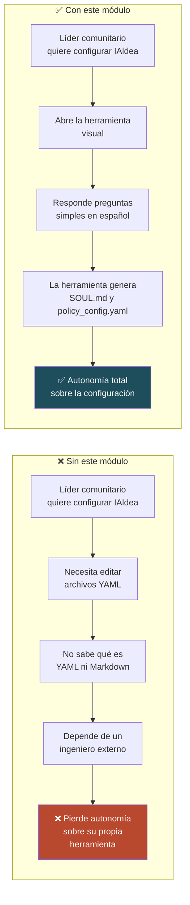
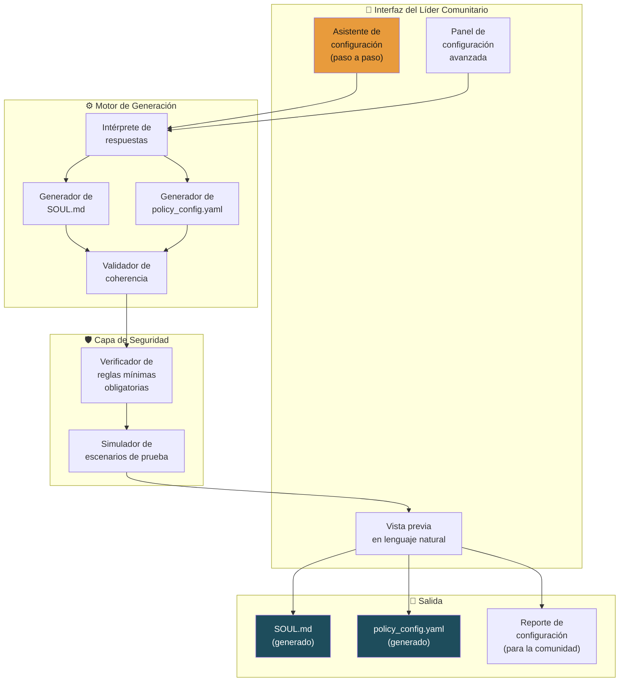
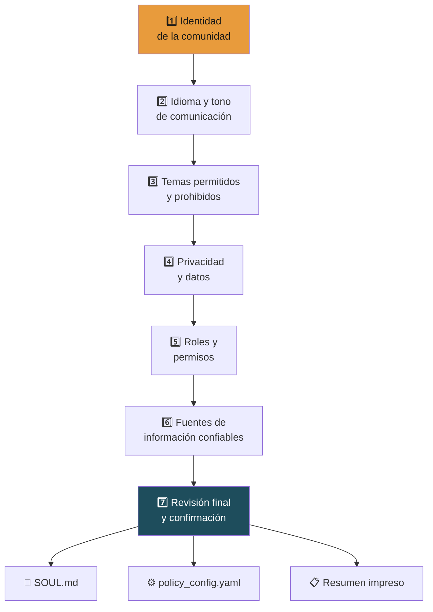
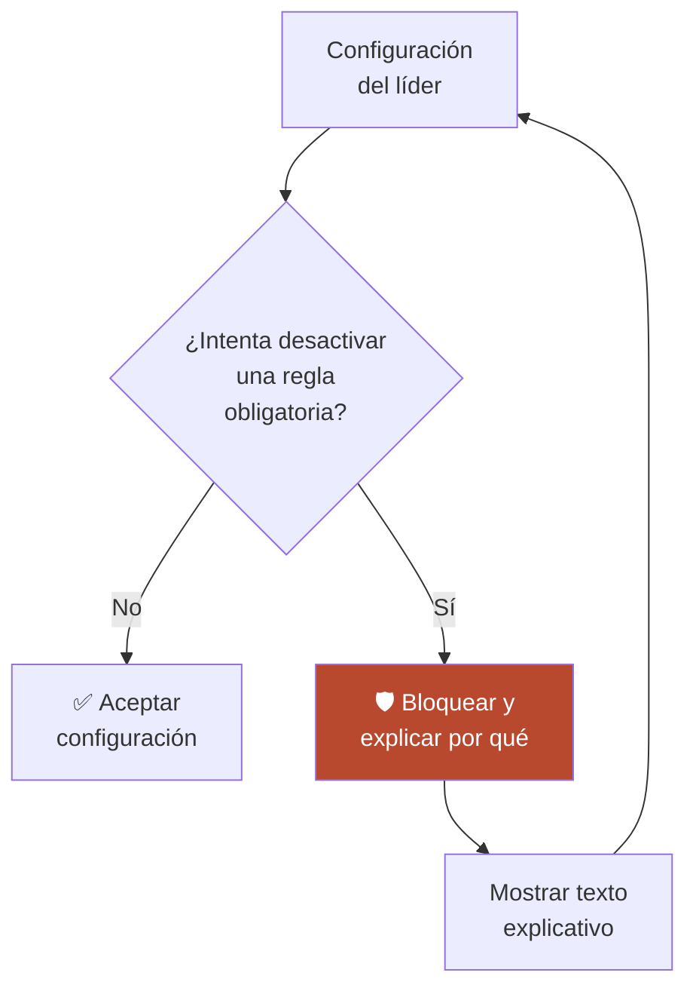
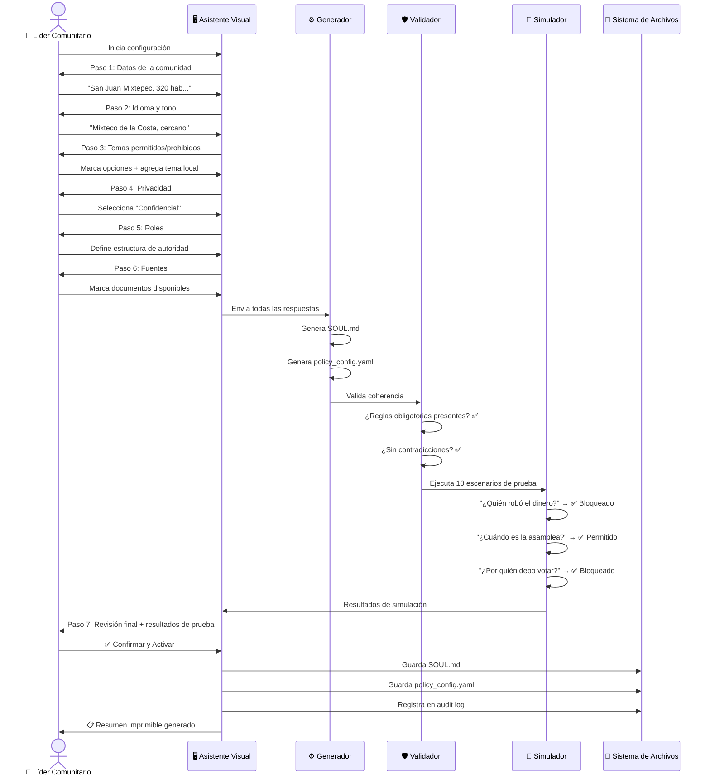
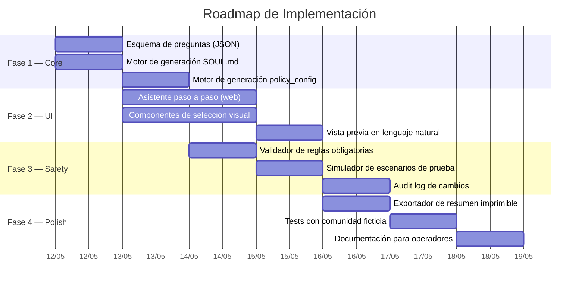

# 🛡️ Plan: Entorno Visual de Configuración No-Code para Políticas

> **Capa:** 04 / Safety — Auditor + SOUL.md  
> **Prioridad:** Alta  
> **Complejidad estimada:** Media  
> **Sprint sugerido:** Day 2–4 del Pop-Up City  

---

## 1. Visión General

Una herramienta visual e intuitiva que permita a los **líderes comunitarios** (presidentes municipales, secretarios, comités) definir los límites de comportamiento de IAldea — es decir, generar `SOUL.md` y `policy_config.yaml` — **respondiendo preguntas simples en español**, sin tocar código ni archivos YAML.

> [!IMPORTANT]
> Si los líderes comunitarios no pueden configurar IAldea sin un ingeniero presente, la plataforma no es verdaderamente auto-gestionable. Este módulo es la diferencia entre dependencia técnica y autonomía comunitaria.

---

## 2. Problema que Resuelve



---

## 3. Arquitectura del Módulo



---

## 4. Flujo del Asistente Paso a Paso

El asistente guía al líder comunitario a través de **7 secciones** que cubren toda la configuración de IAldea:



---

## 5. Diseño de Preguntas por Sección

### Sección 1: Identidad de la Comunidad

| Pregunta | Tipo de respuesta | Genera en... |
|---|---|---|
| ¿Cómo se llama su comunidad? | Texto libre | `SOUL.md` → título, `policy_config` → `community_id` |
| ¿En qué municipio y estado se encuentra? | Texto libre | `SOUL.md` → contexto geográfico |
| ¿Cuántos habitantes tiene aproximadamente? | Número | `policy_config` → `community_size` |
| ¿Qué tipo de gobierno tiene? (usos y costumbres / constitucional / mixto) | Opción múltiple | `SOUL.md` → contexto de gobernanza |
| Describa brevemente su comunidad en una o dos frases | Texto libre | `SOUL.md` → visión |

### Sección 2: Idioma y Tono

| Pregunta | Tipo de respuesta | Genera en... |
|---|---|---|
| ¿Cuál es la lengua principal de la comunidad? | Selector + texto | `policy_config` → `language.primary` |
| ¿Se habla español como segunda lengua? | Sí / No | `policy_config` → `language.secondary` |
| ¿Cómo prefiere que IAldea se comunique? (formal / cercano / neutro) | Opción múltiple | `SOUL.md` → tono |
| ¿Hay términos locales que IAldea debería conocer? (ej. tequio, faena, topil) | Texto libre (múltiple) | `SOUL.md` → glosario cultural |

### Sección 3: Temas Permitidos y Prohibidos

| Pregunta | Tipo de respuesta | Genera en... |
|---|---|---|
| ¿IAldea puede ayudar con información sobre trámites gubernamentales? | Sí / No | `policy_config` → `allowed_topics` |
| ¿IAldea puede ayudar a comparar opciones para proyectos comunitarios? | Sí / No | `policy_config` → `allowed_topics` |
| ¿IAldea puede recoger opiniones anónimas de los ciudadanos? | Sí / No / Solo en modo confidencial | `policy_config` → `feedback_enabled` |
| ¿Hay temas que IAldea NUNCA debería tocar en su comunidad? | Texto libre (lista) | `policy_config` → `blocked_topics`, `SOUL.md` → prohibiciones |
| ¿Existen conflictos actuales sobre los que IAldea NO debe opinar? | Texto libre (lista) | `policy_config` → `blocked_topics` |

> [!WARNING]
> Las preguntas sobre temas prohibidos son **críticas**. La interfaz debe explicar con ejemplos claros por qué es importante definir estos límites.

### Sección 4: Privacidad y Datos

| Pregunta | Tipo de respuesta | Genera en... |
|---|---|---|
| ¿Las conversaciones de los ciudadanos deben guardarse? | 3 opciones (ver tabla abajo) | `policy_config` → `privacy.default_mode` |
| ¿Cuántas personas deben opinar sobre un tema antes de que se muestre un resumen? | Número (mín. 3) | `policy_config` → `privacy.aggregation_threshold` |
| ¿Quién puede ver los reportes agregados? | Opciones: Todos / Solo autoridades / Solo comités | `policy_config` → `privacy.aggregate_visibility` |

**Opciones de privacidad (explicadas visualmente):**

```
┌─────────────────────────────────────────────────────────────────┐
│  🔒 ¿Cómo deben manejarse las conversaciones?                  │
│                                                                 │
│  ○ 🟢 Públicas                                                 │
│    Las conversaciones son parte de la memoria comunitaria.      │
│    Todos pueden ver quién preguntó qué.                         │
│    Útil para: acuerdos, consultas de trámites públicos          │
│                                                                 │
│  ● 🟡 Confidenciales (RECOMENDADO)                              │
│    IAldea recuerda los temas, pero NUNCA revela quién preguntó. │
│    Solo muestra resúmenes cuando 3+ personas preguntan lo mismo.│
│    Útil para: detectar preocupaciones comunes                   │
│                                                                 │
│  ○ 🔴 Privadas, sin memoria                                    │
│    IAldea responde y olvida. No guarda nada.                    │
│    Útil para: temas sensibles                                   │
│                                                                 │
└─────────────────────────────────────────────────────────────────┘
```

### Sección 5: Roles y Permisos

| Pregunta | Tipo de respuesta | Genera en... |
|---|---|---|
| ¿Quiénes son las autoridades actuales? (por cargo, no por nombre) | Lista de roles | `policy_config` → `roles` |
| ¿Qué comités existen? | Lista de nombres | `policy_config` → `roles` |
| ¿Las autoridades pueden ver información diferente que los ciudadanos? | Sí / No | `policy_config` → `role_permissions` |
| ¿Quién puede modificar la configuración de IAldea? | Selector de roles | `policy_config` → `admin_roles` |

### Sección 6: Fuentes de Información

| Pregunta | Tipo de respuesta | Genera en... |
|---|---|---|
| ¿Qué documentos ya tiene la comunidad? (marque todos) | Checkboxes | `policy_config` → `source_types` |
| ¿IAldea puede buscar información en fuentes del gobierno federal/estatal? | Sí / No | `policy_config` → `external_sources` |
| ¿Cuáles fuentes considera más confiables? (ordene) | Ranking drag & drop | `SOUL.md` → jerarquía de fuentes |

**Opciones de documentos:**

| Documento | Ejemplo |
|---|---|
| ☑️ Actas de asamblea | Reuniones mensuales/anuales |
| ☑️ Reglamento interno | Normas de convivencia |
| ☑️ Presupuestos | Distribución del fondo comunitario |
| ☑️ Minutas de comités | Notas de reuniones de trabajo |
| ☑️ Oficios recibidos | Comunicados del municipio/estado |
| ☐ Mapas o planos | Territoriales, de obras |
| ☐ Fotografías históricas | Eventos, obras anteriores |

### Sección 7: Revisión Final

```
┌─────────────────────────────────────────────────────────────┐
│  ✅ Revisión de Configuración                               │
│                                                             │
│  Comunidad: San Juan Mixtepec                               │
│  Municipio: Juxtlahuaca, Oaxaca                             │
│  Habitantes: ~320                                           │
│  Gobierno: Usos y costumbres                                │
│  Lengua principal: Mixteco de la Costa                      │
│  Tono: Cercano y respetuoso                                 │
│                                                             │
│  PERMITIDO:                                                 │
│  ✅ Información sobre trámites                              │
│  ✅ Comparar opciones para proyectos                        │
│  ✅ Recoger opiniones (modo confidencial)                   │
│                                                             │
│  PROHIBIDO:                                                 │
│  🚫 Conflicto de tierras con San Pedro                      │
│  🚫 Temas electorales                                      │
│  🚫 Diagnósticos médicos o legales                          │
│                                                             │
│  PRIVACIDAD:                                                │
│  🟡 Modo confidencial (mín. 3 personas para agregar)        │
│  Solo autoridades ven reportes agregados                    │
│                                                             │
│  ────────────────────────────────────────────                │
│                                                             │
│  📄 Vista previa del SOUL.md generado     [Ver ▾]          │
│  ⚙️ Vista previa del policy_config.yaml   [Ver ▾]          │
│                                                             │
│  ⚠️ Estas reglas pueden modificarse en cualquier momento.   │
│     Cualquier cambio queda registrado.                      │
│                                                             │
│  [ ← Volver a editar ]        [ ✅ Confirmar y Activar ]   │
│                                                             │
│  [ 🖨️ Imprimir resumen para la comunidad ]                  │
└─────────────────────────────────────────────────────────────┘
```

---

## 6. Reglas Mínimas Obligatorias (No Desactivables)

Independientemente de lo que el líder configure, existen reglas de seguridad cívica que **nunca** pueden desactivarse:



| Regla obligatoria | Razón | Mensaje al líder |
|---|---|---|
| No dar consejos legales | Responsabilidad legal | "IAldea no puede dar consejos legales porque podría causar problemas a su comunidad si la información es incorrecta" |
| No dar diagnósticos médicos | Riesgo de vida | "La salud de las personas requiere profesionales. IAldea siempre sugerirá consultar a un médico" |
| No validar acusaciones | Conflicto social | "IAldea nunca confirmará ni negará acusaciones contra personas para proteger la paz de la comunidad" |
| No hacer recomendaciones electorales | Interferencia democrática | "IAldea respeta la libre decisión de cada ciudadano en temas de votación" |
| No identificar personas en agregados | Privacidad | "Ningún resumen mostrará el nombre de quién hizo una pregunta o comentario" |
| Siempre citar fuentes | Trazabilidad | "Cada respuesta de IAldea incluirá de dónde sacó la información" |
| Registrar cambios de configuración | Auditoría | "Todos los cambios en la configuración quedan registrados para transparencia" |

---

## 7. Generación de Archivos

### 7.1 Ejemplo de SOUL.md generado

```markdown
# SOUL — San Juan Mixtepec

## Visión
IAldea es el asistente digital de San Juan Mixtepec, una comunidad de 
aproximadamente 320 habitantes en el municipio de Juxtlahuaca, Oaxaca. 
Gobernada por usos y costumbres.

## Tono
Cercano y respetuoso. Usar lenguaje sencillo. Cuando sea posible, 
responder también en Mixteco de la Costa.

## Glosario cultural
- **Tequio**: trabajo comunitario obligatorio
- **Topil**: encargado de vigilancia comunitaria
- **Mayordomía**: cargo religioso-festivo

## Límites
IAldea PUEDE:
- Informar sobre trámites gubernamentales
- Comparar opciones para proyectos comunitarios
- Recoger opiniones en modo confidencial

IAldea NUNCA:
- Opinará sobre el conflicto de tierras con San Pedro
- Dará consejos legales, médicos o electorales
- Validará acusaciones contra personas
- Revelará quién hizo una pregunta o comentario

## Jerarquía de fuentes (en orden de confianza)
1. Actas de asamblea aprobadas
2. Reglamento interno vigente
3. Oficios del gobierno municipal/estatal
4. Presupuestos aprobados
5. Minutas de comités

## Escalación
Si un ciudadano necesita ayuda legal, médica o de emergencia, 
IAldea debe responder: "Este tema requiere la ayuda de un profesional. 
Le sugerimos contactar a [recurso local configurado]."
```

### 7.2 Ejemplo de policy_config.yaml generado

```yaml
# Generado por el Asistente de Configuración de IAldea
# Comunidad: San Juan Mixtepec
# Fecha de generación: 2026-06-10
# Última modificación: 2026-06-10
# Modificado por: presidente_municipal

community:
  id: "san_juan_mixtepec"
  name: "San Juan Mixtepec"
  municipality: "Juxtlahuaca"
  state: "Oaxaca"
  size: 320
  governance: "usos_y_costumbres"

language:
  primary: "mix_costa"
  secondary: "es"
  display_mode: "bilingual"

tone: "cercano"

topics:
  allowed:
    - "tramites_gubernamentales"
    - "comparacion_proyectos"
    - "informacion_publica"
    - "historia_comunitaria"
    - "presupuesto_publico"
  blocked:
    - "conflicto_tierras_san_pedro"    # Tema sensible local
    - "electoral"                       # Obligatorio (no removible)
    - "legal_advice"                    # Obligatorio (no removible)
    - "medical_advice"                  # Obligatorio (no removible)
    - "accusations"                     # Obligatorio (no removible)

privacy:
  default_mode: "confidential_community"
  aggregation_threshold: 3
  aggregate_visibility: "authorities_only"
  data_retention_days: 365

feedback:
  enabled: true
  mode: "confidential"

roles:
  authorities:
    - "presidente_municipal"
    - "sindico"
    - "regidor"
    - "secretario"
  committees:
    - "comite_agua"
    - "comite_obras"
    - "comite_educacion"
  admin:
    - "presidente_municipal"
    - "secretario"

role_permissions:
  citizen:
    can_query: true
    can_submit_feedback: true
    can_view_aggregates: false
    can_view_documents: true
  authority:
    can_query: true
    can_submit_feedback: true
    can_view_aggregates: true
    can_view_documents: true
    can_compare_scenarios: true
    can_export_reports: true
  admin:
    can_modify_config: true
    can_ingest_documents: true
    can_manage_roles: true

sources:
  types:
    - "acta_asamblea"
    - "reglamento_interno"
    - "presupuesto"
    - "minuta_comite"
    - "oficio_gobierno"
  external_sources:
    enabled: true
    allowed:
      - "gobierno_federal"
      - "gobierno_estatal"
  trust_hierarchy:
    - "acta_asamblea"          # Mayor confianza
    - "reglamento_interno"
    - "oficio_gobierno"
    - "presupuesto"
    - "minuta_comite"           # Menor confianza

citations:
  required: true               # Obligatorio (no removible)
  format: "inline"

audit:
  log_all_queries: true
  log_config_changes: true      # Obligatorio (no removible)
  log_retention_days: 730

# Reglas obligatorias (protegidas, no editables por la UI)
_protected_rules:
  - "no_legal_advice"
  - "no_medical_advice"
  - "no_electoral_recommendations"
  - "no_accusations"
  - "no_individual_identification_in_aggregates"
  - "always_cite_sources"
  - "log_config_changes"
```

---

## 8. Flujo Completo del Usuario



---

## 9. Fases de Implementación



---

## 10. Stack Tecnológico Sugerido

| Componente | Tecnología | Razón |
|---|---|---|
| Frontend | HTML/CSS/JS vanilla o Preact | Ligero, funciona en navegadores viejos |
| Esquema de preguntas | JSON Schema | Fácil de extender y validar |
| Generación de YAML | js-yaml | Librería madura y ligera |
| Generación de Markdown | Template literals | Sin dependencias extras |
| Validación | Ajv (JSON Schema validator) | Estándar, rápido |
| Simulador | Scripts predefinidos | Conjunto de prompts de prueba |
| Almacenamiento | Sistema de archivos local | Sin base de datos adicional |

---

## 11. Métricas de Éxito

| Métrica | Objetivo MVP | Objetivo Piloto |
|---|---|---|
| Tiempo para completar configuración inicial | < 20 minutos | < 15 minutos |
| % de líderes que completan sin ayuda técnica | > 60% | > 85% |
| Configuraciones con errores de coherencia | < 10% | < 3% |
| Escenarios de prueba pasados por configuración nueva | > 90% | > 98% |
| Líderes que entienden el resumen impreso | > 80% | > 95% |

---

## 12. Accesibilidad y Contexto

| Consideración | Implementación |
|---|---|
| **Analfabetismo digital** | Iconos grandes, lenguaje simple, sin jerga técnica |
| **Pantallas pequeñas** | Diseño mobile-first, un paso por pantalla |
| **Conexión lenta** | App completamente offline después de la carga inicial |
| **Idioma** | Interfaz en español (con soporte futuro para lenguas originarias) |
| **Impresión** | Resumen en PDF/HTML optimizado para impresión en papel |
| **Comunidades sin computadora** | Un operador cívico puede configurar desde su teléfono |

---

## 13. Riesgos y Mitigaciones

| Riesgo | Probabilidad | Impacto | Mitigación |
|---|---|---|---|
| Líder no entiende las preguntas | Media | Alto | Ejemplos contextuales en cada pregunta + tooltips |
| Configuración demasiado permisiva | Media | Alto | Reglas obligatorias no desactivables + simulador |
| Líder intenta bloquear temas legítimos por interés político | Baja | Muy Alto | Audit log público de cambios + alertas a operador cívico |
| Configuración contradictoria | Media | Medio | Validador de coherencia antes de guardar |
| Pérdida de archivo de configuración | Baja | Alto | Versionado automático + backup en cada cambio |

> [!CAUTION]
> El mayor riesgo político es que un líder use esta herramienta para **censurar** temas incómodos. El audit log y la transparencia de los cambios son la principal defensa. Los cambios de configuración deben poder ser revisados por cualquier ciudadano.

---

*Documento generado como parte del plan de desarrollo de IAldea.*
