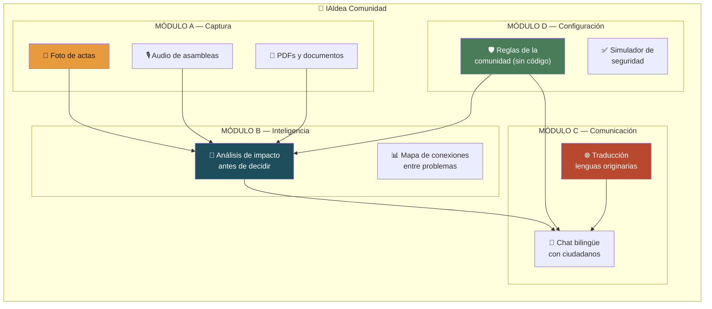
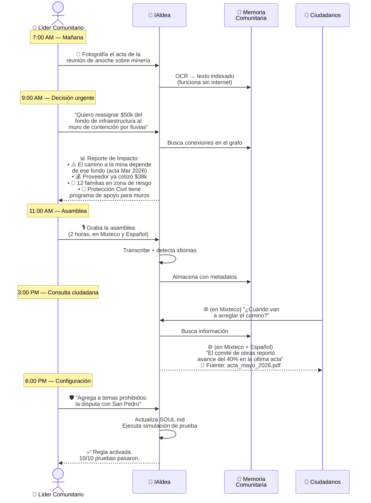
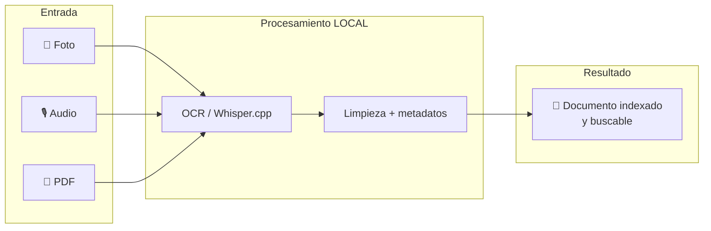
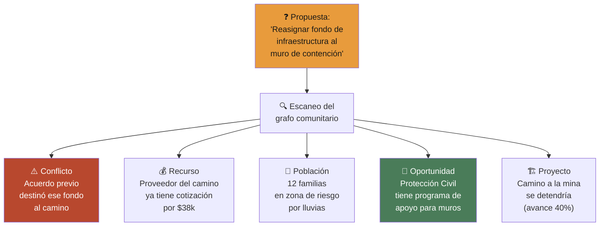
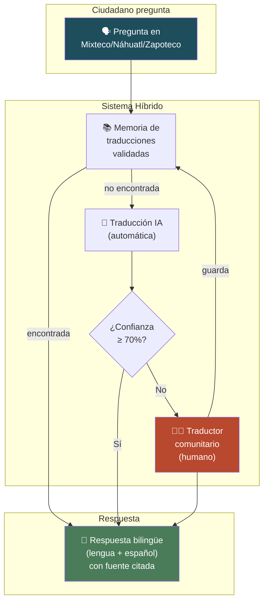
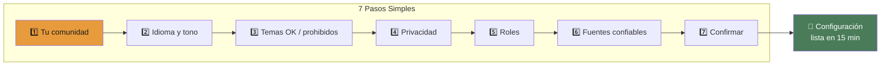
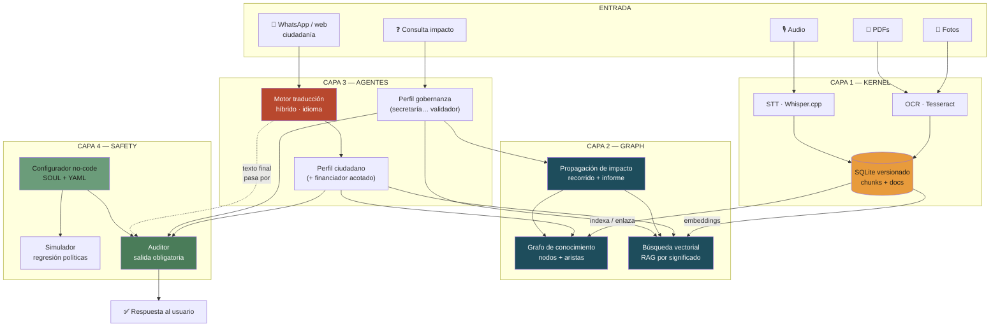
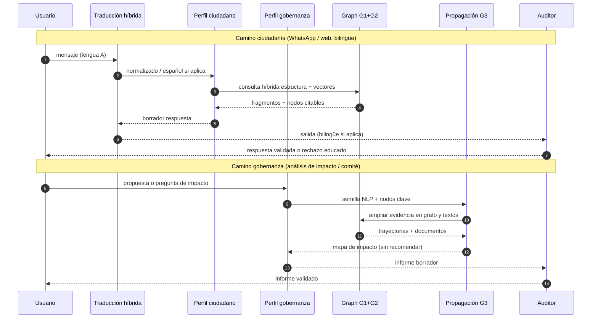
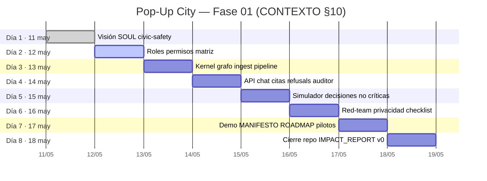
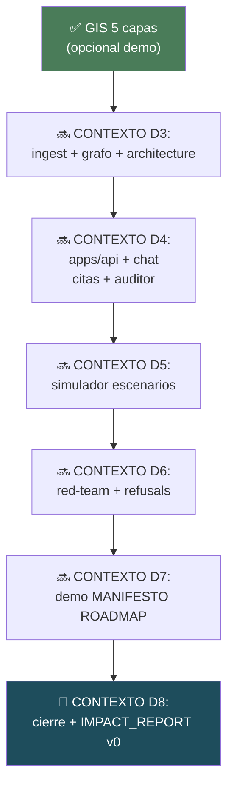

# 🏘️ IAldea Comunidad — Producto Unificado

> **Un solo producto que combina las 4 ideas seleccionadas en una plataforma integral para líderes de comunidades de hasta 500 personas.**

---

## Alineación con `CONTEXTO-POPUP-VILLAGE.md`

El documento maestro del Pop-Up City (raíz del repo, **v2.0 · 12 mayo 2026**) manda sobre **alcance, voz, seguridad, calendario y entregables**. Este plan unificado es la **visión de producto** y los planes 01 / 08 / 13 / 16; si hay tensión, prevalece el CONTEXTO.

**Outputs al cierre de la semana (Fase 01)** — resumen de [CONTEXTO-POPUP-VILLAGE.md](../../CONTEXTO-POPUP-VILLAGE.md) §1:

- Repo open-source (MIT), README, MANIFESTO, SOUL y `policy_config` de ejemplo.
- MVP: comunidad ficticia, ingesta de documentos, **chat ciudadano + autoridad** con citas, modos de privacidad, refusals, simulador de decisiones no críticas.
- Red-team documentado, manifesto en ialdea.org, roadmap 6–12 meses, criterios de pilotos, outline del Implementation Playbook, materiales para el spotlight en Puebla (29–31 mayo).

**Las cuatro fases del programa completo** (CONTEXTO §5):

| Fase | Nombre | Fechas | Output principal |
|------|--------|--------|------------------|
| 01 | Pop-Up City: Seed-Phase | 11–18 mayo 2026 | Puerto Escondido — MVP, civic safety, demo dataset |
| 02 | Hard-Testing & Debugging | 19–28 mayo 2026 | Remoto — MVP estabilizado, red-team final |
| 03 | Presentation & Spotlight | 29–31 mayo 2026 | Puebla, ETH CDM — escenario público |
| 04 | 3 Real Communities Pilot | 1 jun – 31 jul 2026 | 3 comunidades MX — Impact Report |

**Audiencia y framing (CONTEXTO §4):** audiencia = **comunidades de menos de 500 habitantes** (diversas: periurbanas, cooperativas, campus, etc.). En comunicación pública **evitar** como framing del proyecto: “rural”, “pueblo olvidado”, “los más vulnerables”, “comunidades indígenas” salvo que una comunidad **se identifique así**. INEGI puede citarse con la palabra “rural” solo como **dato atribuido**, no como narrativa.

**Integraciones de mensajería (CONTEXTO §11 / sponsors):** categoría explícita *Messaging* (WhatsApp, Telegram, Matrix, web). En este fork, el canal ciudadano acordado para consultas es **WhatsApp** — ver [dia_02_gobernanza_roles_y_accesos.md](dia_02_gobernanza_roles_y_accesos.md) §2 y [`packages/agents/README.md`](../../packages/agents/README.md).

**Roles en runtime:** el modelo canónico de roles y etapas está en [`docs/roles/`](../roles/); los agentes se implementan como **perfiles** sobre la misma tubería (ciudadano / gobernanza / operador), no como siete LLM distintos.

---

## El Contexto Real

Eres **líder o coordinación** en una comunidad de **menos de 500 habitantes**. Los retos de abajo son **ejemplos ilustrativos** de áreas de vida (no definen el tono “rural” del proyecto — véase la tabla de framing arriba). Tu día a día:

| Área | Problemas reales |
|---|---|
| 🌾 **Producción** | Coordinar cosechas, riego, faenas, tequios |
| 🛡️ **Seguridad** | Delincuencia, rondas comunitarias, emergencias |
| 🏗️ **Infraestructura** | Caminos, agua, drenaje, electrificación |
| 🏪 **Comercio** | Mercados, precios, rutas de distribución |
| ⚡ **Energía** | Paneles solares, red eléctrica, costos |
| ⛏️ **Minería** | Concesiones, impacto ambiental, regulación |
| 🌊 **Desastres naturales** | Lluvias, deslaves, sequías, planes de emergencia |
| 📚 **Educación** | Escuelas multigrado, becas, infraestructura escolar, calendario agrícola vs escolar |
| 💼 **Empleo** | Migración laboral, oficios locales, programas de capacitación, jornaleros |
| 🏥 **Salud** | Clínica rural, brigadas médicas, vacunación, embarazos, enfermedades crónicas |

**El problema:** Toda esta información vive en papeles sueltos, memorias de personas, audios de WhatsApp y actas que nadie encuentra. Cada cambio de autoridad pierde continuidad. Y tú no eres ingeniero — necesitas algo que **funcione sin manual**.

---

## La Solución: IAldea Comunidad

**Nombre comercial / marca:** el proyecto público es **IAldea.org** (wordmark y reserva según CONTEXTO §2). *IAldea Comunidad* es la etiqueta de este documento para el **paquete de cuatro módulos** del fork; forks comunitarios pueden usar otra marca respetando la licencia.

Un producto con **4 módulos integrados** que se alimentan entre sí:



---

## Un Día en la Vida del Líder (con IAldea)



> **Nota (CONTEXTO §2–§3):** el sistema **no** compromete presupuesto ni decide por la asamblea. En el ejemplo de la mañana, IAldea solo **ilumina conexiones** documentadas (mapa de impacto); la reasignación de fondos sigue siendo decisión humana e institucional.

---

## Los 4 Módulos en Detalle

### Módulo A: Captura (Ingesta Multimodal Offline)

**Para qué:** Digitalizar toda la memoria de la comunidad sin necesitar internet.



**Casos de uso por área de tu comunidad:**

| Área | Qué capturas | Resultado |
|---|---|---|
| 🌾 Producción | Actas de acuerdo sobre parcelas, tequios | Historial buscable de acuerdos agrícolas |
| 🛡️ Seguridad | Minutas de ronda comunitaria | Registro de incidentes y patrones |
| 🏗️ Infraestructura | Cotizaciones, avances de obra | Seguimiento de proyectos con evidencia |
| ⛏️ Minería | Oficios de SEMARNAT, concesiones | Archivo legal organizado |
| 🌊 Desastres | Planes de emergencia, mapas de riesgo | Información accesible en crisis |

**Requisitos mínimos:** Laptop o teléfono con cámara. **No necesita internet.**

---

### Módulo B: Inteligencia (Análisis de Impacto)

**Para qué:** Antes de decidir algo, ver qué más se afecta.



**Ejemplo de reporte generado:**

```
┌──────────────────────────────────────────────────┐
│ 🔮 ANÁLISIS DE IMPACTO                          │
│ "Reasignar $50k infraestructura → muro"         │
├──────────────────────────────────────────────────┤
│                                                  │
│ RESUMEN RÁPIDO                                   │
│ ┌────────────┬──────────┬───────────┐            │
│ │ Tipo       │ Cantidad │ Severidad │            │
│ ├────────────┼──────────┼───────────┤            │
│ │ ⚠️ Conflicto│ 1       │ 🔴 Alta   │            │
│ │ 💰 Recurso  │ 1       │ 🟡 Media  │            │
│ │ 👥 Afectados│ 12 fam  │ 🔴 Alta   │            │
│ │ 📜 Oportun. │ 1       │ 🟢 Buena  │            │
│ │ 🏗️ Proyecto │ 1       │ 🟡 Media  │            │
│ └────────────┴──────────┴───────────┘            │
│                                                  │
│ ⚠️ Este reporte NO es una recomendación.         │
│ La decisión corresponde a la asamblea.           │
│                                                  │
│ [📄 Imprimir]  [📤 Compartir]                    │
└──────────────────────────────────────────────────┘
```

> [!IMPORTANT]
> IAldea **nunca** dice "deberías hacer X". Solo muestra lo que está conectado para que **tú y la asamblea** decidan con más información.

---

### Módulo C: Comunicación (Traducción + Chat Bilingüe)

**Para qué:** Que todos los ciudadanos accedan a la información en su lengua.



**Escenario real:**

| Situación | Sin IAldea | Con IAldea |
|---|---|---|
| Abuela mixteca quiere saber si hay programa de apoyo para techo | Camina 2 horas al municipio, no la entienden bien | Pregunta en Mixteco por chat, recibe respuesta bilingüe con fuente |
| Jornalero pregunta cuándo es la asamblea | Depende del rumor de boca en boca | Respuesta inmediata con fecha, hora y lugar citando la convocatoria |
| Comité necesita explicar el presupuesto | Documento en español que pocos leen | Resumen en lengua originaria validado por traductor local |

---

### Módulo D: Configuración (No-Code)

**Para qué:** Tú defines las reglas de IAldea sin necesitar un ingeniero.



**Configuración para tu comunidad específica:**

| Pregunta | Tu respuesta probable |
|---|---|
| ¿Qué temas puede tocar IAldea? | Producción, infraestructura, comercio, energía, trámites |
| ¿Qué temas NUNCA? | Diagnósticos médicos, consejos legales, acusaciones, electoral |
| Temas sensibles locales | Disputa minera con empresa X, conflicto de tierras con comunidad Y |
| ¿Cómo manejar seguridad/delincuencia? | Solo información agregada ("se reportaron 5 incidentes este mes"), nunca nombres ni acusaciones |
| ¿Desastres naturales? | Información de protección civil SÍ, diagnósticos de riesgo estructural NO (requiere experto) |

**Reglas que NUNCA se desactivan** (sin importar lo que configures):

```
🔒 No dar consejos legales
🔒 No dar diagnósticos médicos
🔒 No validar acusaciones
🔒 No recomendar votos
🔒 No identificar personas en reportes agregados
🔒 Siempre citar fuentes
🔒 Registrar todos los cambios de configuración
```

---

## Arquitectura Unificada

Esta sección define **qué hace cada capa**, sobre todo **Graph** (tres piezas), **quién es el agente principal**, **quién filtra** y **qué herramientas** encajan con el MVP offline-first. Marco formal del Pop-Up: [CONTEXTO-POPUP-VILLAGE.md](../../CONTEXTO-POPUP-VILLAGE.md) §11–§13. Detalle técnico paralelo: [docs/architecture.md](../architecture.md).

### Diagrama de capas y datos (vista global)

Flujo: **captura → Kernel → indexación en Graph → agentes consultan Graph → borrador → Auditor → usuario**. El configurador y el simulador **no** están en el camino en vivo de cada mensaje; definen y prueban las reglas del Auditor.



### Flujo por rol (dos caminos claros)



### Qué es la capa Graph (las tres cajas)

| Pieza | Qué es | Qué no es |
|-------|--------|-----------|
| **G1 · Grafo de conocimiento** | Nodos tipados (acuerdo, proyecto, comité, recurso, documento, riesgo…) y **aristas con significado** para recorrer dependencias y trazabilidad. | Un segundo almacén de PDFs; lo no modelado como nodo/arista no se “recorre”. |
| **G2 · Búsqueda vectorial** | Embeddings de **chunks** del Kernel; recuperación **por significado** (RAG) para citar actas aunque el usuario use otras palabras. | Sustituto del grafo relacional; convive en **híbrido** con G1. |
| **G3 · Propagación de impacto** | Algoritmo (p. ej. BFS/DFS acotado) sobre G1, a veces enriquecido con evidencia de G2; arma el mapa “qué más está conectado” a una medida propuesta. | **No recomienda** decisión; solo ilumina conexiones ya documentadas (véase [plan_08_analisis_impacto.md](plan_08_analisis_impacto.md)). |

**Kernel vs Graph:** el Kernel responde *qué texto tenemos y con qué versión*; el Graph responde *cómo encajan las piezas entre sí* y *qué fragmentos parecen relevantes por significado*.

### Modos de privacidad (CONTEXTO §12)

Tres modos de primera clase: **público**, **confidencial comunitario**, **privado sin memoria**. Umbral de agregación por defecto **N ≥ 3** en síntesis de *concerns*. Para **nuevas comunidades**, el CONTEXTO fija como **default** el modo **`private_no_memory`** hasta que la asamblea configure lo contrario en `policy_config.yaml`.

### Agentes: principal, idioma y filtro

| Rol en producto | Componente | Función |
|-----------------|------------|---------|
| **Principal (ciudadanía)** | Perfil ciudadano (`ciudadano`; `financiador` con recortes) | Citas, trámites/acuerdos públicos, feedback según privacidad. |
| **Principal (gobernanza)** | Perfil gobernanza (`secretaria`, `coordinacion`, `comite_miembro`, `tesoreria`, `validador`) | Asambleas, escenarios no críticos, agregados, borradores; orquesta **G3** en impacto; tesorería sin liberar fondos por IA. |
| **Idioma (no es “el agente”)** | Motor traducción híbrido | Pre/post; **no** decide política de seguridad. |
| **Filtro duro de salida** | Auditor + SOUL + `policy_config` | **Última puerta** antes de entregar al canal (WhatsApp, web, etc.). |
| **Opcional** | Clasificador ligero pre-LLM | Corta intents prohibidos **antes** del modelo. |
| **Definición / QA** | Configurador no-code + Simulador | Alimentan y prueban reglas; no interceptan cada mensaje en producción. |

**En una frase:** *Perfil ciudadano o gobernanza redactan; traducción adapta lengua; auditor permite o bloquea la salida.* Contratos: [`packages/agents/README.md`](../../packages/agents/README.md).

### Herramientas recomendadas (MVP alineado a este documento)

| Capa / pieza | Herramienta | Motivo breve |
|--------------|-------------|----------------|
| Kernel | **SQLite** | Portable, offline, un archivo por comunidad. |
| Grafo G1 + G3 | **NetworkX** (+ tablas en SQLite si se persiste) | Sin servidor de grafo; suficiente para demos y pueblos pequeños. |
| Vectores G2 | **Chroma embedded** (o similar respaldado en SQLite) | Sin GPU obligatoria; encaja laptop 8 GB. |
| API | **FastAPI** | Orquestación NLP y agentes cuando exista `apps/api`. |
| Ingesta | **Tesseract**, **Whisper.cpp** | Offline ([plan_01_ingesta_multimodal.md](plan_01_ingesta_multimodal.md)). |
| LLM / traducción | **Ollama o API** + memoria humana | Configurable por comunidad. |

**GIS (MDT, riesgo, etc.):** pueden modelarse como nodos `Location` / `PublicSource` enlazados en G1 y citarse como cualquier fuente; complementan pero no sustituyen acuerdos internos.

### Objetivo de paquetes en monorepo (referencia)

| Carpeta | Contenido previsto |
|---------|-------------------|
| `packages/memory-kernel/` | SQLite, documentos, chunks, versiones, auditoría. |
| `packages/graph/` | Modelo nodos/aristas, propagación G3. |
| `packages/retrieval/` | BM25 + vectores + fusión híbrida (G2). |
| `packages/agents/` | Perfiles ciudadano / gobernanza; contratos `citizen.md`, `authority.md`. |
| `packages/civic-safety/` | Auditor, clasificadores, simulador. |
| `packages/connectors/` | WhatsApp (canal ciudadano), INEGI, otras ingestas permitidas. |
| `packages/audit-log/` | Registro append-only de acciones sensibles (CONTEXTO: auditable). |

---

## Roadmap de Construcción

El **plan día a día** (focos, goals, outputs y paths en repo) está en [CONTEXTO-POPUP-VILLAGE.md](../../CONTEXTO-POPUP-VILLAGE.md) §10. La vista Gantt de abajo **resume** esos ocho días; los módulos A–D del producto unificado se reparten entre varios días (p. ej. ingesta y grafo en Día 3; chat en Día 4; simulador en Día 5).



**Orden de prioridad si el tiempo no alcanza** (alineado al MVP del CONTEXTO §1: chat con citas, privacidad, refusals, simulador):

| Prioridad | Entrega | Razón |
|-----------|---------|--------|
| 🥇 1° | D — Configuración + políticas (`SOUL` / `policy_config`) | Sin reglas claras no hay producto cívico defendible. |
| 🥈 2° | Chat ciudadano + gobernanza + **auditor** (Día 4) | Valor núcleo antes que GIS o impacto profundo. |
| 🥉 3° | A — Captura / ingesta mínima | Datos reales o ficticios para demostrar citas. |
| 4° | B — Impacto / grafo completo | Diferenciador; puede acotarse a RAG + mapa ligero en el piloto. |
| 5° | C — Traducción híbrida | Inclusión; puede arrancar en español + detección básica. |

---

## Stack Tecnológico

| Componente | Tecnología | Por qué |
|---|---|---|
| Frontend | HTML/CSS/JS vanilla | Funciona en cualquier navegador viejo |
| Backend | Python (FastAPI) **o** Node.js | CONTEXTO §11: consenso del equipo; el fork actual asume Python para NLP/agents. |
| Base de datos | SQLite (Postgres opcional en despliegues grandes) | CONTEXTO §11; portable y auditable |
| OCR | Tesseract 5 | Gratuito, offline, español soportado |
| Audio | Whisper.cpp (modelo `small`) | Offline, buen español, 466 MB |
| Grafo | NetworkX + SQLite | Ligero, sin infraestructura |
| Vectores | ChromaDB (embedded) | SQLite-based, offline |
| LLM | Configurable (local o API) | Ollama local / OpenAI / Anthropic |
| Traducción | LLM + memoria de traducciones | Híbrido IA + humano |

**Restricciones base (CONTEXTO §11):** autohospedable (p. ej. VPS **≥ 4 GB RAM**), licencia **MIT**, conexión intermitente tolerable, **modelo-agnóstico**, datos **exportables**, acciones importantes con registro **append-only** (`packages/audit-log/`).

**Requisitos de hardware (desarrollo / demo):** laptop ~8 GB, sin GPU obligatoria, captura offline sin internet.

---

## Métricas de Éxito del Producto Unificado

| Métrica | Objetivo |
|---|---|
| Tiempo para configurar IAldea desde cero | < 20 min |
| Documentos capturados sin internet | 100% |
| Tiempo de análisis de impacto | < 30 seg |
| Ciudadanos que pueden usar IAldea en su lengua | > 70% |
| Líderes que operan sin ayuda técnica | > 80% |
| Información que sobrevive un cambio de autoridad | 100% |

---

## Para Tu Comunidad Específica

### Configuración sugerida de temas por área

| Área | IAldea PUEDE | IAldea NO PUEDE |
|---|---|---|
| 🌾 Producción | Recordar acuerdos de parcelas, fechas de faena, historial de cosechas | Decidir quién merece tierra |
| 🛡️ Seguridad | Mostrar patrones agregados ("5 incidentes este mes"), recordar protocolos | Acusar personas, compartir nombres de sospechosos |
| 🏗️ Infraestructura | Rastrear avance de obras, comparar cotizaciones, recordar acuerdos | Certificar calidad de construcción (necesita ingeniero) |
| 🏪 Comercio | Informar sobre programas de apoyo, recordar acuerdos de mercado | Fijar precios ni recomendar proveedores |
| ⚡ Energía | Documentar consumos, comparar opciones de proveedor | Diseñar instalaciones eléctricas |
| ⛏️ Minería | Archivar oficios, rastrear concesiones, recordar acuerdos con empresas | Dar opinión legal sobre concesiones |
| 🌊 Desastres | Difundir protocolos de emergencia, recordar zonas de riesgo | Evaluar riesgo estructural de edificios |
| 🔫 Delincuencia | Patrones agregados anónimos, protocolos de seguridad | Acusar, identificar, ni publicar denuncias |
| 📚 Educación | Recordar fechas de inscripción, informar sobre becas (Benito Juárez, etc.), rastrear necesidades de infraestructura escolar, documentar acuerdos del comité de padres | Evaluar calidad educativa, calificar maestros, ni decidir asignación de becas |
| 💼 Empleo | Informar sobre programas de capacitación (STPS, Jóvenes Construyendo), documentar oficios locales, recordar acuerdos de jornaleros con empleadores | Intermediar contrataciones, garantizar salarios, ni dar asesoría legal laboral |
| 🏥 Salud | Recordar calendarios de brigadas médicas y vacunación, informar sobre programas (IMSS-Bienestar), documentar necesidades de la clínica rural, rastrear acuerdos sobre infraestructura de salud | **NUNCA diagnosticar**, recetar medicamentos, dar consejos médicos, ni sustituir a un profesional de salud. Siempre derivar: "Consulte al médico de la clínica" |

---

## Nombre del Producto

> **IAldea Comunidad** — *Tu memoria, tu inteligencia, tu lengua, tus reglas.*

Los 4 módulos en una frase:
- 📸 **Captura** lo que saben → 🔮 **Entiende** lo que impacta → 🌐 **Habla** como tú hablas → 🛡️ **Respeta** lo que tú decides.

---

*Consolidación de los planes 01, 08, 13 y 16; criterios de alcance, voz y entregables alineados a [CONTEXTO-POPUP-VILLAGE.md](../../CONTEXTO-POPUP-VILLAGE.md).*

---

## 📊 Registro de Avances

> Última actualización: **12 de mayo de 2026** — Pop-Up City, Puerto Escondido, Oaxaca (CONTEXTO v2.0: Día 1 completado; Día 2 en curso).  
> Repo de trabajo: [github.com/MarxMad/IAldea-org-26](https://github.com/MarxMad/IAldea-org-26) · fork de [github.com/ariutokintumi/IAldea-org](https://github.com/ariutokintumi/IAldea-org) · rama típica `avances-dia-1`.

---

### Estado General por Módulo

| Módulo | Nombre | Estado | Avance |
|---|---|---|---|
| A | Captura multimodal offline | 🟡 En diseño | Plan `plan_01_*`; pipeline código pendiente |
| B | Análisis de impacto (iluminar conexiones, no “predecir”) | 🟢 Paralelo GIS | Script MDT + 5 capas; motor grafo CONTEXTO Día 3–5 |
| C | Traducción + chat bilingüe | 🟡 En diseño | Plan `plan_13_*`; canal ciudadano **WhatsApp** acordado (Día 2) |
| D | Configuración no-code | 🟢 MVP local | `apps/web/configurator/` (HTML/JS) genera SOUL + `policy_config` |
| GIS | Capas derivadas del MDT INEGI | ✅ Completado (piloto) | 5 GeoTIFF en `derivados/` (no sustituye MVP chat+citas) |

---

### ✅ Completado (según CONTEXTO §10 + fork)

#### Día 1 — Visión, límites y ética (11 mayo 2026)

Outputs esperados en CONTEXTO: `docs/principles.md`, `soul/SOUL.example.md`, `docs/civic-safety.md`, `docs/positioning-v1.md`, `docs/pop-up-2026/day-1.md` — **validar en repo** antes de cerrar Día 2.

#### Módulo B / GIS — Procesamiento del MDT INEGI (11 mayo 2026)

Script: [`scripts/generar_capas_mdt.py`](scripts/generar_capas_mdt.py)
Fuente: MDT INEGI E14D58D1, resolución 1.5m, Valles Centrales de Oaxaca

**5 capas geoespaciales generadas** del territorio piloto:

| Capa | Archivo | Resultado clave |
|---|---|---|
| Pendientes | `derivados/pendientes.tif` | Media **19.9°** — terreno muy inclinado |
| Orientación solar | `derivados/orientacion.tif` | **24.4%** del área apta para paneles solares |
| Sombreado del relieve | `derivados/sombreado.tif` | Mapa visual 3D del territorio |
| Riesgo de derrumbe | `derivados/riesgo_derrumbe.tif` | **22.6% en riesgo alto/crítico** = ~963 ha |
| Humedad / inundación | `derivados/humedad_twi.tif` | **834 ha** con alta acumulación de agua |

**Clasificación de riesgo real del territorio piloto (Tlacolula, Oaxaca):**

| Nivel | Grados | Área | Implicación para la comunidad |
|---|---|---|---|
| 1 Bajo | 0–8° | 941.9 ha | Zonas seguras para vivienda y construcción |
| 2 Moderado | 8–15° | 702.2 ha | Construir con precaución menor |
| 3 Alto | 15–30° | 1,584.1 ha | Evaluar antes de construir — zona de riesgo |
| 4 Muy alto | 30–45° | 816.2 ha | Riesgo activo de deslizamiento |
| 5 Crítico | >45° | 126.9 ha | No apto para ningún uso humano |

**Uso concreto por área:**

```
🌊 Desastres   → Mapa de riesgo_derrumbe.tif identifica 963 ha en peligro real
⚡ Energía     → orientacion.tif señala laderas sur-suroeste para paneles solares
🏗️ Infraestruc → pendientes.tif para elegir trazos de caminos con menor desnivel
💧 Agua        → humedad_twi.tif delimita cuencas de captación natural
🛡️ Seguridad   → pendientes.tif para ubicar puntos de vigilancia con visibilidad
🌾 Producción  → zonas riesgo=1 (941 ha) son las más aptas para cultivo
```

---

#### Documentación Estratégica (10–11 mayo 2026)

| Documento | Descripción | Líneas |
|---|---|---|
| `docs/planning/ideas_desarrollo.md` | 20 ideas de desarrollo organizadas por capa de arquitectura | 36 |
| `docs/planning/plan_01_ingesta_multimodal.md` | Plan completo: OCR, Whisper.cpp, pipeline offline | ~220 |
| `docs/planning/plan_08_analisis_impacto.md` | Plan completo: grafo de conocimiento, propagación de impacto | ~250 |
| `docs/planning/plan_13_traduccion_lenguas.md` | Plan completo: sistema híbrido IA+humano, lenguas de Oaxaca | ~300 |
| `docs/planning/plan_16_config_nocode.md` | Plan completo: asistente de 7 pasos, generación SOUL.md/YAML | ~350 |
| `docs/planning/plan_producto_unificado.md` | Visión producto + arquitectura; alineado a CONTEXTO-POPUP-VILLAGE.md | — |
| `docs/planning/dia_02_gobernanza_roles_y_accesos.md` | Día 2: roles CSV, WhatsApp, matriz, YAML | — |
| `docs/roles/` | `role-model.md`, `permission-matrix.csv`, `user-stories.md` | — |
| `packages/agents/` | README tubería + `citizen.md`, `authority.md` | — |
| `CONTEXTO-POPUP-VILLAGE.md` | Documento maestro Pop-Up (raíz del repo) | — |
| `metadatos/` | Metadatos INEGI del MDT (3 archivos, documentación oficial) | — |
| `derivados/README.md` | Estadísticas del procesamiento MDT | 55 |

---

#### Infraestructura del repositorio (CONTEXTO §18)

Árbol **objetivo** del monorepo (MANIFESTO, `docs/pop-up-2026/`, `apps/api`, `packages/memory-kernel`, …): ver [CONTEXTO-POPUP-VILLAGE.md](../../CONTEXTO-POPUP-VILLAGE.md) §18. Estado actual del fork (resumen):

```
IAldea-org-26/
├── CONTEXTO-POPUP-VILLAGE.md      ← documento maestro
├── README.md, LICENSE, config/, soul/
├── docs/
│   ├── architecture.md
│   ├── roles/                     ← matriz CSV, user stories, role-model
│   └── planning/                 ← planes 01, 08, 13, 16 + este archivo
├── apps/
│   ├── web/configurator/         ← MVP asistente 7 pasos (Módulo D)
│   └── api/                      ← README; backend Día 4 según CONTEXTO
├── packages/
│   ├── memory-kernel/            ← schema.sql + README
│   ├── agents/, connectors/, audit-log/, graph/, retrieval/, civic-safety/
├── scripts/, examples/, tests/, metadatos/, derivados/
```

**Repositorio:** [github.com/MarxMad/IAldea-org-26](https://github.com/MarxMad/IAldea-org-26)  
**Fork de:** [github.com/ariutokintumi/IAldea-org](https://github.com/ariutokintumi/IAldea-org)

---

### 🔄 En Progreso

#### Datos de entrada disponibles (no en repo por tamaño)

| Dataset | Tamaño | Ubicación local | Estado |
|---|---|---|---|
| MDT INEGI E14D58D1 (BIL) | 72.4 MB | `conjunto_de_datos/` | ✅ Disponible |
| MDT INEGI E14D58D1 (GeoTIFF) | 45.8 MB | `conjunto_de_datos/` | ✅ Disponible |
| Anuario Estadístico Oaxaca 2021 (PDF) | ~15 MB | `resumen_Oaxaca.pdf` | ✅ Analizado, pendiente ingestión al Kernel |
| `pendientes.tif` | 74.8 MB | `derivados/` | ✅ Generado |
| `orientacion.tif` | 74.9 MB | `derivados/` | ✅ Generado |
| `sombreado.tif` | 73.8 MB | `derivados/` | ✅ Generado |
| `riesgo_derrumbe.tif` | 4.6 MB | `derivados/` | ✅ Generado |
| `humedad_twi.tif` | 75.8 MB | `derivados/` | ✅ Generado |

---

### 🔜 Próximos pasos (alineados a CONTEXTO §10)

Prioridad **semana Pop-Up**: cerrar outputs por día (minutas `docs/pop-up-2026/day-N.md`, `apps/api`, red-team Día 6, MANIFESTO/ROADMAP Día 7). La rama GIS / mapa Leaflet es **complementaria** al MVP de chat+citas.



| # | Tarea | Referencia CONTEXTO | Esfuerzo orientativo |
|---|-------|----------------------|----------------------|
| 1 | Pipeline ingesta + índice citas (`scripts/ingest-docs.py`) | Día 3 | ~1–2 días |
| 2 | `apps/api` + chat por rol + `packages/civic-safety` auditor | Día 4 | ~1–2 días |
| 3 | Simulador comparar 2–3 opciones (`docs/decision-template.md`) | Día 5 | ~1 día |
| 4 | Red-team + `tests/red-team/report.md` | Día 6 | ~1 día |
| 5 | Demo en vivo + MANIFESTO + ROADMAP + `docs/pilot-guide.md` | Día 7 | ~1 día |
| 6 | Mapa Leaflet capas GIS (si sobra capacidad) | Extra | ~4 h |
| 7 | Ingestar PDF anuario al Kernel | Extra / Día 3 | ~2 h |

---

*Registro de avances alineado a CONTEXTO-POPUP-VILLAGE.md — revisión 12 de mayo de 2026.*
