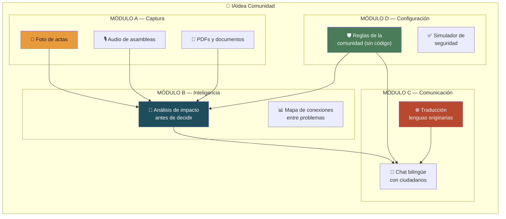
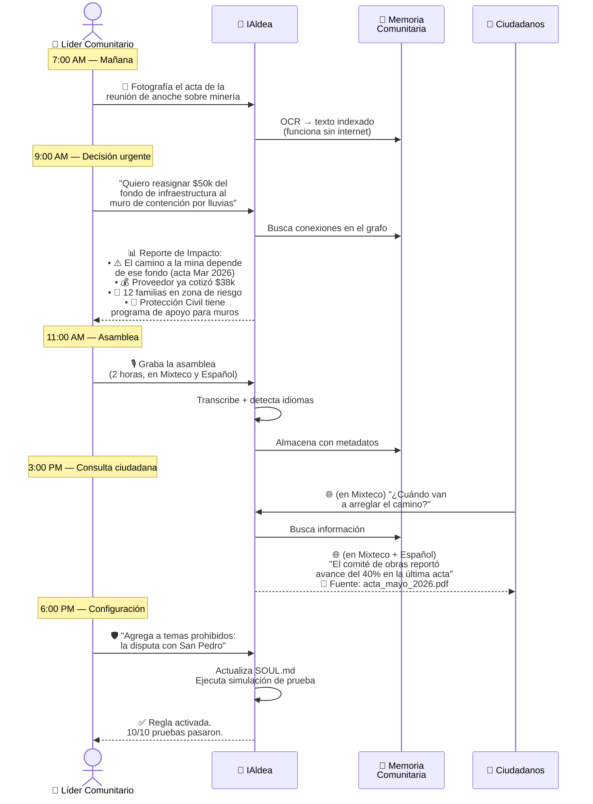
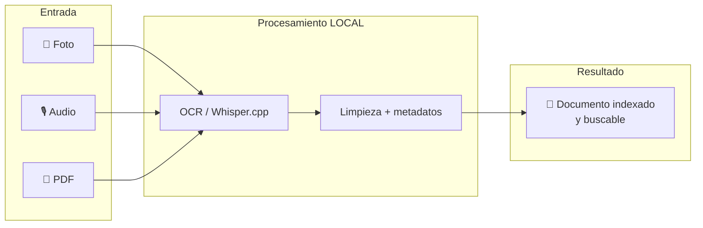
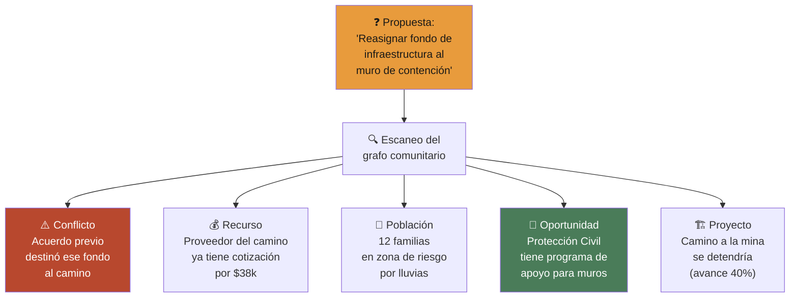
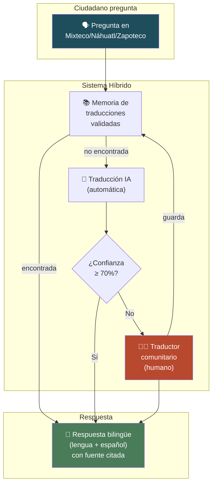
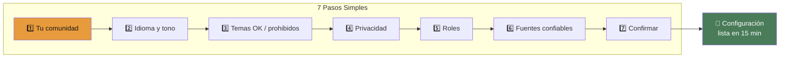
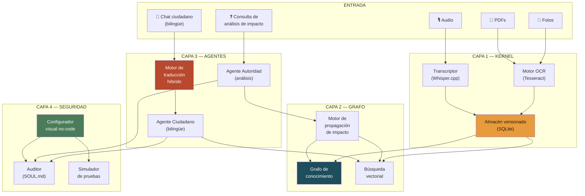
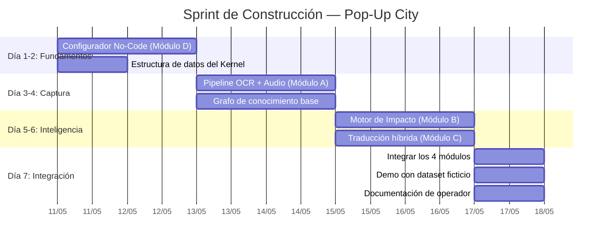

# 🏘️ IAldea Comunidad — Producto Unificado

> **Un solo producto que combina las 4 ideas seleccionadas en una plataforma integral para líderes de comunidades de hasta 500 personas.**

---

## El Contexto Real

Eres líder de una comunidad de 500 personas. Tu día a día:

| Área | Problemas reales |
|---|---|
| 🌾 **Producción** | Coordinar cosechas, riego, faenas, tequios |
| 🛡️ **Seguridad** | Delincuencia, rondas comunitarias, emergencias |
| 🏗️ **Infraestructura** | Caminos, agua, drenaje, electrificación |
| 🏪 **Comercio** | Mercados, precios, rutas de distribución |
| ⚡ **Energía** | Paneles solares, red eléctrica, costos |
| ⛏️ **Minería** | Concesiones, impacto ambiental, regulación |
| 🌊 **Desastres naturales** | Lluvias, deslaves, sequías, planes de emergencia |
| 📚 **Educación** | Escuelas multigrado, becas, infraestructura escolar, calendario agrícola vs escolar |
| 💼 **Empleo** | Migración laboral, oficios locales, programas de capacitación, jornaleros |
| 🏥 **Salud** | Clínica rural, brigadas médicas, vacunación, embarazos, enfermedades crónicas |

**El problema:** Toda esta información vive en papeles sueltos, memorias de personas, audios de WhatsApp y actas que nadie encuentra. Cada cambio de autoridad pierde continuidad. Y tú no eres ingeniero — necesitas algo que **funcione sin manual**.

---

## La Solución: IAldea Comunidad

Un producto con **4 módulos integrados** que se alimentan entre sí:



---

## Un Día en la Vida del Líder (con IAldea)



---

## Los 4 Módulos en Detalle

### Módulo A: Captura (Ingesta Multimodal Offline)

**Para qué:** Digitalizar toda la memoria de la comunidad sin necesitar internet.



**Casos de uso por área de tu comunidad:**

| Área | Qué capturas | Resultado |
|---|---|---|
| 🌾 Producción | Actas de acuerdo sobre parcelas, tequios | Historial buscable de acuerdos agrícolas |
| 🛡️ Seguridad | Minutas de ronda comunitaria | Registro de incidentes y patrones |
| 🏗️ Infraestructura | Cotizaciones, avances de obra | Seguimiento de proyectos con evidencia |
| ⛏️ Minería | Oficios de SEMARNAT, concesiones | Archivo legal organizado |
| 🌊 Desastres | Planes de emergencia, mapas de riesgo | Información accesible en crisis |

**Requisitos mínimos:** Laptop o teléfono con cámara. **No necesita internet.**

---

### Módulo B: Inteligencia (Análisis de Impacto)

**Para qué:** Antes de decidir algo, ver qué más se afecta.



**Ejemplo de reporte generado:**

```
┌──────────────────────────────────────────────────┐
│ 🔮 ANÁLISIS DE IMPACTO                          │
│ "Reasignar $50k infraestructura → muro"         │
├──────────────────────────────────────────────────┤
│                                                  │
│ RESUMEN RÁPIDO                                   │
│ ┌────────────┬──────────┬───────────┐            │
│ │ Tipo       │ Cantidad │ Severidad │            │
│ ├────────────┼──────────┼───────────┤            │
│ │ ⚠️ Conflicto│ 1       │ 🔴 Alta   │            │
│ │ 💰 Recurso  │ 1       │ 🟡 Media  │            │
│ │ 👥 Afectados│ 12 fam  │ 🔴 Alta   │            │
│ │ 📜 Oportun. │ 1       │ 🟢 Buena  │            │
│ │ 🏗️ Proyecto │ 1       │ 🟡 Media  │            │
│ └────────────┴──────────┴───────────┘            │
│                                                  │
│ ⚠️ Este reporte NO es una recomendación.         │
│ La decisión corresponde a la asamblea.           │
│                                                  │
│ [📄 Imprimir]  [📤 Compartir]                    │
└──────────────────────────────────────────────────┘
```

> [!IMPORTANT]
> IAldea **nunca** dice "deberías hacer X". Solo muestra lo que está conectado para que **tú y la asamblea** decidan con más información.

---

### Módulo C: Comunicación (Traducción + Chat Bilingüe)

**Para qué:** Que todos los ciudadanos accedan a la información en su lengua.



**Escenario real:**

| Situación | Sin IAldea | Con IAldea |
|---|---|---|
| Abuela mixteca quiere saber si hay programa de apoyo para techo | Camina 2 horas al municipio, no la entienden bien | Pregunta en Mixteco por chat, recibe respuesta bilingüe con fuente |
| Jornalero pregunta cuándo es la asamblea | Depende del rumor de boca en boca | Respuesta inmediata con fecha, hora y lugar citando la convocatoria |
| Comité necesita explicar el presupuesto | Documento en español que pocos leen | Resumen en lengua originaria validado por traductor local |

---

### Módulo D: Configuración (No-Code)

**Para qué:** Tú defines las reglas de IAldea sin necesitar un ingeniero.



**Configuración para tu comunidad específica:**

| Pregunta | Tu respuesta probable |
|---|---|
| ¿Qué temas puede tocar IAldea? | Producción, infraestructura, comercio, energía, trámites |
| ¿Qué temas NUNCA? | Diagnósticos médicos, consejos legales, acusaciones, electoral |
| Temas sensibles locales | Disputa minera con empresa X, conflicto de tierras con comunidad Y |
| ¿Cómo manejar seguridad/delincuencia? | Solo información agregada ("se reportaron 5 incidentes este mes"), nunca nombres ni acusaciones |
| ¿Desastres naturales? | Información de protección civil SÍ, diagnósticos de riesgo estructural NO (requiere experto) |

**Reglas que NUNCA se desactivan** (sin importar lo que configures):

```
🔒 No dar consejos legales
🔒 No dar diagnósticos médicos
🔒 No validar acusaciones
🔒 No recomendar votos
🔒 No identificar personas en reportes agregados
🔒 Siempre citar fuentes
🔒 Registrar todos los cambios de configuración
```

---

## Arquitectura Unificada



---

## Roadmap de Construcción



**Orden de prioridad si el tiempo no alcanza:**

| Prioridad | Módulo | Razón |
|---|---|---|
| 🥇 1° | D — Configuración No-Code | Sin esto, el líder no puede usar nada solo |
| 🥈 2° | A — Captura Offline | Sin datos, no hay inteligencia posible |
| 🥉 3° | B — Análisis de Impacto | El mayor valor diferenciador |
| 4° | C — Traducción | Crítico para inclusión, pero puede empezar básico |

---

## Stack Tecnológico

| Componente | Tecnología | Por qué |
|---|---|---|
| Frontend | HTML/CSS/JS vanilla | Funciona en cualquier navegador viejo |
| Backend | Python 3.11+ (FastAPI) | Ecosistema NLP maduro |
| Base de datos | SQLite | Sin servidor, portable, offline |
| OCR | Tesseract 5 | Gratuito, offline, español soportado |
| Audio | Whisper.cpp (modelo `small`) | Offline, buen español, 466 MB |
| Grafo | NetworkX + SQLite | Ligero, sin infraestructura |
| Vectores | ChromaDB (embedded) | SQLite-based, offline |
| LLM | Configurable (local o API) | Ollama local / OpenAI / Anthropic |
| Traducción | LLM + memoria de traducciones | Híbrido IA + humano |

**Requisitos de hardware:** Laptop con 8 GB RAM. Sin GPU. Sin internet para captura.

---

## Métricas de Éxito del Producto Unificado

| Métrica | Objetivo |
|---|---|
| Tiempo para configurar IAldea desde cero | < 20 min |
| Documentos capturados sin internet | 100% |
| Tiempo de análisis de impacto | < 30 seg |
| Ciudadanos que pueden usar IAldea en su lengua | > 70% |
| Líderes que operan sin ayuda técnica | > 80% |
| Información que sobrevive un cambio de autoridad | 100% |

---

## Para Tu Comunidad Específica

### Configuración sugerida de temas por área

| Área | IAldea PUEDE | IAldea NO PUEDE |
|---|---|---|
| 🌾 Producción | Recordar acuerdos de parcelas, fechas de faena, historial de cosechas | Decidir quién merece tierra |
| 🛡️ Seguridad | Mostrar patrones agregados ("5 incidentes este mes"), recordar protocolos | Acusar personas, compartir nombres de sospechosos |
| 🏗️ Infraestructura | Rastrear avance de obras, comparar cotizaciones, recordar acuerdos | Certificar calidad de construcción (necesita ingeniero) |
| 🏪 Comercio | Informar sobre programas de apoyo, recordar acuerdos de mercado | Fijar precios ni recomendar proveedores |
| ⚡ Energía | Documentar consumos, comparar opciones de proveedor | Diseñar instalaciones eléctricas |
| ⛏️ Minería | Archivar oficios, rastrear concesiones, recordar acuerdos con empresas | Dar opinión legal sobre concesiones |
| 🌊 Desastres | Difundir protocolos de emergencia, recordar zonas de riesgo | Evaluar riesgo estructural de edificios |
| 🔫 Delincuencia | Patrones agregados anónimos, protocolos de seguridad | Acusar, identificar, ni publicar denuncias |
| 📚 Educación | Recordar fechas de inscripción, informar sobre becas (Benito Juárez, etc.), rastrear necesidades de infraestructura escolar, documentar acuerdos del comité de padres | Evaluar calidad educativa, calificar maestros, ni decidir asignación de becas |
| 💼 Empleo | Informar sobre programas de capacitación (STPS, Jóvenes Construyendo), documentar oficios locales, recordar acuerdos de jornaleros con empleadores | Intermediar contrataciones, garantizar salarios, ni dar asesoría legal laboral |
| 🏥 Salud | Recordar calendarios de brigadas médicas y vacunación, informar sobre programas (IMSS-Bienestar), documentar necesidades de la clínica rural, rastrear acuerdos sobre infraestructura de salud | **NUNCA diagnosticar**, recetar medicamentos, dar consejos médicos, ni sustituir a un profesional de salud. Siempre derivar: "Consulte al médico de la clínica" |

---

## Nombre del Producto

> **IAldea Comunidad** — *Tu memoria, tu inteligencia, tu lengua, tus reglas.*

Los 4 módulos en una frase:
- 📸 **Captura** lo que saben → 🔮 **Entiende** lo que impacta → 🌐 **Habla** como tú hablas → 🛡️ **Respeta** lo que tú decides.

---

*Documento generado como consolidación de los planes 01, 08, 13 y 16 de IAldea.*
